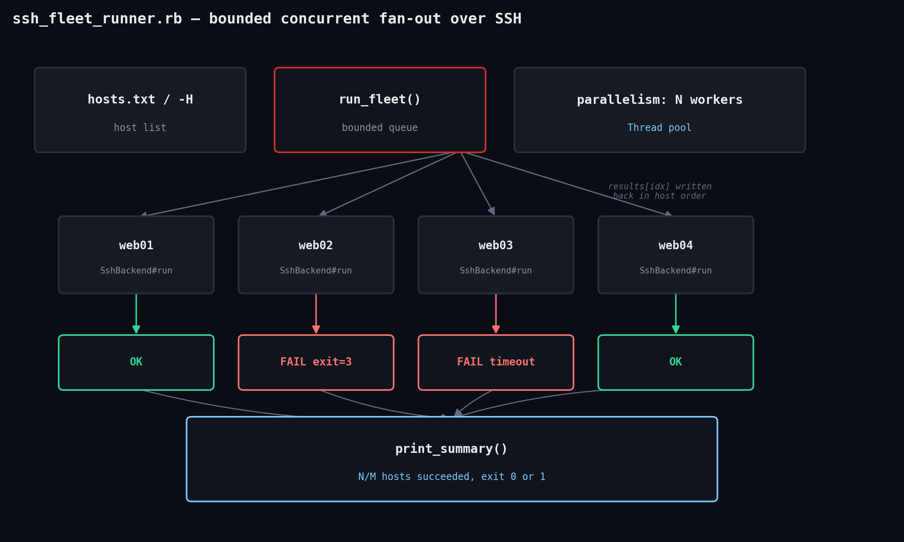

# ssh-fleet-runner

Run one shell command across a fleet of Linux hosts concurrently over SSH, and print a pass/fail summary — for the "I have a text file of 40 hostnames and need to run one command on all of them tonight" problem, without reaching for Ansible/Fabric for a one-off.



## Prerequisites

- Ruby 3.0+
- Gem: [`net-ssh`](https://rubygems.org/gems/net-ssh) (`~> 7.0`) — `gem install net-ssh`
- SSH key-based auth already set up to the target hosts (this tool does not prompt for passwords)

> **A note on how this was tested:** the sandbox this tutorial was built in has outbound network access blocked to rubygems.org, so `gem install net-ssh` isn't possible there. The script isolates every call that actually touches the network inside `SshBackend`, and everything *around* that — the bounded thread pool, per-host result aggregation, host-order preservation, CLI parsing — is tested against a `FakeBackend` stand-in in `fleet_runner_test.rb`, with no real network or SSH server involved. Run `ruby fleet_runner_test.rb` yourself once you have a working Ruby to see all 12 assertions pass. On a machine with real gem access, `gem install net-ssh` and the script talks to real hosts through the same `SshBackend#run` method.

## Usage

```bash
gem install net-ssh

# From a hosts file (# comments and blank lines are ignored)
ruby ssh_fleet_runner.rb -f hosts.txt -u deploy -i ~/.ssh/id_ed25519 -- 'uptime'

# Inline host list, custom parallelism
ruby ssh_fleet_runner.rb -H web01,web02,web03 -u deploy -p 5 -- 'systemctl is-active nginx'
```

Options:

| Flag | Default | Meaning |
|---|---|---|
| `-f, --hosts-file PATH` | — | File with one hostname per line |
| `-H, --hosts LIST` | — | Comma-separated hosts (alternative to `-f`) |
| `-u, --user USER` | `$USER` | SSH user |
| `-i, --identity PATH` | — | Private key path |
| `-p, --parallelism N` | 10 | Max concurrent SSH connections |
| `-t, --timeout SECONDS` | 10 | Per-host connect timeout |
| `--port N` | 22 | SSH port |

Exit status is `0` only if every host succeeded; `1` if any host failed or errored — so it composes cleanly into a CI/cron pipeline (`ssh_fleet_runner.rb ... || alert-someone`).

## How it works

1. **`SshBackend#run`** wraps a single `Net::SSH.start` call, opens a channel, streams stdout/stderr, and captures the remote exit status via the `exit-status` request. It never raises out to the caller — any `StandardError` (auth failure, timeout, DNS failure) is captured into an `Outcome` with `error` set, so one bad host can't kill the run.
2. **`run_fleet`** builds a shared work queue of `[host, index]` pairs and spins up `min(parallelism, hosts.size)` threads that each pull from the queue under a `Mutex` until it's empty. Every worker writes its result into `results[idx]` — not `results <<` — so the final array is always in the *original* host order, regardless of which host finishes first. That matters for diffable, script-friendly output.
3. **`print_summary`** renders each host's status, indented stdout/stderr, and a final `N/M hosts succeeded` line.
4. The **CLI** (`parse_options`/`load_hosts`) is a thin wrapper: it builds one `SshBackend` and calls `run_fleet`, then exits `0`/`1` based on whether every `Outcome#ok` was true.

## Example output

```
[OK  ] web01                    exit=0
        active
[FAIL] web02                    exit=3
        stderr: unit not found
[FAIL] web03                    error: Net::SSH::ConnectionTimeout
[OK  ] web04                    exit=0
        active

2/4 hosts succeeded
```
(Captured from `fleet_runner_test.rb`'s `FakeBackend` scenario — see the "output" tab on the tutorial for the full test run.)

## Troubleshooting

- **`LoadError: cannot load such file -- net/ssh`** — `gem install net-ssh` wasn't run, or you're on a different Ruby/gemset than you think (`gem env`, `bundle exec` if you're using Bundler).
- **Every host reports `Net::SSH::AuthenticationFailed`** — the key isn't authorized on the target, or you need `-u` to point at the right remote user. Test one host manually first: `ssh -i ~/.ssh/id_ed25519 deploy@web01`.
- **Hangs instead of failing fast** — lower `-t/--timeout`; a host that's firewalled (vs. actively refusing) can otherwise sit until the OS-level TCP timeout.
- **Output looks interleaved/garbled** — it shouldn't be: `results[idx] = ...` writes are per-thread-unique indices (no shared mutation race on the array itself), and printing happens after `workers.each(&:join)`, once everything's finished. If you see garbling, check you haven't modified the loop to print inside each worker thread instead.
- **Want to run on Windows targets instead** — Windows OpenSSH is supported by `net-ssh` the same way; see this repo's `wmi-process-watchdog` script for a WMI-native alternative when SSH isn't the right tool for the job on Windows.

## Extending it

- Add `--sudo` to prefix the remote command and handle a sudo password prompt via `channel.on_data` pattern-matching `[sudo] password`.
- Add `--upload LOCAL:REMOTE` using `Net::SCP` (from the `net-scp` gem) before running the command.
- Stream results as they complete instead of waiting for the whole fleet, by yielding from `run_fleet` via a block instead of returning an array.
- Add retry-with-backoff per host inside `SshBackend#run` for flaky links.

## References

- Full script + this README: [`ruby-devops-toolkit/ssh-fleet-runner`](https://github.com/jjam3774/ruby-devops-toolkit/tree/main/ssh-fleet-runner)
- `net-ssh` on RubyGems: https://rubygems.org/gems/net-ssh
- `net-ssh` GitHub (usage examples, `Net::SSH.start` options): https://github.com/net-ssh/net-ssh
