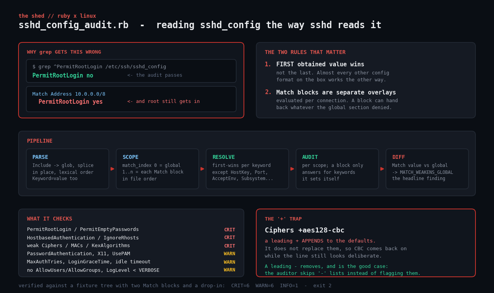

# sshd-config-audit

Audit an OpenSSH server config **the way `sshd` actually reads it**: first value
wins, `Include` files are spliced in at the point of inclusion, and every `Match`
block is evaluated as its own overlay.

Most SSH hardening checkers grep for a keyword and report the line they find.
That is wrong twice over. OpenSSH takes the **first** obtained value for almost
every keyword, not the last — and a `Match` block further down the file can hand
back everything the global section just locked away. That is how a host passes a
grep-based audit while still accepting root logins with a password from the
office subnet.



## Prerequisites

- Ruby 2.6 or newer (tested on Ruby 3.0.2). No gems — `optparse` and `json` only.
- Read access to `/etc/ssh/sshd_config` and anything it `Include`s. The main
  file is usually world-readable; drop-ins under `sshd_config.d` sometimes are
  not, so run as root for a complete picture. Unreadable files are reported, not
  skipped silently.
- Nothing needs to be running. This reads the config on disk, which is also what
  lets you audit a captured config from another host.

## Usage

```
ruby sshd_config_audit.rb                          # audit /etc/ssh/sshd_config
ruby sshd_config_audit.rb --config ./sshd_config   # audit a specific file
ruby sshd_config_audit.rb --root ./fixtures        # treat ./fixtures as /
ruby sshd_config_audit.rb --show-effective         # dump the resolved config
ruby sshd_config_audit.rb --json
ruby sshd_config_audit.rb --no-color               # plain text for logs
```

Exit codes: `0` clean, `1` WARN findings, `2` at least one CRIT.

## How it works

### 1. Parse — a flat, ordered list of directives

Every non-comment line becomes a `Directive` carrying its keyword, value, source
file, line number, and a `match_index`: `0` for the global section, `1..n` for
each `Match` block in file order.

`Include` is expanded **in place**, as a glob, in lexical order — exactly what
`sshd` does. That ordering matters more than it looks: Fedora and Ubuntu 24.04
ship `Include /etc/ssh/sshd_config.d/*.conf` at the *top* of the file, so a
drop-in overrides everything below it, and a drop-in named `10-` beats one named
`50-`. `Keyword=value` is accepted alongside `Keyword value`, because `sshd`
accepts both.

### 2. Resolve — first value wins

```ruby
elsif !out.key?(key)
  out[key] = d      # first obtained value; later ones are ignored
end
```

A short list of keywords legitimately accumulates instead of overriding —
`HostKey`, `Port`, `ListenAddress`, `AcceptEnv`, `Subsystem`, `SetEnv`,
`PermitOpen`, `PermitListen` — and those are collected into arrays. Everything
else is first-wins.

### 3. Scope — a Match block is an overlay, not a section

`sshd` re-reads the config for each connection, and a `Match` block's directives
are simply "obtained first" for a client that matches. So the effective config
for `Match Address 10.0.0.0/8` is that block's directives layered over the
global ones.

Inside a block, the auditor only reports on keywords **the block itself sets**.
Everything else is inherited and was already reported globally; repeating it per
block turns one finding into five.

### 4. Diff — the finding this script exists for

`MATCH_WEAKENS_GLOBAL` fires when a `Match` block sets `PermitRootLogin yes`,
`PasswordAuthentication yes`, `PermitEmptyPasswords yes`, or
`PubkeyAuthentication no` while the global section says otherwise. A block that
merely repeats an already-bad global value is not a weakening and is not
double-reported.

### 5. Algorithm lists and the `+` trap

`Ciphers`, `MACs`, `KexAlgorithms`, `HostKeyAlgorithms` and
`PubkeyAcceptedAlgorithms` accept `+`, `-` and `^` prefixes that *modify* the
default set rather than replacing it:

| Prefix | Meaning | Audited as |
| --- | --- | --- |
| none | replace the default list entirely | flag any weak entry |
| `+` | **append to** the defaults | flag any weak entry, and say so |
| `-` | **remove from** the defaults | skipped — naming a weak algorithm here *disables* it |
| `^` | move to the front of the defaults | flag any weak entry |

`Ciphers +aes128-cbc` looks deliberate and hardened. It re-enables CBC on top of
everything OpenSSH already allowed.

## What it checks

| Code | Severity | Keyword |
| --- | --- | --- |
| `ROOT_LOGIN` | CRIT | `PermitRootLogin yes` |
| `EMPTY_PASSWORDS` | CRIT | `PermitEmptyPasswords yes` |
| `HOSTBASED_AUTH` | CRIT | `HostbasedAuthentication yes` |
| `RHOSTS` | CRIT | `IgnoreRhosts no` |
| `WEAK_CIPHERS` / `WEAK_MACS` / `WEAK_KEX` | CRIT | CBC, arcfour, MD5/SHA-1 MACs, SHA-1 key exchange |
| `WEAK_HOSTKEY_ALGS` / `WEAK_PUBKEY_ALGS` | CRIT | `ssh-rsa` (SHA-1), `ssh-dss` |
| `MATCH_WEAKENS_GLOBAL` | CRIT | a `Match` block undoing the global posture |
| `PASSWORD_AUTH` | WARN | `PasswordAuthentication yes` |
| `X11_FORWARDING` | WARN | `X11Forwarding yes` |
| `USER_ENVIRONMENT` | WARN | `PermitUserEnvironment` — `LD_PRELOAD` via `authorized_keys` |
| `STRICT_MODES` | WARN | `StrictModes no` |
| `GSSAPI` | WARN | `GSSAPIAuthentication yes` on a non-Kerberised host |
| `NO_PAM` | WARN | `UsePAM no` — bypasses `faillock`, account expiry, `pwquality` |
| `MAX_AUTH_TRIES` | WARN | more than 4 (every offered key counts as an attempt) |
| `LOGIN_GRACE` | WARN | longer than 60s |
| `NO_IDLE_TIMEOUT` | WARN | `ClientAliveInterval` unset or 0 |
| `NO_ACCESS_LIST` | WARN | no `AllowUsers`/`AllowGroups`/`DenyUsers`/`DenyGroups` |
| `LOG_LEVEL` | WARN | below `VERBOSE` — only `VERBOSE` logs the key fingerprint used |
| `*_DEFAULT` | INFO | keyword unset; the audit is reading a compiled-in default, not a decision |

## Example output

Against a fixture tree with an `Include` drop-in and two `Match` blocks:

```
$ ruby sshd_config_audit.rb --root ./fixtures --no-color

sshd config audit  -  ./fixtures/etc/ssh/sshd_config
files read: /etc/ssh/sshd_config, /etc/ssh/sshd_config.d/10-hardening.conf
match blocks: Address 10.0.0.0/8 | User git
==============================================================================

Match Address 10.0.0.0/8 (/etc/ssh/sshd_config:30)
------------------------------------------------------------------------------
  CRIT  MATCH_WEAKENS_GLOBAL
        PermitRootLogin is yes inside this Match block but no globally. A grep-based audit reads the global line and calls this host hardened.
        at /etc/ssh/sshd_config:32
  CRIT  MATCH_WEAKENS_GLOBAL
        PasswordAuthentication is yes inside this Match block but no globally. A grep-based audit reads the global line and calls this host hardened.
        at /etc/ssh/sshd_config:31
  CRIT  ROOT_LOGIN
        PermitRootLogin yes - root can log in directly; an attacker only has to guess one password, and the audit trail loses who it was. Set PermitRootLogin prohibit-password.
        at /etc/ssh/sshd_config:32
  WARN  PASSWORD_AUTH
        PasswordAuthentication yes - password auth is on, so this host is brute-forceable; keys or certificates are the fix. Set PasswordAuthentication no.
        at /etc/ssh/sshd_config:31

global
------------------------------------------------------------------------------
  CRIT  WEAK_CIPHERS
        Ciphers (+ appends to the defaults) enables aes128-cbc - CBC-mode and arcfour ciphers are broken or deprecated.
        at /etc/ssh/sshd_config:24
  CRIT  WEAK_KEX
        KexAlgorithms enables diffie-hellman-group14-sha1 - SHA-1 key exchange and 1024-bit groups are within reach of a well-funded attacker.
        at /etc/ssh/sshd_config:26
  CRIT  WEAK_MACS
        MACs enables hmac-sha1 - MD5 and SHA-1 MACs, and 64-bit UMAC, are no longer acceptable.
        at /etc/ssh/sshd_config:25
  WARN  LOGIN_GRACE
        LoginGraceTime 2m - a long grace window lets an attacker hold many unauthenticated connections open.
        at /etc/ssh/sshd_config:14
  WARN  LOG_LEVEL
        LogLevel INFO - only VERBOSE logs the key fingerprint used for each login, which is what you need after an incident.
        at /etc/ssh/sshd_config:20
  WARN  MAX_AUTH_TRIES
        MaxAuthTries 6 - allow at most 4 attempts per connection.
        at /etc/ssh/sshd_config:13
  WARN  NO_IDLE_TIMEOUT
        ClientAliveInterval is unset or 0 - idle sessions never time out.
        at /etc/ssh/sshd_config:21
  WARN  X11_FORWARDING
        X11Forwarding yes - X11 forwarding is on; on a server with no GUI it is pure attack surface. Set X11Forwarding no.
        at /etc/ssh/sshd_config:15
  INFO  GSSAPI_DEFAULT
        GSSAPIAuthentication is not set; relying on the compiled-in default (expected no)

==============================================================================
summary  CRIT=6  WARN=6  INFO=1
```

Exit code `2`. Note that `Match User git` produced **no** findings — it sets only
`PubkeyAuthentication yes` and `X11Forwarding no`, both of which are fine, and it
inherits everything else rather than being blamed for it.

## Troubleshooting

**"cannot read /etc/ssh/sshd_config".** Wrong path (some builds use
`/usr/local/etc/ssh/sshd_config`) or insufficient permissions. Use `--config`.

**"Include … matched no files".** Reported as a parse problem, not an error. It
is usually harmless — Debian ships the `Include` line before the directory has
anything in it — but it is also how a drop-in you thought was applied quietly is
not.

**Findings disagree with `sshd -T`.** `sshd -T` dumps the effective config for
one hypothetical connection and is the authoritative answer; run
`sshd -T -C user=alice,host=x,addr=10.0.0.5` to see a specific `Match` resolved.
This script deliberately reports *all* scopes, including ones `sshd -T` would
need a separate invocation for — that is the point. If a **global** value
disagrees with `sshd -T`, that is a bug worth reporting.

**A `Match` criterion this script does not evaluate.** Correct: it does not
resolve `Match User`, `Group`, `Host`, `Address` or `LocalPort` against a real
client. It reports each block and what it changes, and leaves "does this block
apply to anyone who matters" to you.

**`RELPATH`-style false positives on distro defaults.** The rules are
deliberately blunt. `LOG_LEVEL` will fire on every stock Debian install, because
stock Debian is `INFO`. Treat WARN as "confirm this is a decision", not "this is
broken".

## Extending it

- **Validate with `sshd -t`.** Shell out to `sshd -t -f <file>` first and refuse
  to report on a config the daemon itself would reject.
- **Resolve `Match` criteria.** Accept `--as user@addr` and evaluate the blocks
  the way `sshd -T -C` does, then report a single effective config for that
  client.
- **Client configs.** `ssh_config` uses the *same* first-wins rule and the same
  `Match`/`Host` overlay model, so the `Resolver` transplants almost unchanged.
- **Fleet diff.** `--json` on every host, then diff. Two "identical" bastions
  with different `Ciphers` lines is a finding no per-host audit will show you.
- **Compare against `sshd -T` in CI.** Capture both, assert they agree, and you
  have a regression test for the parser itself.

## References

- [`sshd_config(5)` — OpenBSD manual](https://man.openbsd.org/sshd_config) — the first-value-wins rule and `Match` semantics are specified here.
- [OpenSSH release notes](https://www.openssh.com/releasenotes.html) — 8.8 disabled `ssh-rsa` (SHA-1) by default; 7.6 removed CBC ciphers from the defaults.
- [Ruby `OptionParser` documentation](https://docs.ruby-lang.org/en/3.0/OptionParser.html)
- [Mozilla OpenSSH security guidelines](https://infosec.mozilla.org/guidelines/openssh) — the algorithm lists this baseline follows.

## License

MIT, same as the rest of the toolkit.
