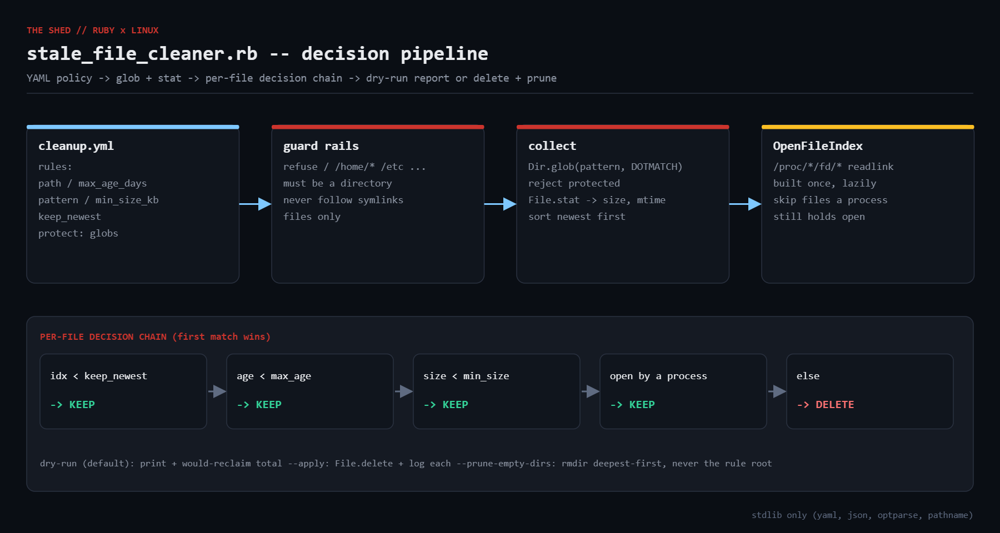

# stale-file-cleaner

Policy-driven stale-file cleanup for Linux, in one Ruby file. Replaces the
`find ... -mtime +N -delete` cron line with a YAML policy, dangerous-root guard
rails, an open-file check via `/proc/*/fd`, dry-run by default, and a report
that explains every KEEP/DELETE decision.



## Prerequisites

* Ruby 2.7+ (tested on 3.0.2) — stdlib only (`yaml`, `json`, `optparse`, `pathname`)
* Linux (`/proc/*/fd` is used for the open-file check)

## Usage

```bash
ruby stale_file_cleaner.rb --policy cleanup.yml                      # dry-run (default)
ruby stale_file_cleaner.rb --policy cleanup.yml --apply              # delete for real
ruby stale_file_cleaner.rb --policy cleanup.yml --apply --prune-empty-dirs
ruby stale_file_cleaner.rb --policy cleanup.yml --json               # audit report
```

Policy file:

```yaml
rules:
  - path: /var/tmp
    max_age_days: 14
    min_size_kb: 4
  - path: /var/log/myapp
    max_age_days: 30
    pattern: "**/*.log.*"       # rotated logs only
  - path: /srv/releases
    max_age_days: 45
    pattern: "**/build.tar"
    keep_newest: 5              # never fewer than 5 newest
protect:
  - "**/.git/**"
  - "**/*.pid"
```

Exit code is `0` when there were no errors, `1` otherwise.

## How it works

1. **Guard rails** — rule roots in `FORBIDDEN_ROOTS` (`/`, `/etc`, `/var`, ...)
   or matching `/home/<user>` are rejected. Symlinks are never followed.
2. **Collect** — `Dir.glob(pattern, FNM_DOTMATCH)`, regular files only,
   `protect` globs removed, `File.stat` for size/mtime, sorted newest-first.
3. **Decision chain** (first match wins): within `keep_newest` -> KEEP;
   younger than `max_age_days` -> KEEP; smaller than `min_size_kb` -> KEEP;
   open by any process -> KEEP; otherwise DELETE. Every KEEP records a reason.
4. **OpenFileIndex** readlinks `/proc/[0-9]*/fd/*` once (lazily) so files a
   process still holds open are skipped — deleting them would not free space.
5. **Execute** (`--apply`) deletes and logs each file; `--prune-empty-dirs`
   removes now-empty directories deepest-first, never the rule root.

## Example output

```
$ ruby stale_file_cleaner.rb --policy cleanup.yml
stale_file_cleaner  mode=dry-run  scanned=19
------------------------------------------------------------------------
DELETE     300.0KB   30.0d  /tmp/lab/logs/app.log.3
DELETE     300.0KB   40.0d  /tmp/lab/logs/app.log.4
DELETE     300.0KB   50.0d  /tmp/lab/logs/app.log.5
DELETE     300.0KB   60.0d  /tmp/lab/logs/app.log.6
DELETE     300.0KB   70.0d  /tmp/lab/logs/app.log.7
DELETE     700.0KB   36.0d  /tmp/lab/releases/r4/build.tar
DELETE     700.0KB   45.0d  /tmp/lab/releases/r5/build.tar
DELETE     700.0KB   54.0d  /tmp/lab/releases/r6/build.tar
DELETE     700.0KB   63.0d  /tmp/lab/releases/r7/build.tar
DELETE     700.0KB   72.0d  /tmp/lab/releases/r8/build.tar
DELETE       2.0MB   20.0d  /tmp/lab/tmp/old-upload.bin
------------------------------------------------------------------------
would reclaim 6.9MB across 11 file(s)
ERROR refusing to clean /home: too dangerous as a rule root
exit=1

$ ruby stale_file_cleaner.rb --policy cleanup.yml --apply --prune-empty-dirs
deleted /tmp/lab/tmp/old-upload.bin (2.0MB, 20.0d)
deleted /tmp/lab/logs/app.log.3 (300.0KB, 30.0d)
deleted /tmp/lab/logs/app.log.4 (300.0KB, 40.0d)
deleted /tmp/lab/logs/app.log.5 (300.0KB, 50.0d)
deleted /tmp/lab/logs/app.log.6 (300.0KB, 60.0d)
deleted /tmp/lab/logs/app.log.7 (300.0KB, 70.0d)
deleted /tmp/lab/releases/r4/build.tar (700.0KB, 36.0d)
deleted /tmp/lab/releases/r5/build.tar (700.0KB, 45.0d)
deleted /tmp/lab/releases/r6/build.tar (700.0KB, 54.0d)
deleted /tmp/lab/releases/r7/build.tar (700.0KB, 63.0d)
deleted /tmp/lab/releases/r8/build.tar (700.0KB, 72.0d)
pruned empty dir /tmp/lab/releases/r4
pruned empty dir /tmp/lab/releases/r5
pruned empty dir /tmp/lab/releases/r6
pruned empty dir /tmp/lab/releases/r7
pruned empty dir /tmp/lab/releases/r8
stale_file_cleaner  mode=apply  scanned=19
------------------------------------------------------------------------
DELETED    300.0KB   30.0d  /tmp/lab/logs/app.log.3
DELETED    300.0KB   40.0d  /tmp/lab/logs/app.log.4
DELETED    300.0KB   50.0d  /tmp/lab/logs/app.log.5
DELETED    300.0KB   60.0d  /tmp/lab/logs/app.log.6
DELETED    300.0KB   70.0d  /tmp/lab/logs/app.log.7
DELETED    700.0KB   36.0d  /tmp/lab/releases/r4/build.tar
DELETED    700.0KB   45.0d  /tmp/lab/releases/r5/build.tar
DELETED    700.0KB   54.0d  /tmp/lab/releases/r6/build.tar
DELETED    700.0KB   63.0d  /tmp/lab/releases/r7/build.tar
DELETED    700.0KB   72.0d  /tmp/lab/releases/r8/build.tar
DELETED      2.0MB   20.0d  /tmp/lab/tmp/old-upload.bin
------------------------------------------------------------------------
freed 6.9MB across 11 file(s), 0 failed
ERROR refusing to clean /home: too dangerous as a rule root
exit=1
```

The lab tree used above contains a file held open by `sleep`, a `.git`
directory, a `.pid` file, eight release tarballs and a deliberately dangerous
`/home` rule to demonstrate each safety check.

## Troubleshooting

* **"refusing to clean /var"** — intentional; target a subdirectory.
* **KEEP: still open by a process** — correct; find the holder with `lsof`.
* **`df` does not move after deleting** — another process holds a deleted file; `lsof +L1`.
* **Permission denied** — listed under `failed`, exit code 1, run continues.

## Extending

* Quarantine instead of delete, with a second rule purging the quarantine.
* `min_free_percent` so a rule only fires under disk pressure.
* Prometheus textfile metrics for bytes reclaimed per rule.
* `atime` support for caches.
* systemd timer with `ProtectSystem=strict` + `ReadWritePaths=`.

## References

* [Ruby Dir.glob](https://docs.ruby-lang.org/en/3.3/Dir.html#method-c-glob)
* [Ruby File::Stat](https://docs.ruby-lang.org/en/3.3/File/Stat.html)
* [Psych.safe_load](https://docs.ruby-lang.org/en/3.3/Psych.html#method-c-safe_load)
* [proc(5) — /proc/[pid]/fd](https://man7.org/linux/man-pages/man5/proc.5.html)
