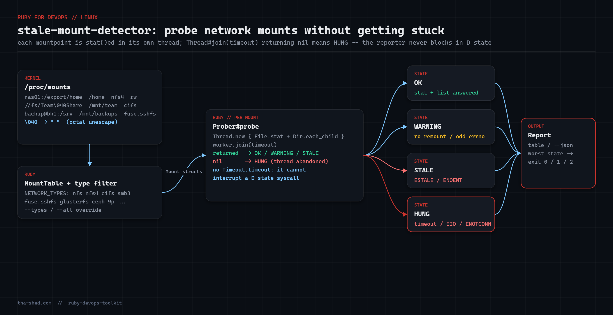

# stale-mount-detector

Find **hung or stale network mounts** (NFS, CIFS/SMB, SSHFS, GlusterFS, CephFS) *before* `df` hangs your monitoring agent.

A dead NFS server does not produce an error; it produces a process stuck in uninterruptible sleep (state `D`). Any tool that innocently `stat()`s the mountpoint — `df`, `ls`, your backup job, your Nagios check — joins it there. `stale_mount_detector.rb` reads `/proc/mounts`, keeps only network filesystems, and probes each mountpoint **in a separate thread with a hard timeout**, so a hung mount is reported as `HUNG` instead of hanging the reporter.



## Prerequisites

- Linux with `/proc/mounts`
- Ruby 2.7+ (stdlib only: `optparse`, `json`)
- No root required — `stat()` on a mountpoint works for any user

## Usage

```bash
ruby stale_mount_detector.rb                 # probe all network mounts
ruby stale_mount_detector.rb --timeout 3     # seconds per mount (default 5)
ruby stale_mount_detector.rb --json          # machine readable
ruby stale_mount_detector.rb --types nfs,nfs4,cifs
ruby stale_mount_detector.rb --all           # probe every mount, local too
ruby stale_mount_detector.rb --root ./fixture  # fake /proc/mounts for tests
```

Exit codes: `0` all OK · `1` at least one WARNING (read-only or odd errno) · `2` at least one HUNG or STALE · `3` mount table unreadable.

## How it works

1. **`MountTable.load`** parses `/proc/mounts`. Mountpoints containing spaces are octal-escaped in that file (`Team\040Share`), so it unescapes `\NNN` sequences — a gotcha that silently breaks most one-liners.
2. Mounts are filtered to `NETWORK_TYPES` (`nfs nfs4 cifs smb3 fuse.sshfs glusterfs ceph 9p …`) unless you pass `--all` or your own `--types`.
3. **`Prober#probe`** runs `touch(path)` — a `File.stat` plus one `Dir.each_child` — inside `Thread.new`, then waits with `Thread#join(timeout)`. If `join` returns `nil` the thread never came back: the mount is `HUNG`, and the thread is simply abandoned. The script deliberately does **not** use `Timeout.timeout`, which cannot interrupt a thread blocked in a D-state syscall.
4. Errno mapping: `ESTALE` → `STALE` (server export changed / rebooted), `ENOENT` → `STALE` (mountpoint dir gone), `EIO`/`ENOTCONN`/`EHOSTDOWN` → `HUNG`, `EACCES` → `OK` (the server answered, you just cannot list it). A responsive mount that is `ro` is downgraded to `WARNING` because read-only network mounts are usually the result of an unexpected remount.
5. **`Report`** collapses everything into a table or JSON and the worst state becomes the exit code.

On platforms without native threads (e.g. the ruby.wasm harness used for testing) `Thread.new` raises `NotImplementedError`; the prober catches that and probes synchronously. On real Linux the threaded path always runs.

## Example output

```
stale-mount-detector v1.0.0
STATE     LATENCY  TYPE        MOUNTPOINT                   DEVICE                               DETAIL
OK            0ms  nfs4        /home                        nas01:/export/home
WARNING       0ms  nfs         /mnt/archive                 nas02:/export/archive                mounted read-only
OK            0ms  cifs        /mnt/team                    //fileserver/Team Share
STALE         0ms  fuse.sshfs  /mnt/backups                 backup@bk1:/srv/backups              ENOENT: mountpoint directory missing

OK=2  WARNING=1  STALE=1
```

A real hung NFS mount shows up as `HUNG   5000ms  nfs4  /data  nas03:/export/data  no response in 5.0s (thread abandoned)`.

## Troubleshooting

- **The script itself hangs at exit** — Ruby waits for nothing at process exit, but a shell wrapper using `$(…)` may. Run it directly from cron/systemd, or add `exit!` semantics if you wrap it.
- **Everything reports `STALE ENOENT` under `--root`** — with `--root`, mountpoints are resolved *under* the fixture root (`fixture/mnt/team`), so create the directories you expect to be healthy.
- **CIFS mount shows `OK` but users complain** — `stat()` on the root of a CIFS share can be served from cache. Add a second probe that reads a known file, or lower `--timeout` and run more often.
- **`--json` says `"detail": null`** — that is the healthy case; only abnormal states carry a detail string.
- **How this was tested** — against a synthetic `/proc/mounts` with seven entries (ext4, proc, nfs4, ro nfs, CIFS with an escaped space, sshfs with a missing mountpoint, tmpfs) via `--root`, covering the OK / WARNING / STALE / bad-root paths and the `--types` / `--all` filters. A genuinely hung NFS server cannot be simulated in a fixture; that path relies on `Thread#join(timeout)` returning `nil`, which is standard Ruby behaviour.

## Extending

- Compare against `/etc/fstab` and report network mounts that *should* be mounted but are not.
- Add `--remount` to run `umount -l` + `mount` for `STALE` entries (log first, act only with `--really`).
- Export a Prometheus gauge per mount (`mount_probe_latency_ms`, `mount_state`) via the node_exporter textfile collector.
- Feed `latency_ms` into a time series to catch a NAS that is *slowing down* before it hangs.

## References

- [proc(5) — /proc/mounts format and octal escaping](https://man7.org/linux/man-pages/man5/proc.5.html)
- [nfs(5) — hard vs soft mounts, ESTALE](https://man7.org/linux/man-pages/man5/nfs.5.html)
- [Ruby `Thread#join` docs](https://docs.ruby-lang.org/en/3.3/Thread.html#method-i-join)
- [Ruby `Errno` docs](https://docs.ruby-lang.org/en/3.3/Errno.html)
