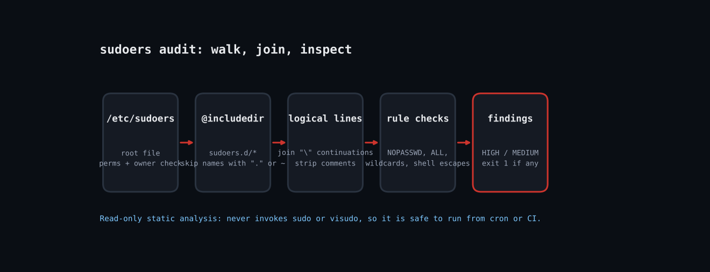

# Audit sudoers for Passwordless Root and Shell Escapes with Ruby



Sudo rules accumulate. A deploy user gets `NOPASSWD: ALL` for a Friday release, someone allows `vim` so an editor can touch one config, a wildcard sneaks into a path. Each of those is effectively unrestricted root. `visudo -c` only checks syntax, not safety. This script does static analysis: it follows `@includedir`, mimics sudo's file-name rules, and reports findings by severity with a CI-friendly exit code. It never runs sudo.

Blog post: https://tha-shed.com (search "Audit sudoers for Passwordless Root and Shell Escapes with Ruby")

## Prerequisites
- Ruby 2.7+ (tested on 3.3.6), stdlib only.
- Linux with sudo installed. Run as root to read `/etc/sudoers` (mode 0440).
- Use `--file` to audit a copy of someone else's sudoers tree safely.

## Usage
```
sudo ruby sudoers_audit.rb
sudo ruby sudoers_audit.rb --json > findings.json
ruby sudoers_audit.rb -f ./copy/sudoers
```

## How it works
1. **Walk includes recursively**: `walk` follows `#include`, `@include`, `#includedir` and `@includedir`, tracks visited files, and caps depth at 10. Files in a drop-in directory whose names contain a dot or end in `~` are skipped, exactly like sudo does.
2. **Join logical lines**: Backslash continuations are joined and trailing comments stripped so a rule split across lines is analysed as one.
3. **Check file ownership and mode**: Sudoers files must be owned by root and not group/world writable. A 0666 drop-in is an instant HIGH finding.
4. **Pattern-check each rule**: NOPASSWD plus ALL is HIGH; NOPASSWD alone is MEDIUM; full ALL for a non-admin user is MEDIUM; wildcards and editors/interpreters (vim, find, python, ruby, bash, less) are HIGH because they allow a root shell escape.
5. **Sort and exit**: Findings sort HIGH first. Exit 1 if any HIGH/MEDIUM, so a nightly CI job can fail loudly.

## Example output
```
HIGH   nopasswd-all     fixture/sudoers.d/10-deploy:1  deploy: passwordless ALL
HIGH   wildcard-cmd     fixture/sudoers.d/20-webops:1  webops: wildcard in command (arg injection risk)
HIGH   shell-escape     fixture/sudoers.d/20-webops:1  webops: vim allows shell escape to root
HIGH   world-writable   fixture/sudoers.d/30-bob:0  mode 0666
MEDIUM weak-defaults    fixture/sudoers:2  Defaults !use_pty
MEDIUM unexpected-all   fixture/sudoers.d/10-deploy:1  deploy: full ALL access
MEDIUM nopasswd         fixture/sudoers.d/20-webops:1  webops: NOPASSWD rule
MEDIUM group-writable   fixture/sudoers.d/30-bob:0  mode 0666
MEDIUM unexpected-all   fixture/sudoers.d/30-bob:1  bob: full ALL access

4 high, 5 medium
exit code: 1
```

## Troubleshooting
- **cannot read /etc/sudoers:** run with sudo, or point `--file` at a copy.
- **False positives:** the checks are heuristic regexes. A flagged `find` rule is only exploitable if `-exec` is allowed; review before removing.
- **Aliases are not expanded:** `Cmnd_Alias` definitions are skipped, so a rule using an alias may hide a risky command (see Extending).
- **Testing note:** verified against a fixture tree (root file plus three drop-ins, one chmod 0666) in the Linux sandbox.

## Extending
- Expand `Cmnd_Alias` and `User_Alias` before checking rules.
- Compare findings to an approved baseline JSON and only alert on new ones.
- Check `sudo -l -U user` output for effective rights.
- Ship results to your SIEM as JSON with `--json`.

## References
- [sudoers(5) manual](https://www.sudo.ws/docs/man/sudoers.man/)
- [GTFOBins](https://gtfobins.github.io/)
- [Ruby File::Stat](https://docs.ruby-lang.org/en/master/File/Stat.html)
