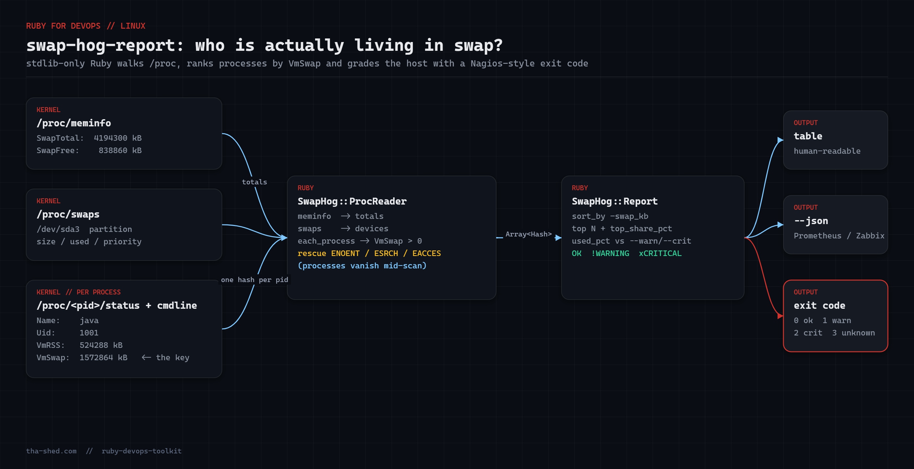

# swap-hog-report

Find out **which processes are living in swap**, not just that swap is "80% used".

`free -m` tells you swap is nearly full. It does not tell you that a leaky Java heap and a forgotten Redis instance own 90% of it. `swap_hog_report.rb` walks `/proc`, reads `VmSwap` from every `/proc/<pid>/status`, and prints a ranked report with system-wide swap usage, swap devices, and a health verdict with a Nagios/systemd-friendly exit code.



## Prerequisites

- Linux (anything with a `/proc` filesystem — kernel 2.6.34+ exposes `VmSwap`)
- Ruby 2.7 or newer (stdlib only: `optparse`, `json` — no gems)
- Run as root to see every process; as a normal user you still get system-wide totals plus your own processes

## Usage

```bash
ruby swap_hog_report.rb                  # top 10 swap consumers
ruby swap_hog_report.rb --top 25         # top 25
ruby swap_hog_report.rb --json           # machine-readable output
ruby swap_hog_report.rb --warn 60 --crit 85
ruby swap_hog_report.rb --min-kb 10240   # ignore anything under 10 MiB
ruby swap_hog_report.rb --root ./fixture # read a fake /proc tree (tests)
```

Exit codes: `0` OK, `1` WARNING, `2` CRITICAL, `3` UNKNOWN (no swap configured, `/proc` unreadable).

## How it works

1. **`ProcReader#meminfo`** parses `/proc/meminfo` into a hash — `SwapTotal` and `SwapFree` give the system-wide picture.
2. **`ProcReader#swaps`** parses `/proc/swaps` (skipping the header row) so the report can show *which* device or file is absorbing the pressure and at what priority.
3. **`ProcReader#each_process`** iterates every numeric directory in `/proc`, reads `status`, and keeps only processes with `VmSwap > 0`. Every read is wrapped in `rescue Errno::ENOENT, Errno::ESRCH, Errno::EACCES` because processes exit between the moment you list `/proc` and the moment you open their files — a classic race that crashes naive scripts.
4. **`Report`** sorts by `swap_kb` descending, computes `used_pct`, and works out `top_share_pct` — how much of the used swap the top N explain. A high share means "one hog"; a low share means "death by a thousand daemons", which needs a different fix (more RAM, not a restart).
5. **`Format.table`** / `--json` render the result; `exit_code` maps the verdict to 0/1/2/3.

Reading `cmdline` uses `File.binread` and splits on `\0`, because arguments are NUL-separated in `/proc/<pid>/cmdline`. Kernel threads have an empty cmdline, so the report falls back to `[Name]`.

## Example output

```
swap-hog-report v1.0.0  status=CRITICAL
swap: 3.2 GiB used of 4.0 GiB (80.0%)  free 819.2 MiB
  /dev/sda3                    partition    3.2 GiB used / 4.0 GiB    prio -2

PID     UID    NAME                        SWAP         RSS  CMD
1337    1001   java                     1.5 GiB   512.0 MiB  /usr/bin/java -Xmx4g -jar app.jar
842     109    redis-server             1.2 GiB    20.0 MiB  /usr/bin/redis-server *:6379
2210    113    postgres               256.0 MiB    96.0 MiB  postgres: checkpointer
2300    33     gunicorn               128.0 MiB    64.0 MiB  gunicorn: worker [app]

top 4 processes account for 97.7% of used swap (5 swapping processes total)
```

With `--json` you get the same data as an object (`status`, `swap`, `devices`, `top_share_pct`, `processes`) ready for Prometheus textfile collectors, Zabbix, or a log shipper.

## Troubleshooting

- **Only your own processes appear** — `/proc/<pid>/status` is world-readable, but on hardened kernels with `hidepid=2` on `/proc` you only see your own PIDs. Run as root or from a shell without the restriction.
- **`status=UNKNOWN` and totals are 0** — no swap is configured (`SwapTotal: 0`). That is valid; the script exits 3 so monitoring can distinguish "no swap" from "swap fine".
- **`UNKNOWN: no /proc under "..."`** — you passed `--root` to a directory with no `proc/` subfolder, or you are not on Linux.
- **Numbers don't match `smem`** — `VmSwap` counts anonymous pages the process swapped out; shared/`tmpfs` pages that were swapped are attributed differently. For most "who is eating swap" questions `VmSwap` is the right number.
- **How this was tested** — the script was exercised against a synthetic `/proc` tree (7 fake processes, one swap partition) using the `--root` flag, plus the `--json` and bad-root paths. It reads only files and needs no privileges, so the fixture exercises the exact same code path as production.

## Extending

- Add a `--kill-above MB` flag that sends `SIGTERM` to processes above a threshold (log first, kill only with `--really`).
- Emit Prometheus textfile format (`swap_hog_bytes{pid="1337",name="java"} 1610612736`) for node_exporter.
- Cross-reference `Uid` with `/etc/passwd` via `Etc.getpwuid` to show user names instead of numbers.
- Run it under a systemd timer and page only when `top_share_pct > 70` — a single hog is actionable, a diffuse spread is a capacity problem.

## References

- [proc(5) man page — /proc/[pid]/status, /proc/meminfo, /proc/swaps](https://man7.org/linux/man-pages/man5/proc.5.html)
- [Ruby `File` class docs](https://docs.ruby-lang.org/en/3.3/File.html)
- [Ruby `OptionParser` docs](https://docs.ruby-lang.org/en/3.3/OptionParser.html)
- [Nagios plugin return codes](https://nagios-plugins.org/doc/guidelines.html#AEN78)
