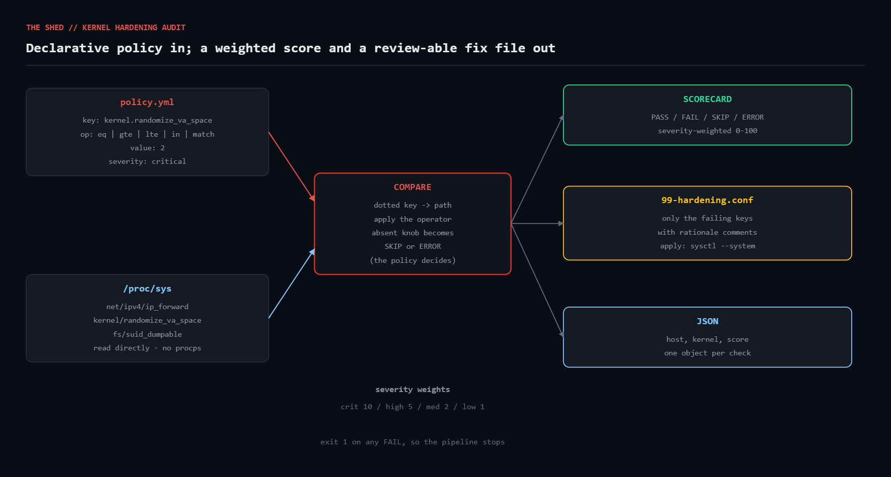

# sysctl-hardening-audit

Audit Linux kernel parameters against a declarative YAML hardening policy.
Reads live values straight out of `/proc/sys`, compares each one with a
per-check operator, produces a severity-weighted score, and can emit a
ready-to-review `/etc/sysctl.d/` drop-in containing exactly the fixes needed.



## The problem

Every hardening standard — CIS, DISA STIG, your own wiki page — eventually
reduces to a list of `/proc/sys` knobs that must hold particular values. Setting
them is trivial. *Keeping* them set is not.

Kernel parameters drift for boring reasons. A kernel upgrade ships a new
default. A container runtime flips `net.ipv4.ip_forward` on and never puts it
back. A host was hardened by hand in 2023, rebooted in 2024, and nobody noticed
that the values were never written to `/etc/sysctl.d/`. `sysctl -w` succeeds
silently and survives exactly until the next reboot.

The failure mode is that nothing tells you. There is no log line for "ASLR is
now partial". You find out during an audit, or you do not find out at all.

## Prerequisites

| Requirement | Notes |
|---|---|
| Ruby | >= 2.7 (endless methods, `filter_map`). Tested on 3.0.2. |
| Gems | None. Stdlib only (`yaml`, `json`, `optparse`, `fileutils`). |
| OS | Linux with `/proc/sys` mounted. |
| Privileges | Reading is unprivileged. A handful of knobs are root-only; those report `ERROR` with the reason rather than failing the run. |

Note that `procps` is **not** required — the script reads the filesystem
directly, which is all `sysctl` itself does.

## Usage

```bash
# Audit against a policy
ruby sysctl_audit.rb --policy policy.yml

# Only the things that will get you fired
ruby sysctl_audit.rb --policy policy.yml --min-severity high

# JSON for a log pipeline or a dashboard
ruby sysctl_audit.rb --policy policy.yml --json

# Write a drop-in with just the failing keys, then review it before applying
ruby sysctl_audit.rb --policy policy.yml --remediate 99-hardening.conf
sudo cp 99-hardening.conf /etc/sysctl.d/ && sudo sysctl --system

# Point at a fixture tree instead of the live kernel (CI, unit tests)
ruby sysctl_audit.rb --policy policy.yml --root ./fixtures/proc
```

Exit codes: `0` fully compliant, `1` at least one `FAIL`, `2` the audit could
not run.

## Policy format

```yaml
name: baseline-linux-server-v1

checks:
  - key: kernel.randomize_va_space
    op: eq                 # eq | ne | gte | lte | in | match
    value: 2
    severity: critical     # low | medium | high | critical
    title: Full ASLR enabled
    rationale: full address space randomisation is the cheapest exploit mitigation there is

  - key: net.ipv4.conf.all.rp_filter
    op: in
    value: [1, 2]          # strict or loose reverse-path filtering both acceptable

  - key: kernel.unprivileged_bpf_disabled
    op: gte
    value: 1
    severity: high
    skip_if_absent: true   # older kernels do not have this knob
```

## How it works

### Reading the kernel

`sysctl -a` is a thin wrapper over `/proc/sys`. Going straight to the
filesystem removes the `procps` dependency and — usefully — makes the reader
trivially mockable: the dotted key is just a path.

```ruby
def path_for(key) = File.join(@root, key.tr('.', '/'))
# net.ipv4.ip_forward -> /proc/sys/net/ipv4/ip_forward
```

`--root ./fixtures/proc` swaps in a directory tree of plain files, so the whole
comparison engine can be exercised in CI without root, without a real kernel,
and without mutating anything.

Multi-value knobs (`net.ipv4.tcp_rmem` is three tab-separated integers) get
their whitespace squeezed to single spaces so comparisons are stable across
kernels that pad differently.

### Operators as a lookup table

Keeping the comparisons in a hash of lambdas rather than a `case` statement
buried in the auditor means adding an operator is a one-line change, and the
policy file can name any of them:

```ruby
HANDLERS = {
  'eq'    => ->(actual, want) { numeric?(actual, want) ? f(actual) == f(want) : actual == want.to_s },
  'gte'   => ->(actual, want) { f(actual) >= f(want) },
  'in'    => ->(actual, want) { Array(want).map(&:to_s).include?(actual) },
  'match' => ->(actual, want) { Regexp.new(want.to_s) =~ actual ? true : false }
}
```

`eq` deliberately compares numerically when both sides look numeric, so `1` and
`1.0` and `"1"` all agree, and falls back to string comparison for knobs like
`kernel.core_pattern`.

### Absent knobs are a policy decision, not an error

A knob can be legitimately missing: IPv6 compiled out, a module not loaded, a
container without the netfilter namespace, a kernel too old to have
`unprivileged_bpf_disabled`. Whether that is acceptable is not something the
script can know, so the policy author declares it:

```ruby
rescue ProcSysReader::Missing => e
  Result.new(status: check.skip_if_absent ? 'SKIP' : 'ERROR', ...)
```

`SKIP` results are excluded from the score entirely — scoring a host down for a
check that could never apply to it produces numbers nobody trusts.

### Severity-weighted scoring

A flat pass percentage lets ten trivial misses look worse than one critical
one. Weighting fixes that:

```ruby
WEIGHT = { 'critical' => 10, 'high' => 5, 'medium' => 2, 'low' => 1 }
```

The score is earned weight over total weight, so missing `randomize_va_space`
costs ten times what missing `log_martians` does.

### Remediation as a reviewable file

The script never calls `sysctl -w`. It writes a drop-in containing only the
failing keys, each preceded by its severity, title and rationale as comments,
sorted so the critical fixes are at the top. That file goes through code review
like anything else, and it applies with `sysctl --system` — which also means it
survives the next reboot, unlike the `sysctl -w` loop it replaces.

## Example output

Run against a live 6.8 kernel:

```
==============================================================================
  KERNEL HARDENING AUDIT -- baseline-linux-server-v1
  host=claude kernel=6.8.0-136-generic 2026-08-18 14:32:10
==============================================================================
  STATE  SEV      PARAMETER                          EXPECTED     ACTUAL
------------------------------------------------------------------------------
  [FAIL] high     net.ipv4.conf.all.accept_redirects == 0         1
         reason: accepting redirects lets an attacker on the LAN reroute your traffic
         fix:    net.ipv4.conf.all.accept_redirects = 0
  [FAIL] medium   net.ipv6.conf.all.accept_redirects == 0         1
         reason: same pivot risk as IPv4 redirects
         fix:    net.ipv6.conf.all.accept_redirects = 0
  [FAIL] low      net.ipv4.conf.all.log_martians     == 1         0
         reason: gives you evidence of spoofing attempts in the kernel log
         fix:    net.ipv4.conf.all.log_martians = 1
  [PASS] critical kernel.randomize_va_space          == 2         2
  [PASS] high     fs.suid_dumpable                   == 0         0
  [PASS] high     kernel.unprivileged_bpf_disabled   >= 1         2
  [PASS] high     net.ipv4.conf.all.accept_source_ro == 0         0
  [PASS] high     net.ipv4.ip_forward                == 0         0
  [PASS] medium   fs.protected_hardlinks             == 1         1
  [PASS] medium   fs.protected_symlinks              == 1         1
  [PASS] medium   kernel.dmesg_restrict              == 1         1
  [PASS] medium   kernel.kptr_restrict               >= 1         1
  [PASS] medium   net.ipv4.conf.all.rp_filter        one of 1|2   2
  [PASS] medium   net.ipv4.tcp_syncookies            == 1         1
------------------------------------------------------------------------------
  score: 84/100 (severity weighted)   pass=11  fail=3  skip=0  error=0
==============================================================================
```

The generated drop-in for that run:

```
# Generated by sysctl_audit 1.0.0 on 2026-08-18
# Policy: baseline-linux-server-v1  Host: claude
# Review before deploying. Apply with: sudo sysctl --system

# [high] ICMP redirects rejected
#   accepting redirects lets an attacker on the LAN reroute your traffic
net.ipv4.conf.all.accept_redirects = 0

# [medium] IPv6 ICMP redirects rejected
#   same pivot risk as IPv4 redirects
net.ipv6.conf.all.accept_redirects = 0

# [low] Martian packets logged
#   gives you evidence of spoofing attempts in the kernel log
net.ipv4.conf.all.log_martians = 1
```

## Troubleshooting

**Everything reports `ERROR` with "not present".** You pointed `--root` at a
tree that does not contain the knobs, or `/proc` is not mounted. Confirm with
`ls /proc/sys/kernel/randomize_va_space`.

**A check reports `ERROR` for a knob that clearly exists.** Some knobs are
mode `0600` and root-only (`kernel.unprivileged_bpf_disabled` on some
distributions). The reader distinguishes "missing" from "not readable by uid N"
in the message — read it before assuming the kernel is at fault.

**A fix I applied with `sysctl -w` reverted after reboot.** That is `sysctl -w`
working as designed; it only writes the running kernel. Use `--remediate` and
drop the file in `/etc/sysctl.d/`.

**`net.ipv4.conf.all.*` is set but a specific interface still misbehaves.**
`all` and the per-interface knob are combined, and for several parameters the
kernel takes the **maximum**, not the `all` value. Add per-interface checks
(`net.ipv4.conf.eth0.accept_redirects`) if you need certainty.

**The score moved without any check changing.** Adding a `critical` check to
the policy changes the denominator. Version your policy (`name:`) and compare
scores only within the same version.

## Extending

- **Ship the CIS list.** The included `policy.yml` is a starting baseline;
  the CIS Benchmark section 3 knobs map onto this format one-to-one.
- **Per-role policies.** Deep-merge `common.yml` with `role-router.yml` so a
  genuine router can override `ip_forward` to `1` without weakening every host.
- **Drift over time.** Store the JSON output per run and alert on the score
  falling, which catches regressions faster than an absolute threshold.
- **Other config surfaces.** The `Check`/`Operators`/`Report` split is not
  sysctl-specific; swapping `ProcSysReader` for a reader over `/sys/module/*`
  parameters or systemd unit properties reuses everything else.
- **Ansible/Puppet handoff.** Emit the failures as a task list rather than a
  conf file if your fleet is already config-managed.

## References

- [`sysctl(8)`](https://man7.org/linux/man-pages/man8/sysctl.8.html) and [`sysctl.d(5)`](https://man7.org/linux/man-pages/man5/sysctl.d.html)
- [`proc(5)` — /proc/sys hierarchy](https://man7.org/linux/man-pages/man5/proc.5.html)
- [Linux kernel docs: sysctl/kernel.rst](https://docs.kernel.org/admin-guide/sysctl/kernel.html)
- [Linux kernel docs: networking ip-sysctl](https://docs.kernel.org/networking/ip-sysctl.html)
- [CIS Benchmarks](https://www.cisecurity.org/cis-benchmarks)
- [Ruby `Struct` with `keyword_init`](https://docs.ruby-lang.org/en/master/Struct.html)

## License

MIT — see the repository root.
