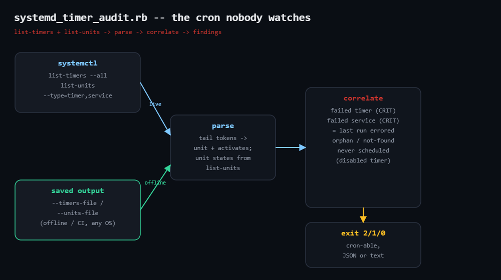

# systemd-timer-audit

Inventories and audits systemd timers — the modern replacement for cron that
inherited none of cron's habit of mailing you when a job fails. Surfaces failed
timers, failed timer-driven services (the last run errored), and timers that
aren't scheduled to run at all. Stdlib only, no D-Bus.



## Prerequisites

- Ruby 2.7+; standard library only (`json`, `optparse`, `open3`)
- A systemd host for live mode (shells out to `systemctl`)
- Any OS for the analysis: capture the tables and pass `--timers-file` /
  `--units-file`

## Usage

```bash
ruby systemd_timer_audit.rb                  # audit the live system
ruby systemd_timer_audit.rb --json
ruby systemd_timer_audit.rb \
  --timers-file timers.txt --units-file units.txt   # offline / CI
```

Capture inputs for offline mode:

```bash
systemctl list-timers --all --no-legend                    > timers.txt
systemctl list-units --type=timer,service --all --no-legend > units.txt
```

Exit codes: `0` clean · `1` warnings · `2` at least one CRIT.

## How it works

1. **Read systemd's own tables** — runs `systemctl list-timers` and
   `systemctl list-units` via `Open3` (or reads saved output). No libsystemd,
   no D-Bus, trivially mockable.
2. **Parse the timers table** — locates the `.timer` token, takes the next
   token as the activated unit, treats a leading `-` as "no next elapse".
   `list-units` supplies each unit's LOAD/ACTIVE/SUB state.
3. **Correlate** — failed timer (CRIT, won't run), failed target service
   (CRIT, last run errored), loaded-but-not-scheduled timer (WARN). A defensive
   pass catches failed services with a sibling `.timer`.

## Example output (captured tables)

```
systemd_timer_audit: 4 timers, 8 units seen
CRIT failed-service         backup.service                   service activated by backup.timer is failed
CRIT failed-timer           fstrim.timer                     timer unit is in failed state
WARN not-scheduled          certbot.timer                    timer has no next elapse (disabled or missing OnCalendar?)
2 CRIT, 1 WARN
```

## Troubleshooting

- **"could not gather systemd data"** — non-systemd host or a container with no
  system bus; capture the tables elsewhere and use the file flags.
- **not-scheduled on a deliberately disabled timer** — expected (WARN, not
  CRIT); filter the unit if it's meant to be dormant.
- **Locale-translated output** — `--no-legend` avoids header parsing; run under
  `LC_ALL=C` if your locale reformats columns.
- **Transient units** — `systemd-run` timers come and go; treat single-run
  findings accordingly.

## Extending

- Parse unit files and warn when a daily timer lacks `Persistent=true`.
- Flag timers whose LAST run is older than their interval.
- Emit failing units for your alerting, or generate `OnFailure=` drop-ins.
- Fleet mode over SSH; aggregate the JSON by finding code.

## References

- Blog post: https://tha-shed.com/ (Ruby for DevOps series)
- systemd.timer(5): https://www.freedesktop.org/software/systemd/man/latest/systemd.timer.html
- systemctl(1): https://www.freedesktop.org/software/systemd/man/latest/systemctl.html
- Ruby stdlib `Open3`: https://docs.ruby-lang.org/en/3.3/Open3.html
