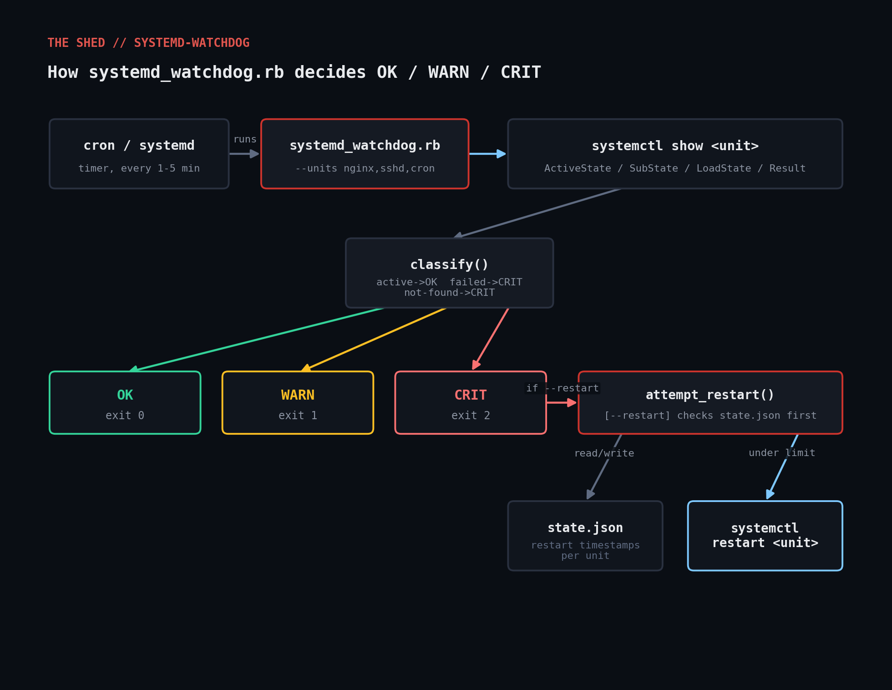

# systemd-watchdog

Watches a list of systemd units, classifies each as **OK / WARN / CRIT**, and
(optionally) auto-restarts CRIT units through a rate limiter that refuses to
restart the same unit more than `--max-restarts` times within a trailing
`--window` — so a crash-looping service can't be restarted into oblivion by
cron.



## Why

`systemctl status` is fine for a human staring at one box, but it isn't
machine-readable, and it does nothing to stop a crash-looping service from
being restarted forever by a naive `systemctl restart` wrapped in a cron job.
This script gives you a Nagios/cron-friendly exit code (0/1/2) and a restart
path that's safe to point at production.

## Prerequisites

- Ruby 2.7+ (tested on 3.0.2) — standard library only: `optparse`, `open3`,
  `json`, `fileutils`. No gems.
- A Linux host running systemd (`systemctl` on `PATH`).
- Permission to run `systemctl show` (unprivileged is fine), and — if you use
  `--restart` — permission to run `systemctl restart <unit>` for the units
  you're watching (typically via a scoped sudoers rule or polkit).

## Usage

```bash
# Basic health check
ruby systemd_watchdog.rb --units nginx,sshd,cron

# JSON output for a monitoring pipeline
ruby systemd_watchdog.rb --units nginx --json

# Auto-restart CRIT units, at most 3 times per 10-minute window
ruby systemd_watchdog.rb --units nginx,sshd --restart --max-restarts 3 --window 600

# See what would be restarted without doing it
ruby systemd_watchdog.rb --units nginx --restart --dry-run
```

Exit codes: `0` = all units OK, `1` = at least one WARN, `2` = at least one
CRIT. `3` = usage error (e.g. missing `--units`).

## How it works

1. **`show_properties`** runs `systemctl show <unit> -p ActiveState -p SubState -p LoadState -p Result`
   per unit via `Open3.capture3` and parses the `Key=Value` output.
2. **`classify`** turns that into `:ok` / `:warn` / `:crit`. It's
   deliberately conservative: anything not explicitly recognized is `:warn`,
   never a silent `:ok`. `failed` and `LoadState=not-found` are always
   `:crit`; `inactive` is only `:crit` if systemd itself recorded a
   non-success `Result` for the last run (plenty of oneshot/timer units are
   *supposed* to be inactive between runs).
3. **`attempt_restart`** (only when `--restart` is set) reads a small JSON
   state file of past restart timestamps per unit, drops entries older than
   `--window`, and only restarts if there are fewer than `--max-restarts`
   left. `--dry-run` exercises the exact same rate-limit logic without ever
   calling `systemctl restart`.

## Example output

```
$ ruby systemd_watchdog.rb --units cron,ssh,apparmor,this-unit-does-not-exist
OK   cron                 cron is active (running)
OK   ssh                  ssh is active (running)
OK   apparmor             apparmor is active (exited)
CRIT this-unit-does-not-exist this-unit-does-not-exist unit file not found

overall: crit
$ echo $?
2
```

## Testing notes

The OK/WARN path (`show_properties` + `classify`) was tested live against
this environment's real systemd instance (`cron`, `ssh`, `apparmor` units,
plus an intentionally nonexistent unit). Putting a unit into a real `failed`
state and exercising the restart/rate-limit path requires root and a
writable `/etc/systemd/system`, which wasn't available here — so that path
(`attempt_restart`, the rate limiter, dry-run) is fully unit-tested in
`systemd_watchdog_test.rb` by monkey-patching `Open3.capture3` to return the
exact text systemctl prints for a failed unit, then driving the same private
methods a real CRIT event would hit.

```
$ ruby systemd_watchdog_test.rb
PASS  healthy unit classifies as :ok
PASS  failed unit classifies as :crit and gets restarted
PASS  rate limiter refuses restart #4 within the window
PASS  dry-run mode logs but does not restart
PASS  unit that does not exist (not-found) classifies as :crit

ALL TESTS PASSED
```

## Troubleshooting

- **"systemctl show <unit> failed" / empty properties** — usually a
  typo'd unit name or a template unit needing an instance suffix
  (`getty@tty1.service`, not `getty@.service`).
- **Restarts never happen with `--restart`** — check the state file
  (default `$TMPDIR/systemd_watchdog_state.json`, override with
  `--state-file`); if it already has `--max-restarts` timestamps inside the
  window, that's the rate limiter working as designed.
- **Permission denied on `systemctl restart`** — this script does not
  attempt to sudo/escalate itself; grant restart permission at the
  cron/systemd-timer level with a narrow sudoers/polkit rule.

## Extending

- Add a `--webhook URL` flag to POST a JSON summary on any CRIT.
- Read the unit list from a YAML/JSON config file instead of `--units`.
- Emit Prometheus textfile-collector metrics (pairs well with
  [`prometheus-exporter`](../prometheus-exporter) in this repo).
- Track the `Result` value at restart time in the state file for
  post-incident review.

## References

- [systemctl(1) — `show` command](https://www.freedesktop.org/software/systemd/man/latest/systemctl.html#show%20PATTERN%E2%80%A6%7CJOB%E2%80%A6)
- [Ruby stdlib: Open3](https://ruby-doc.org/stdlib/libdoc/open3/rdoc/Open3.html)
