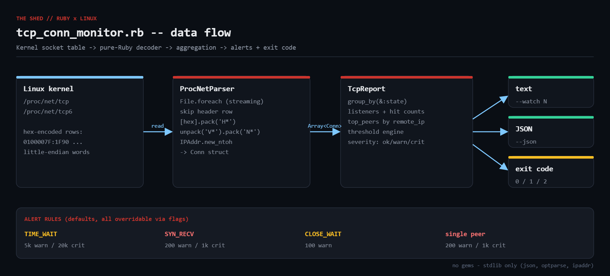

# tcp-conn-monitor

Pure-Ruby TCP connection-state monitor for Linux. Reads `/proc/net/tcp` and
`/proc/net/tcp6` directly (no `ss`, no `netstat`, no gems) and reports state
counts, per-port hit counts, the noisiest remote peers, threshold alerts and a
cron/Nagios-friendly exit code.



## Prerequisites

* Ruby 2.7+ (tested on 3.0.2) — stdlib only (`json`, `optparse`, `ipaddr`)
* Linux with `/proc` mounted. Root is **not** required.

## Usage

```bash
ruby tcp_conn_monitor.rb                  # human-readable report
ruby tcp_conn_monitor.rb --json           # JSON for your log pipeline
ruby tcp_conn_monitor.rb --top 5          # show top 5 ports/peers
ruby tcp_conn_monitor.rb --watch 10       # live view, refresh every 10 s
ruby tcp_conn_monitor.rb --time-wait-warn 8000 --peer-crit 2000   # tune thresholds
ruby tcp_conn_monitor.rb --proc-dir ./fixtures   # read a fake /proc for testing
```

Exit codes: `0` healthy, `1` warning threshold breached, `2` critical.

## How it works

1. **ProcNetParser** streams both tables with `File.foreach`, skips the header,
   and splits each row. Field 1/2 are local/remote `HEXADDR:HEXPORT`, field 3 is
   the state code, field 7 the UID, field 9 the inode.
2. **decode_addr** turns `0100007F:1F90` into `127.0.0.1`, `8080`:
   `[hex].pack('H*')` -> bytes, `unpack('V*').pack('N*')` byte-swaps each
   little-endian word, `IPAddr.new_ntoh` builds the address. IPv4-mapped IPv6
   addresses are collapsed to plain IPv4.
3. **TcpReport** aggregates with `group_by`: state counts, listeners with live
   connection counts, top peers with per-state breakdown.
4. **alerts** compares against `DEFAULT_THRESHOLDS` (every key is also a CLI
   flag) and yields `[:ok|:warn|:crit, messages]`, which drives the exit code.

## Example output

```
$ ruby tcp_conn_monitor.rb --proc-dir /tmp/fakeproc --top 5
TCP connection report  claude  2026-09-09T14:49:52Z
================================================================
STATE           COUNT
TIME_WAIT        6200
ESTABLISHED       344
SYN_RECV          250
CLOSE_WAIT        120
LISTEN              4
TOTAL            6918

PORT   BIND                       UID  CONNS
443    0.0.0.0                     33   6790
5432   127.0.0.1                  105    120
22     0.0.0.0                      0      3
80     ::                           0      1

REMOTE PEER                               CONNS  STATES
198.51.100.7                                340  ESTABLISHED=340
203.0.113.24                                176  TIME_WAIT=176
203.0.113.11                                175  TIME_WAIT=175
203.0.113.26                                173  TIME_WAIT=173
203.0.113.34                                172  TIME_WAIT=172

severity: WARN
  WARN TIME_WAIT=6200 (consider keep-alive / net.ipv4.tcp_tw_reuse)
  WARN SYN_RECV=250 (half-open backlog growing)
  WARN CLOSE_WAIT=120 (application is not closing sockets)
  WARN peer 198.51.100.7 holds 340 connections
$ echo exit=$?
exit=1
```

(The fixture used above contains 6,200 TIME_WAIT sockets, a 340-connection
peer, a SYN_RECV spike and a CLOSE_WAIT leak so every alert branch fires.)

## Troubleshooting

* **Addresses decode as garbage** — big-endian host; drop the `V*`/`N*` swap.
* **`/proc/net/tcp6` missing** — IPv6 disabled; the script skips it.
* **Counts lower than `ss -s`** — `ss -s` includes UDP/RAW/UNIX; compare with `ss -tan | wc -l`.
* **Empty table in a container** — `/proc/net` is per network namespace; run on the host.

## Extending

* Map the inode column to PIDs via `/proc/*/fd` to show the owning process.
* `--prometheus` output for the node_exporter textfile collector.
* Diff two samples to compute connection churn per second.
* Reverse-DNS / GeoIP enrichment of top peers.
* Webhook notification when severity crosses into crit.

## References

* [proc(5) — /proc/net/tcp](https://man7.org/linux/man-pages/man5/proc.5.html)
* [Ruby pack/unpack](https://docs.ruby-lang.org/en/3.3/packed_data_rdoc.html)
* [Ruby IPAddr](https://docs.ruby-lang.org/en/3.3/IPAddr.html)
* [tcp_states.h](https://github.com/torvalds/linux/blob/master/include/net/tcp_states.h)
