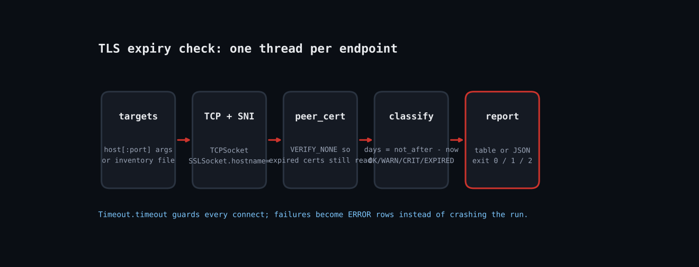

# Never Get Paged for an Expired Cert: A TLS Expiry Monitor in Ruby



Every sysadmin has been bitten by an expired certificate: the renewal job failed silently, nobody noticed, and one morning a load balancer starts throwing handshake errors. Monitoring suites can catch this, but a 70-line Ruby script gives you the same protection anywhere there is a cron job or CI runner. It reads the certificate the server actually presents (not the one on disk), computes days remaining, and exits with a Nagios-style code so any scheduler can alert on it.

Blog post: https://tha-shed.com (search "Never Get Paged for an Expired Cert: A TLS Expiry Monitor in Ruby")

## Prerequisites
- Ruby 2.7 or newer (tested on 3.3.6). No gems: only `socket`, `openssl`, `optparse`, `json` and `timeout` from the standard library.
- Any OS: Linux, macOS or Windows (RubyInstaller).
- Outbound network access to the ports you are checking.

## Usage
```
ruby tls_cert_expiry.rb -w 30 -c 14 example.com:443 api.example.com
ruby tls_cert_expiry.rb --json internal.lan:8443
```

## How it works
1. **Connect with SNI**: `ssl.hostname = host` sends Server Name Indication. Without it, shared hosts return a default certificate and you report on the wrong site.
2. **Disable verification on purpose**: `VERIFY_NONE` looks alarming, but a monitor must read expired and self-signed certs rather than fail the handshake. We only read `peer_cert`; no data is sent.
3. **Compute days remaining**: `(not_after - now) / 86400` floored. Negative means already expired. `classify` maps the number to OK / WARNING / CRITICAL / EXPIRED using the `--warn` and `--crit` thresholds.
4. **Run endpoints in parallel**: One `Thread` per target, wrapped in `Timeout.timeout`, so one dead host cannot block the others. Failures become ERROR rows.
5. **Report and exit**: Results are sorted most-urgent first. Exit 0 = all OK, 1 = warning, 2 = critical/expired/error, so cron or Nagios can alert without parsing text.

## Example output
```
STATUS     TARGET                     DAYS  EXPIRES
ERROR      127.0.0.1:24449               -  Errno::ECONNREFUSED: Connection refused - connect(2) for "127.0.0.1" port 24449
EXPIRED    127.0.0.1:24444              -4  2026-10-01
CRITICAL   127.0.0.1:24443               4  2026-10-09
WARNING    127.0.0.1:24442              19  2026-10-24
OK         127.0.0.1:24441              89  2027-01-02
exit code: 2
```

## Troubleshooting
- **ECONNREFUSED / timeout:** firewall or wrong port. Test with `openssl s_client -connect host:port`.
- **Wrong certificate shown:** the host needs SNI; make sure you pass the real hostname, not an IP.
- **STARTTLS services (SMTP 587, IMAP):** this script speaks direct TLS only; see Extending.
- **Testing note:** verified in the Linux sandbox against four local TLS servers with generated certs (90, 20, 5 and -3 days). No public hosts were contacted.

## Extending
- Read targets from an inventory file or Consul/Kubernetes ingress list.
- Add `cert.extensions` parsing to check the SAN list covers the hostname.
- Post failures to Slack or a webhook with `Net::HTTP`.
- Add STARTTLS support for SMTP/IMAP via a plaintext handshake before `connect`.

## References
- [Ruby OpenSSL::SSL docs](https://docs.ruby-lang.org/en/master/OpenSSL/SSL.html)
- [Ruby OpenSSL::X509::Certificate](https://docs.ruby-lang.org/en/master/OpenSSL/X509/Certificate.html)
- [Ruby Timeout](https://docs.ruby-lang.org/en/master/Timeout.html)
