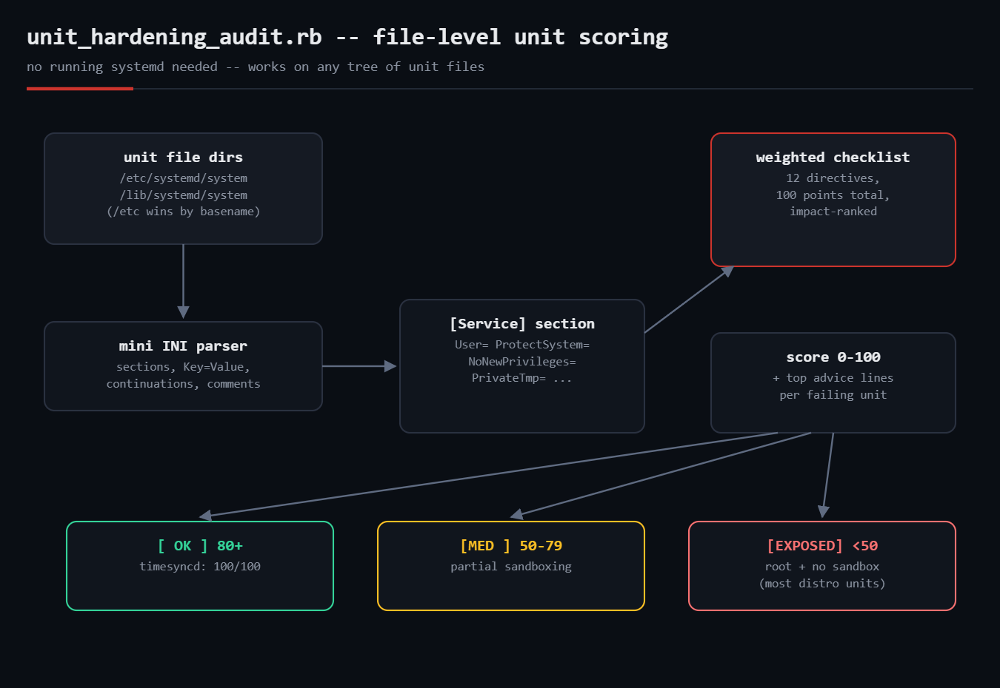

# unit-hardening-audit

Scores the **sandboxing/hardening of systemd service units** 0–100 in pure
standard-library Ruby. `systemd-analyze security` needs a *running* systemd
and DBus; this script only needs the unit **files**, so it works in
containers, chroots, image builds and CI — anywhere you can read
`/lib/systemd/system`.



## Prerequisites

- Ruby 2.7+ (tested on 3.0) — standard library only (`optparse`, `json`)
- Any tree of systemd unit files (a live system, a mounted image, a package
  checkout). systemd itself does **not** need to be running.

## Usage

```bash
ruby unit_hardening_audit.rb                          # scan the default dirs
ruby unit_hardening_audit.rb /etc/systemd/system      # scan specific dirs
ruby unit_hardening_audit.rb --unit ssh.service       # one unit, full detail
ruby unit_hardening_audit.rb --min-score 40           # gate: exit 1 below 40
ruby unit_hardening_audit.rb --json | jq '.units[0]'
```

Exit codes: `0` ok, `1` at least one audited unit under `--min-score` —
drop it into CI to stop new unhardened services from shipping.

## The checklist

Weighted roughly like `systemd-analyze security`'s impact ranking
(total = 100):

| Directive | Points | Why |
|---|---|---|
| `User=` (non-root) | 20 | root compromise = machine compromise |
| `NoNewPrivileges=true` | 12 | blocks setuid privilege escalation |
| `ProtectSystem=strict/full` | 12 | read-only `/usr`, `/etc` |
| `ProtectHome=true` | 8 | hides user data from the service |
| `PrivateTmp=true` | 8 | private `/tmp`, kills symlink attacks |
| `PrivateDevices=true` | 8 | no raw device access |
| `ProtectKernelTunables=true` | 6 | read-only `/proc/sys` |
| `ProtectKernelModules=true` | 6 | no module loading |
| `RestrictSUIDSGID=true` | 6 | can't create setuid files |
| `CapabilityBoundingSet=` set | 6 | minimum capabilities |
| `SystemCallFilter=` set | 5 | seccomp syscall filter |
| `RestrictAddressFamilies=` set | 3 | limits socket families |

## How it works

- **A minimal INI-ish parser** handles sections, `Key=Value`, comments and
  line continuations (`\`) — the whole systemd unit syntax this audit needs,
  in ~25 lines.
- **`/etc` overrides `/lib`:** files are deduped by basename with the first
  scan directory winning, matching systemd's precedence. Symlinks (aliases,
  `.wants/`) and `@template` units are skipped.
- **Each `[Service]` section** is checked against the table above; missing
  directives cost their weight, and the report prints the top advice lines
  per unit so the fix is copy-pasteable.

## Example output

```
$ ruby unit_hardening_audit.rb --top 8 --min-score 40
== unit hardening audit -- 93 service unit(s) from: /etc/systemd/system, /lib/systemd/system ==
[EXPOSED]   0/100  cron.service                     /usr/sbin/cron -f -P $EXTRA_OPTS
             -20pt  runs as root -- set User= to a service account
             -12pt  child processes can gain privileges (setuid binaries); set NoNewPrivileges=true
             -12pt  /usr and /etc are writable; set ProtectSystem=strict (or full)
  ... 85 more (use --top/--json for all)
average score: 9/100 -- 82 unit(s) below --min-score 40

$ ruby unit_hardening_audit.rb --unit systemd-timesyncd.service
[ OK ]    100/100  systemd-timesyncd.service        !!/lib/systemd/systemd-timesyncd
```

Both runs above are real: 93 unit files from an Ubuntu 22.04 container.
`systemd-timesyncd` scoring 100/100 is a nice sanity check — upstream
systemd ships its own daemons heavily sandboxed, while the average distro
service scores single digits.

## Troubleshooting

- **A unit you expected is missing** — templates (`name@.service`) and
  symlinked aliases are skipped by design; audit the template file directly
  with `--unit` if you need it.
- **Drop-in overrides aren't merged** — `unit.service.d/*.conf` fragments are
  not read; the score reflects the base unit file. Merging drop-ins is the
  first item under Extending.
- **Score seems harsh for oneshot units** — a `Type=oneshot` root script gets
  the same -20 as a daemon. That's intentional: oneshots run as root too.
- **`systemd-analyze security` disagrees** — it inspects the *runtime* unit
  (drop-ins merged, defaults applied) and weighs ~80 factors; this is a
  file-level approximation of its top findings.

## Extending it

- Merge `*.service.d/*.conf` drop-ins before scoring
- Score `DynamicUser=`, `MemoryDenyWriteExecute=`, `LockPersonality=`
- Emit a diff mode: score before/after a proposed unit change in CI
- HTML report with per-unit copy-paste `[Service]` hardening blocks

## References

- [systemd.exec(5) — sandboxing directives](https://www.freedesktop.org/software/systemd/man/latest/systemd.exec.html)
- [systemd-analyze(1) — the security verb](https://www.freedesktop.org/software/systemd/man/latest/systemd-analyze.html)
- Blog post: https://tha-shed.com/ (Ruby for DevOps series)
