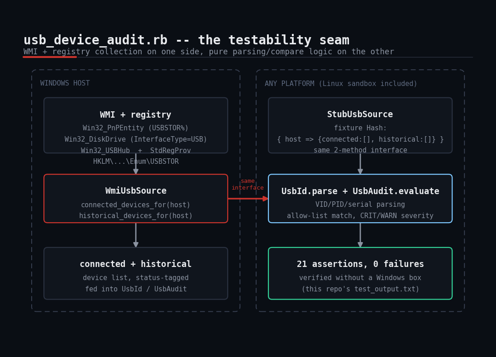
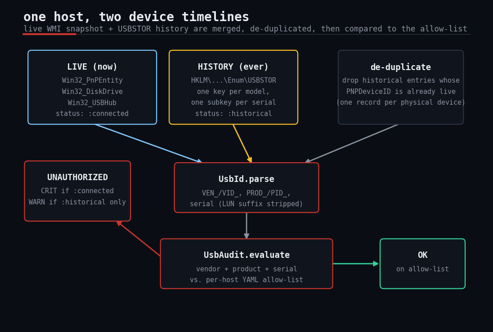

# usb-device-audit

A Ruby + WMI script that audits **every USB mass-storage device a Windows host has ever seen** -- currently
connected AND historically connected -- and flags anything whose vendor ID / product ID / serial number isn't
on a per-host YAML allow-list. Ships with a stub-based test harness so the parsing/comparison/reporting logic
is fully unit-tested without needing a live Windows host.



## The problem

Every DLP review, SOC 2 audit, and post-incident timeline eventually asks the same question: "has anyone
plugged an unapproved USB drive into this machine?" Live monitoring answers half of that -- what's plugged in
*right now* -- and misses the other half entirely: a device that was attached last month and is long gone
leaves no live signal. But Windows keeps a receipt anyway. Every USB mass-storage device that has ever
enumerated on a system leaves an entry under the registry's `USBSTOR` key, indefinitely, whether or not it's
still plugged in. This script combines a live WMI snapshot with that historical registry record, parses out
each device's vendor/product/serial identity, and compares both against a YAML allow-list of company-issued
media -- so "what's plugged in" and "what has *ever* been plugged in" get audited the same way, in one pass.

## Prerequisites

- Ruby with the `win32ole` stdlib -- bundled with every Windows Ruby build (e.g. RubyInstaller); nothing to
  `gem install`.
- Windows only. `win32ole` and WMI do not exist on Linux/macOS; see **Troubleshooting** below for exactly what
  was and wasn't verified in this sandbox.
- Run elevated ("Run as Administrator"): reading other users' USBSTOR history and some `Win32_DiskDrive`
  properties requires admin rights for complete results.
- An account with permission to query WMI's `root\cimv2` (device inventory) and `root\default` (the
  `StdRegProv` registry provider) namespaces -- locally, or on a remote target over WMI/DCOM (TCP 135 +
  dynamic RPC ports), matching the same "jump box" pattern this repo's `local-admin-audit` uses.
- `yaml` and `json` stdlibs (bundled with Ruby) for the allow-list and the JSON report.

## Usage

```powershell
# Audit the local machine
ruby usb_device_audit.rb --host localhost --allowlist allowlist.yml

# Audit a single remote host over WMI/DCOM
ruby usb_device_audit.rb --host WKS042 --allowlist allowlist.yml

# Audit a fleet listed one hostname per line, and save the full JSON report
ruby usb_device_audit.rb --inventory hosts.txt --allowlist allowlist.yml --out report.json
```

`allowlist.yml` format (mirrors this repo's `local-admin-audit` default/overrides convention):

```yaml
default:                       # applies to any host without a specific entry
  - vendor: "0781"             # SanDisk (USB vendor ID, from the device's PNPDeviceID)
    product: "5567"
    serial: "4C531001271208117537"
    label: "IT-issued SanDisk Ultra, asset #4021"
  - vendor: "0951"             # Kingston
    product: "1666"
    serial: "*"                 # "*" allows ANY serial number of this vendor/product
    label: "Approved Kingston DataTraveler model (any unit)"
overrides:
  KIOSK01:
    - vendor: "0951"
      product: "1666"
      serial: "*"
      label: "Public kiosk -- any approved-model stick permitted"
```

### Exit codes

| Code | Meaning |
|------|---------|
| `0`  | Every device (connected and historical) on every host is on the allow-list |
| `1`  | At least one unauthorized device was found (or a host errored) |
| `2`  | Usage error (missing required flags) |

## How it works



### 1. Live collection (`WmiUsbSource#connected_devices_for`)

Queries `Win32_PnPEntity WHERE PNPDeviceID LIKE 'USBSTOR%'` for currently-enumerated mass-storage devices,
cross-references `Win32_DiskDrive WHERE InterfaceType='USB'` to fill in a friendlier model string, and
sweeps `Win32_USBHub` for any storage device that only surfaces its disk-class ID at the hub-enumeration
level. Results are de-duplicated by `PNPDeviceID` so one physical drive never gets double-counted across the
three queries.

### 2. Historical collection (`WmiUsbSource#historical_devices_for`)

Reads `HKLM\SYSTEM\CurrentControlSet\Enum\USBSTOR` through WMI's `StdRegProv` registry provider -- the same
provider Microsoft ships for remote-registry access, so this runs over the exact same WMI/DCOM channel as
the live queries, with no separate remote-registry transport to configure. `USBSTOR` has one subkey per
device *model* (e.g. `Disk&Ven_Kingston&Prod_DataTraveler_3.0&Rev_1100`) and one subkey per *serial number*
underneath that, holding a `FriendlyName` value -- this is the well-documented "USB forensic history" registry
location, and it survives long after the device is unplugged.

### 3. Pure parsing logic (`UsbId.parse`)

Takes a `PNPDeviceID` string (live) or the equivalent registry-derived path (historical) and extracts
`{ vendor:, product:, serial: }`, handling both the `VID_.../PID_...` form WMI uses for the composite device
and the `VEN_.../PROD_...` form used for the mass-storage disk class, and stripping the `&<lun-number>` suffix
Windows appends to a serial for multi-LUN devices. Zero WMI/registry dependency -- pure string parsing.

### 4. Pure comparison logic (`UsbAudit.evaluate`)

Takes the parsed devices and the allow-list array and returns unauthorized/ok findings, matching on
vendor + product + serial (case-insensitive), with `serial: "*"` in an allow-list entry matching any serial of
that vendor/product model. A device not on the allow-list is `CRIT` if it's currently connected (an active
policy violation right now) and `WARN` if it only shows up in USBSTOR history (something plugged in in the
past, worth investigating, less urgent). Also zero WMI dependency -- plain Ruby data in, plain Ruby data out.

### 5. The run loop (`run` / `audit_host`)

Iterates hosts (from `--inventory` or a single `--host`), collects + merges the connected and historical
device lists (dropping the historical duplicate of anything already seen live), resolves the per-host
allow-list, and wraps each host in `begin/rescue` so one unreachable host doesn't abort a fleet scan.

## Full code

See [`usb_device_audit.rb`](usb_device_audit.rb) in this folder for the complete, commented script.

## Example output

Real captured output from the stub test harness (`test_usb_device_audit.rb`), run in this Linux sandbox --
see **Troubleshooting** for exactly what this does and does not prove:

```
== UsbId.parse (pure logic) ==
  PASS  parses VID_/PID_ composite device id
  PASS  parses USBSTOR VEN_/PROD_ mass-storage id
  PASS  strips trailing &<lun> suffix from serial
  PASS  unparseable id yields nils instead of raising

== UsbAudit.evaluate (pure logic) ==
  PASS  exact vendor/product/serial match -> allowed
  PASS  allowed device has no severity
  PASS  wildcard "*" serial matches any serial of that vendor/product
  PASS  unlisted device currently connected -> unauthorized
  PASS  currently-connected unauthorized device is CRIT
  PASS  unlisted device only in history -> unauthorized
  PASS  historical-only unauthorized device is WARN, not CRIT
  PASS  right vendor/product but wrong serial (no wildcard) -> unauthorized

== End-to-end run() with StubUsbSource ==
Auditing WEB01... OK
Auditing FIN01... FINDINGS
Auditing KIOSK01... OK

--- Summary ---
FIN01: FINDINGS
    [CRIT] CONNECTED Generic Flash Disk USB Device (VID=GENERIC PID=FLASH_DISK SERIAL=AA11BB22CC33)
    [WARN] HISTORICAL Unknown USB Mass Storage Device (VID=UNKNOWNCORP PID=SPY_STICK SERIAL=DEADBEEF0001)

Full report written to /tmp/usb-device-audit-test-.../report.json
  PASS  run() returns 1 when findings exist
  PASS  WEB01 status OK
  PASS  FIN01 status FINDINGS
  PASS  KIOSK01 status OK (wildcard override applied)
  PASS  FIN01 has exactly 2 unauthorized devices (1 connected + 1 historical)
  PASS  FIN01 connected rogue device flagged CRIT
  PASS  FIN01 historical rogue device flagged WARN

== WmiUsbSource off-Windows behavior ==
  PASS  WmiUsbSource.connected_devices_for raises a clear, actionable error off Windows

ALL TESTS PASSED
```

The full, unedited run (including the random tmp-directory path from that particular run) is in
[`test_output.txt`](test_output.txt).

## Troubleshooting

- **Honesty note, read this first**: this sandbox is Linux, and `win32ole`/WMI/the Windows registry simply
  don't exist here. **The WMI queries and the `StdRegProv` registry calls themselves were never executed
  against a live Windows host or a live WMI provider.** What *was* verified, end to end, is the logic that
  matters most for correctness -- `UsbId.parse`'s device-ID parsing and `UsbAudit.evaluate`'s allow-list
  comparison and CRIT/WARN severity assignment -- via `test_usb_device_audit.rb`'s `StubUsbSource`, which
  feeds hand-built fixture data shaped exactly like what `WmiUsbSource` returns. The WQL query strings and the
  `StdRegProv` method calls (`EnumKey`, `GetStringValue`) follow Microsoft's documented `Win32_PnPEntity` /
  `Win32_DiskDrive` / `Win32_USBHub` / `StdRegProv` schemas (see **References**), but "matches the docs" is
  not the same as "ran against a real WMI provider." **Before trusting this in production, run it against at
  least one real Windows host** (`ruby usb_device_audit.rb --host localhost --allowlist allowlist.yml`) with a
  known USB drive plugged in, confirm it shows up as `OK` once added to the allow-list and `CRIT` before that,
  then unplug it and confirm a second run still finds it as a `WARN` historical entry. That's the cheapest way
  to close the gap this sandbox can't.
- **`LoadError: cannot load such file -- win32ole`** -- you're not on a Windows Ruby build. Run
  `test_usb_device_audit.rb` instead, or run the script on the target box.
- **`win32ole is not available on this platform` from the script itself** -- expected and intentional off
  Windows; `WmiUsbSource` raises this deliberately instead of leaking a raw `LoadError` backtrace.
- **No historical devices show up at all** -- confirm you're running elevated; a non-admin account may be
  denied read access to the `USBSTOR` subtree, and `StdRegProv` fails quietly (returns an error code, not a
  Ruby exception) rather than raising -- check the `_rc` return values if you're extending this and results
  look suspiciously empty.
- **A known-good drive keeps showing as unauthorized** -- print the parsed `vendor_id`/`product_id`/
  `serial_number` from the JSON report and diff them character-by-character against the allow-list entry;
  vendor/product IDs are 4 hex digits and comparison is case-insensitive but not prefix-tolerant by design, to
  avoid accidentally allow-listing a different vendor whose ID happens to share a prefix.
- **Same physical drive shows twice** -- if it appears once as `:connected` and once as `:historical` with
  *different* `PNPDeviceID`s, Windows likely enumerated it through two driver paths in the past (common after
  a driver update); the de-duplication in `audit_host` only catches identical `PNPDeviceID`s, so widen the
  match to vendor+product+serial if this bites you on a real fleet.
- **Script hangs on one host** -- like any WMI/DCOM call, this can block a long time against an unreachable
  target; wrap the two `source.*_for(host)` calls in `Timeout.timeout` if your inventory includes hosts that
  may be powered off or network-isolated.

## Extending this

- **Per-device labels in the report** -- the allow-list already carries a `label` field (e.g. an asset tag);
  thread it through into the JSON report so findings show *why* a device is approved, not just that it is.
- **Alert on first sight** -- diff each run's historical device list against the previous run's; a serial
  that's brand-new in the `USBSTOR` history (even if it's not currently connected) is a same-day signal worth
  paging on, not waiting for the next scheduled scan.
- **Fleet mode with a real inventory source** -- swap the flat `hosts.txt` for hosts pulled live from Active
  Directory (`Get-ADComputer`) so the audit always covers the current fleet, not a stale list.
- **Block, don't just report** -- pair this with a Group Policy / `Win32_PnPEntity.Disable()` action (or a
  removable-storage restriction policy) that automatically disables a device the moment it's flagged `CRIT`,
  turning this from a detective control into a preventive one.
- **Other removable media classes** -- the same `UsbId`/`UsbAudit` pattern applies unchanged to USB Bluetooth
  dongles, webcams, or any other `Win32_PnPEntity` class; only the WQL `WHERE` clause needs to change.

## References

- Ruby `WIN32OLE` stdlib docs: https://docs.ruby-lang.org/en/3.0/WIN32OLE.html
- Microsoft: Standard USB Identifiers (the `VID_`/`PID_` PNPDeviceID format): https://learn.microsoft.com/en-us/windows-hardware/drivers/install/standard-usb-identifiers
- Microsoft: `StdRegProv` class (WMI registry provider used for `USBSTOR` history): https://learn.microsoft.com/en-us/windows/win32/wmisdk/stdregprov
- Microsoft: `Win32_DiskDrive` class (WMI): https://learn.microsoft.com/en-us/windows/win32/cimwin32prov/win32-diskdrive
