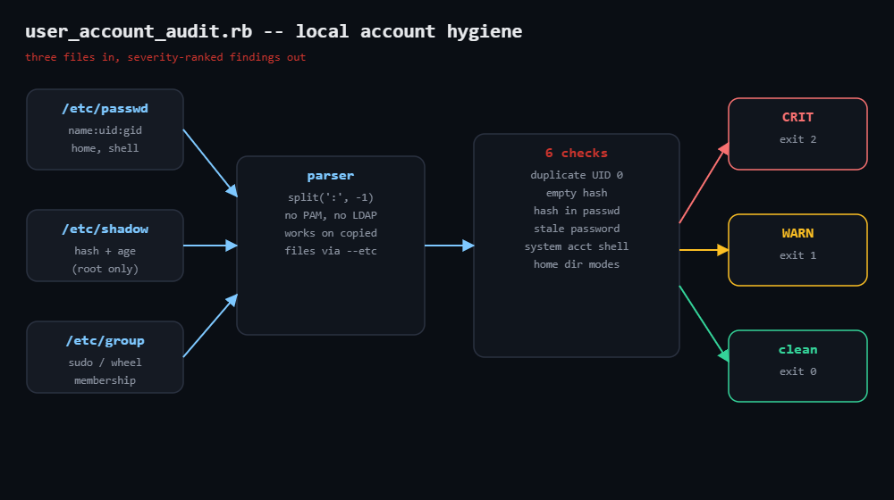

# user-account-audit

Audits Linux local accounts straight from `/etc/passwd`, `/etc/shadow` and
`/etc/group`: duplicate UID 0 entries, passwordless accounts, hashes stored in
world-readable `passwd`, stale passwords, system accounts with login shells,
and missing or world-writable home directories. Severity-ranked findings,
text or JSON, CI-friendly exit codes. Stdlib only.



## Prerequisites

- Ruby 2.7+ (tested on 3.0); standard library only (`json`, `optparse`, `time`)
- `root` for shadow checks on a live system — without it the script runs every
  passwd/group check and reports exactly what it skipped
- Or no live system at all: `--etc DIR` audits copied files from an image,
  container layer, or backup

## Usage

```bash
sudo ruby user_account_audit.rb                  # audit the live system
ruby user_account_audit.rb --etc ./copies        # audit copied etc files
sudo ruby user_account_audit.rb --json           # for pipelines
sudo ruby user_account_audit.rb --max-age 90     # stale-password threshold
ruby user_account_audit.rb --sudo-groups sudo,wheel,adm
```

Exit codes: `0` clean · `1` warnings only · `2` at least one CRIT.

## How it works

1. **Parsing** — every file is split with `split(':', -1)`; the `-1` keeps
   empty trailing fields, which is exactly what empty-password detection needs.
   No PAM, no NSS, no LDAP — local files only, which is also why copies work.
2. **Six checks**, each mapping to a real incident pattern:
   - `duplicate-uid` — any shared UID warns; a second UID 0 is CRIT (the
     classic backdoor)
   - `empty-passwd-field` / `hash-in-passwd` — pre-shadow relics: password-less
     login, or a hash anyone can crack offline
   - `empty-shadow-hash` — password-less login, shadow edition
   - `stale-password` — shadow's days-since-epoch age vs `--max-age`
     (locked `!`/`*` hashes excluded)
   - `system-account-shell` — sub-1000 UIDs with interactive shells
   - `world-writable-home` — if anyone can write your `.bashrc`, anyone can be
     you at next login
3. **Sudo inventory** — members of `sudo`/`wheel`/`admin` are listed (not
   flagged); what counts as "too many admins" is policy, not parsing.
4. **Exit codes** — findings sort CRIT-first and the exit code summarises the
   whole report for cron/CI.

## Example output (fixture files)

```
user_account_audit: 8 accounts in /tmp/etc-fix/passwd
admin group members: alice, bob, toor

CRIT duplicate-uid          root, toor     UID 0 shared by: root, toor
CRIT empty-shadow-hash      toor           empty hash in shadow — account has NO password
CRIT hash-in-passwd         legacyapp      password hash stored in world-readable passwd file
CRIT world-writable-home    alice          home /tmp/homes/alice is world-writable (777)
WARN stale-password         root           password last changed 991 days ago (max 365)
WARN system-account-shell   games          system account (UID 5) has login shell /bin/sh

4 CRIT, 4 WARN
```

## Troubleshooting

- **"shadow unreadable"** — not a bug; run with `sudo`, or accept that the
  empty-password and age checks are skipped (the report says so).
- **Everything clean on a corporate box** — LDAP/SSSD/AD users aren't in local
  files; this audits *local* accounts, the ones central IAM forgets.
- **stale-password noise** — locked hashes (`!`, `*` prefixes) are already
  excluded; extend the prefix list if your distro locks differently.
- **Shared group homes flagged** — the check only fires on other-writable
  (`o+w`); whitelist paths in your fork if your site shares homes on purpose.

## Extending

- Baseline mode: save a known-good JSON run, diff future runs, alert only on
  new findings.
- Walk `~/.ssh/authorized_keys` per home; flag keys on system accounts.
- Merge `lastlog` to find shells that haven't logged in for a year.
- Fleet mode over SSH; aggregate the JSON, gate on exit codes.

## References

- Blog post: https://tha-shed.com/ (Ruby for DevOps series)
- `man 5 passwd`: https://man7.org/linux/man-pages/man5/passwd.5.html
- `man 5 shadow`: https://man7.org/linux/man-pages/man5/shadow.5.html
- Ruby stdlib `OptionParser`: https://docs.ruby-lang.org/en/3.3/OptionParser.html
