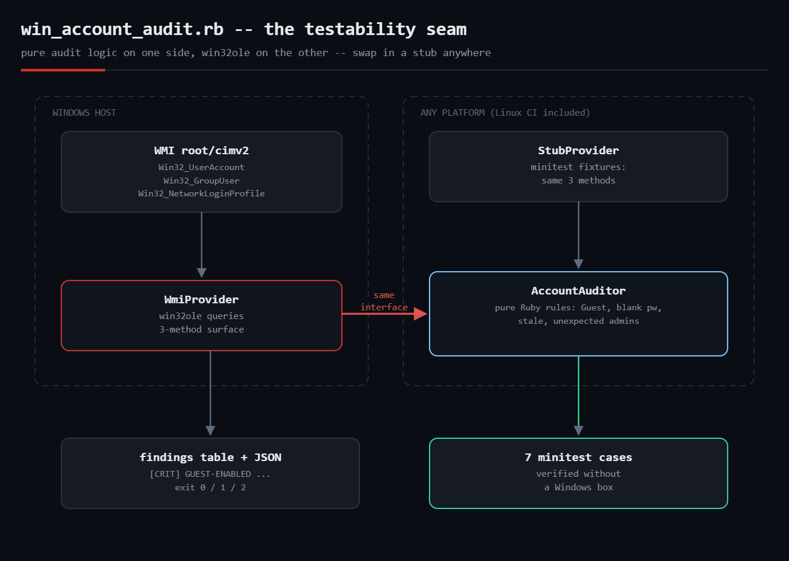

# win-account-audit

Audits **local Windows user accounts** for the problems security auditors
actually look for — enabled Guest, blank-password accounts, passwords that
never expire, the built-in Administrator left enabled, stale accounts, and
unexpected members of the local Administrators group. Uses WMI via the
`win32ole` standard library: no gems, no PowerShell dependency.



## Prerequisites

- Windows with the RubyInstaller build of Ruby 2.7+ (`win32ole` ships in the
  standard library on Windows)
- Run **elevated** (WMI account queries need admin rights for complete results)
- On non-Windows platforms the script exits with a clear message — but the
  audit *logic* still runs anywhere via the stub test harness (see below)

## Usage

```powershell
ruby win_account_audit.rb
ruby win_account_audit.rb --stale-days 60 --allow-admins "Administrator,svc_backup"
ruby win_account_audit.rb --json > audit.json
```

Exit codes: `0` clean, `1` warnings only, `2` at least one CRIT finding.

## Findings reference

| Rule | Severity | Meaning |
|---|---|---|
| `GUEST-ENABLED` | CRIT | built-in Guest (SID `-501`) is enabled |
| `PW-NOT-REQUIRED` | CRIT | enabled account can log on with a blank password |
| `UNEXPECTED-ADMIN` | CRIT | Administrators member not on the allow list |
| `PW-NEVER-EXPIRES` | WARN | enabled account whose password never expires |
| `BUILTIN-ADMIN-ON` | WARN | built-in Administrator (RID 500) is enabled |
| `STALE-ACCOUNT` | WARN | enabled but no interactive logon in N days |

## How it works

- **`WmiProvider`** is the only class that touches `win32ole`. It answers three
  questions: local accounts (`Win32_UserAccount WHERE LocalAccount = TRUE`),
  Administrators membership (`Win32_GroupUser` associations, parsed from
  `PartComponent`), and last logons (`Win32_NetworkLoginProfile`, whose WMI
  datetimes look like `20260801093000.000000-300`).
- **`AccountAuditor`** is pure Ruby: it takes *any* provider answering those
  three questions and emits sorted findings. Built-ins are identified by SID
  suffix (`-500` Administrator, `-501` Guest) — never by name, because the
  names are localized and renameable.
- Because the seam is explicit, the audit rules are **unit-testable on any
  platform** by injecting a stub provider with fixture data.

## Testing without a Windows box

```
$ ruby test_win_account_audit.rb

--- simulated audit output (stub WMI fixtures) ---
[CRIT] GUEST-ENABLED     Guest            built-in Guest account is enabled
[CRIT] PW-NOT-REQUIRED   Guest            account can log on with a blank password
[CRIT] PW-NOT-REQUIRED   svc_legacy       account can log on with a blank password
[CRIT] UNEXPECTED-ADMIN  svc_legacy       member of local Administrators but not on the allow list
[WARN] BUILTIN-ADMIN-ON  Administrator    built-in Administrator (RID 500) is enabled -- rename/disable per CIS 2.3.1
[WARN] PW-NEVER-EXPIRES  Administrator    password is set to never expire
...
11 finding(s), 4 critical

7 runs, 19 assertions, 0 failures, 0 errors, 0 skips
```

Honesty note: the WMI queries themselves require a real Windows host, so this
script's *logic* was verified with the minitest stub harness above on Linux;
the WQL query strings follow Microsoft's documented `Win32_UserAccount` /
`Win32_GroupUser` / `Win32_NetworkLoginProfile` schemas.

## Troubleshooting

- **`LoadError: cannot load such file -- win32ole`** — you're not on a Windows
  Ruby build. Run the test harness instead, or run the script on the target box.
- **Empty Administrators membership** — run elevated; standard users can't
  enumerate group associations completely.
- **`Win32_UserAccount` is slow on domain-joined machines** — the
  `LocalAccount = TRUE` filter in the WQL keeps WMI from enumerating the whole
  domain; don't remove it.
- **`LastLogon` is NULL for accounts that only log on over the network** —
  `Win32_NetworkLoginProfile` tracks interactive logons; treat "no recorded
  logon" as *possibly* stale, then confirm in the Security event log (4624).

## Extending it

- Check `Win32_LogonSession` for live sessions of flagged accounts
- Emit a CSV/HTML evidence report for auditors
- Fleet mode: WinRM/SSH the JSON from every host into one report
- Add password-age checks via `NetUserGetInfo` (FFI) where WMI can't see it

## References

- [Win32_UserAccount class (Microsoft Learn)](https://learn.microsoft.com/en-us/windows/win32/cimwin32prov/win32-useraccount)
- [Ruby WIN32OLE docs](https://docs.ruby-lang.org/en/3.0/WIN32OLE.html)
- [CIS Microsoft Windows Benchmarks](https://www.cisecurity.org/benchmark/microsoft_windows_desktop)
- Blog post: https://tha-shed.com/ (Ruby for DevOps series)
