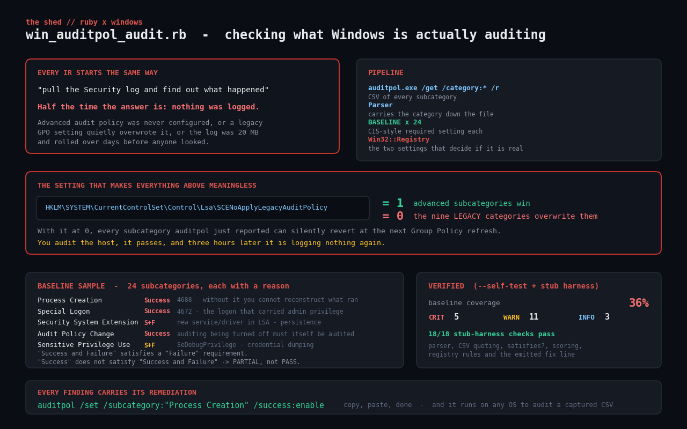

# win-auditpol-audit

Check what a Windows host is **actually** auditing.

Every Windows incident response starts the same way: pull the Security log and
find out what happened. Half the time the answer is *nothing was logged* —
because the advanced audit policy was never configured, or because a legacy
Group Policy setting quietly overwrote it, or because the Security log was
20 MB and rolled over days before anyone looked.

This script reads the effective policy from `auditpol.exe`, compares all
subcategories against a CIS-style baseline, and flags the two configuration
traps that make a "configured" policy do nothing.



## Prerequisites

- **Windows** for a live audit, from an **elevated** prompt — `auditpol /get`
  needs it. `Win32::Registry` ships with Ruby on Windows.
- Ruby 2.6 or newer. No gems.
- `--self-test` and `--csv` run on **any** OS, including Linux and macOS, because
  neither touches `auditpol.exe` or the registry.

## Usage

On Windows, elevated:

```
ruby win_auditpol_audit.rb                    # audit this host
ruby win_auditpol_audit.rb --json
ruby win_auditpol_audit.rb --export pol.csv   # also save the raw auditpol CSV
```

Anywhere — Linux, macOS, CI:

```
ruby win_auditpol_audit.rb --self-test        # built-in fixtures
ruby win_auditpol_audit.rb --csv pol.csv      # a CSV captured on the server
```

The `--csv` path is the practical one for a fleet: have someone run
`auditpol /get /category:* /r > host.csv` on each server (or push it via your
config management tool), then audit the lot from one machine.

Exit codes: `0` baseline met, `1` WARN findings, `2` at least one CRIT.

## How it works

### 1. `auditpol /get /category:* /r`

The `/r` flag emits CSV:

```
Machine Name,Policy Target,Subcategory,Subcategory GUID,Inclusion Setting,Exclusion Setting
APPSRV02,System,Detailed Tracking,,,
APPSRV02,System,Process Creation,{0cce922b-69ae-11d9-bed3-505054503030},No Auditing,
```

The **category name is not a column**. auditpol emits category header rows with
an empty GUID interleaved with the subcategory rows, so the parser has to carry
the current category down the file. Getting this wrong gives you a report where
every subcategory belongs to whatever category happened to be last.

Fields can be quoted when they contain commas, so the script includes a small
RFC4180-ish splitter rather than `line.split(',')`.

### 2. The elevation trap

On some builds a non-elevated `auditpol` prints an error to stdout and still
**exits 0**. A script that trusts the exit code reports a clean policy on a host
it never actually read. So the source checks the shape of the output too:

```ruby
raise "auditpol.exe returned no policy rows (are you elevated?)" unless out.to_s.include?(',')
```

### 3. The baseline

24 subcategories, each with a required setting and a one-line reason. A sample:

| Subcategory | Required | Why |
| --- | --- | --- |
| Process Creation | Success | 4688 — without it you cannot reconstruct what ran |
| Special Logon | Success | 4672 — the logon that carried admin-equivalent privilege |
| Security System Extension | Success and Failure | a new service or driver registering with LSA |
| Audit Policy Change | Success | auditing being turned off must itself be audited |
| Credential Validation | Success and Failure | which account was tried against this machine, and from where |
| Security Group Management | Success and Failure | privilege escalation ends with a group change |
| Sensitive Privilege Use | Success and Failure | `SeDebugPrivilege` — credential dumping signature |
| System Integrity | Success and Failure | if this is off you cannot even tell that logging broke |

The satisfaction rule matters: `Success and Failure` satisfies a `Failure`
requirement, but `Success` does **not** satisfy `Success and Failure` — that is
a `PARTIAL_AUDITING` finding, one severity below the `No Auditing` case.

Subcategories that do not appear at all (`DS Access` on a member server, newer
subcategories on an older build) are reported as INFO `SUBCATEGORY_ABSENT` and
excluded from the coverage percentage, rather than counted as failures.

### 4. The setting that makes all of the above meaningless

```
HKLM\SYSTEM\CurrentControlSet\Control\Lsa\SCENoApplyLegacyAuditPolicy
```

- `= 1` — advanced subcategory settings win.
- `= 0` or absent — the **nine legacy audit categories** from Group Policy
  overwrite every advanced subcategory at the next policy refresh.

With it at 0, everything `auditpol` just reported can silently revert. You audit
the host, it passes, and three hours later it is logging nothing again. That is
a CRIT, and it is checked on every run.

### 5. The Security log

Two more registry values under
`HKLM\SYSTEM\CurrentControlSet\Services\EventLog\Security`:

- `MaxSize` — under 192 MB is a WARN, under 32 MB a CRIT. With Process Creation
  auditing on, a busy server churns 20 MB in hours; by the time anyone
  investigates, the evidence has rolled over.
- `Retention` — `0` means overwrite as needed, which is the right setting *only*
  if events are being forwarded somewhere durable first. Reported as INFO, since
  the script cannot see whether forwarding is configured.

`CrashOnAuditFail = 1` is also flagged (WARN): a deliberate high-assurance
setting that also turns a full Security log into an outage.

### 6. Every finding carries its fix

```
auditpol /set /subcategory:"Process Creation" /success:enable
```

Generated from the baseline entry, quoted correctly, ready to paste.

## Example output

```
$ ruby win_auditpol_audit.rb --self-test --no-color

windows audit policy audit  -  APPSRV02  (source: self-test fixtures)
==============================================================================

       CATEGORY               SUBCATEGORY                        EFFECTIVE
  --------------------------------------------------------------------------
  PART Account Logon          Credential Validation              Success
  FAIL Account Logon          Kerberos Authentication Service    No Auditing
  PART Account Management     User Account Management            Success
  PASS Account Management     Security Group Management          Success and Failure
  PASS Account Management     Computer Account Management        Success
  FAIL Detailed Tracking      Process Creation                   No Auditing
  FAIL Detailed Tracking      PNP Activity                       No Auditing
  PART Logon/Logoff           Logon                              Success
  PASS Logon/Logoff           Logoff                             Success
  PASS Logon/Logoff           Account Lockout                    Failure
  FAIL Logon/Logoff           Special Logon                      No Auditing
  FAIL Logon/Logoff           Other Logon/Logoff Events          No Auditing
  FAIL Object Access          Removable Storage                  No Auditing
  FAIL Object Access          File Share                         No Auditing
  FAIL Object Access          Detailed File Share                No Auditing
  PASS Policy Change          Audit Policy Change                Success
  PASS Policy Change          Authentication Policy Change       Success
  FAIL Policy Change          MPSSVC Rule-Level Policy Change    No Auditing
  FAIL Privilege Use          Sensitive Privilege Use            No Auditing
  PASS System                 Security State Change              Success
  FAIL System                 Security System Extension          No Auditing
  PASS System                 System Integrity                   Success and Failure
   --  DS Access              Directory Service Access           (absent)
   --  DS Access              Directory Service Changes          (absent)

  baseline coverage: 36%  (8 of 22 applicable subcategories)

  CRIT  LEGACY_POLICY_OVERRIDE  HKLM\SYSTEM\CurrentControlSet\Control\Lsa\SCENoApplyLegacyAuditPolicy
        value is 0. Unless this is 1, the nine legacy audit categories from Group Policy overwrite every advanced subcategory at the next policy refresh. Everything auditpol reports above can silently revert.
        fix: Enable "Audit: Force audit policy subcategory settings to override audit policy category settings" in Group Policy (sets this value to 1).

  CRIT  NO_AUDITING  Detailed Tracking / Process Creation
        No Auditing (baseline requires Success) - 4688 is the single most useful event on the box; without it you cannot reconstruct what ran
        fix: auditpol /set /subcategory:"Process Creation" /success:enable

  CRIT  NO_AUDITING  Logon/Logoff / Special Logon
        No Auditing (baseline requires Success) - 4672 marks a logon that carried administrator-equivalent privileges
        fix: auditpol /set /subcategory:"Special Logon" /success:enable

  CRIT  SECURITY_LOG_SMALL  Security event log size
        MaxSize is 20.0 MB. With Process Creation auditing on, a busy server can churn that in hours - so by the time anyone investigates, the evidence has already rolled over.
        fix: Set the Security log to at least 192 MB, and forward events off the host.

==============================================================================
summary  CRIT=5  WARN=11  INFO=3
```

Trimmed — the full run lists every WARN and INFO. Exit code `2`.

## Testing

**Honest disclosure:** `auditpol.exe` and `Win32::Registry` have not been
executed against a live Windows host in this repository, because they cannot be
on Linux. What *was* verified, on Linux:

1. `--self-test`, which runs the parser, baseline, scoring and registry rules
   against built-in fixtures modelled on a half-hardened member server.
2. A **stub harness** that injects a fake `runner` in place of `auditpol.exe`
   and a fixture hash in place of the registry:

```
auditpol stub harness
--------------------------------------------------------------------------
  invokes auditpol with /get /category:* /r      ok
  rejects non-CSV output (not elevated)          ok
  machine name from column 0                     ok
  subcategory count                              ok
  category carried down to subcategory           ok
  effective setting parsed                       ok
  quoted field with embedded comma               ok
  "Success and Failure" satisfies "Failure"      ok
  "Success" does NOT satisfy "Success and Failure" ok
  "No Auditing" satisfies nothing                ok
  empty setting satisfies nothing                ok
  baseline coverage                              ok
  flags the legacy-policy override               ok
  flags the undersized Security log              ok
  absent DS Access rows are INFO, not FAIL       ok
  override finding clears when set to 1          ok
  log-size finding clears at 256 MB              ok
  emits a runnable auditpol fix line             ok
--------------------------------------------------------------------------
all checks passed
```

The seam that makes this possible is one constructor argument:

```ruby
AuditpolSource.new(runner: ->(cmd) { [Fixtures.csv, true] })
```

and one method that takes an override:

```ruby
RegistrySource.read(overrides: { legacy_override: 0, security_log_max: 20_480 * 1024 })
```

What this does **not** prove is that `auditpol /r` on your particular Windows
build emits exactly these column positions and subcategory names. Run it on a
real host and compare against `auditpol /get /category:*` (without `/r`) before
you trust the output.

## Troubleshooting

**"auditpol.exe returned no policy rows (are you elevated?)".** Exactly what it
says. Right-click → Run as administrator. If you are already elevated, the
account may lack the *Manage auditing and security log* user right
(`SeSecurityPrivilege`).

**Coverage looks terrible on a domain controller.** It probably is, but also
check that the `DS Access` subcategories appeared — if they are `(absent)` on a
DC, `auditpol` was not run with full privilege.

**`LEGACY_POLICY_OVERRIDE` on a host managed by Group Policy.** The value is
controlled by *Computer Configuration → Policies → Windows Settings → Security
Settings → Local Policies → Security Options → "Audit: Force audit policy
subcategory settings…"*. Setting the registry key by hand will be reverted at
the next refresh — fix it in the GPO.

**Findings disagree with `gpresult` / RSoP.** `auditpol` reports the *effective*
policy right now; RSoP reports what policy *intends*. A disagreement between
them is itself the finding, and is usually the legacy override above.

**Subcategory names do not match.** The names are localised on non-English
Windows. The baseline matches on the English names, so on a localised host the
GUID column is the stable key — see Extending.

## Extending it

- **Match on GUID, not name.** Subcategory GUIDs are stable and locale
  independent. Adding the GUID to each baseline entry makes the script work on a
  German or Japanese server.
- **Exclusion settings (per-user audit policy).** Column 6 is currently ignored.
  `auditpol /get /user:<name>` exposes per-user overrides, which are a neat way
  to hide a service account's activity.
- **Object SACLs.** Enabling `Object Access / File System` does nothing without a
  SACL on the folders you care about. Cross-check with `Get-Acl -Audit`.
- **Event forwarding.** `Retention 0` is only acceptable with WEF configured.
  Check `HKLM\SOFTWARE\Policies\Microsoft\Windows\EventLog\EventForwarding` and
  downgrade the finding when a subscription exists.
- **Fleet rollup.** `--json` per host into one table answers "how many servers
  are not logging 4688?" — which, for most organisations, is the question.
- **A `--remediate` mode.** Every finding already carries an exact command;
  emitting them as a reviewable `.cmd` file is a small step, and safer than
  running them directly.

## References

- [`auditpol` command reference — Microsoft Learn](https://learn.microsoft.com/en-us/windows-server/administration/windows-commands/auditpol)
- [Advanced security audit policy settings — Microsoft Learn](https://learn.microsoft.com/en-us/windows/security/threat-protection/auditing/advanced-security-audit-policy-settings)
- [Audit: Force audit policy subcategory settings to override audit policy category settings](https://learn.microsoft.com/en-us/windows/security/threat-protection/security-policy-settings/audit-force-audit-policy-subcategory-settings-to-override)
- [Event 4688 — a new process has been created](https://learn.microsoft.com/en-us/windows/security/threat-protection/auditing/event-4688)
- [Ruby `Win32::Registry` documentation](https://docs.ruby-lang.org/en/3.0/Win32/Registry.html)

## License

MIT, same as the rest of the toolkit.
