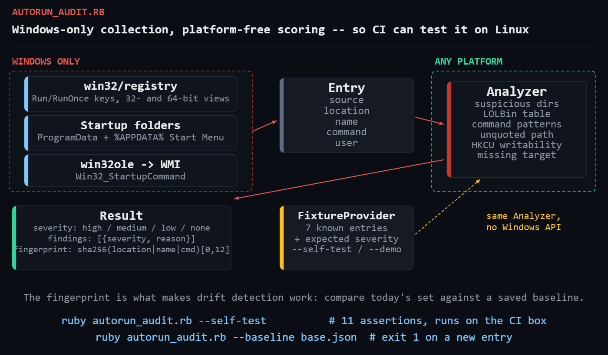

# win-autorun-audit

Inventory and risk-score every autorun entry on a Windows host — registry
`Run` keys (32- and 64-bit views), Startup folders, and WMI
`Win32_StartupCommand` — then diff today's state against a saved baseline.

Pure Ruby stdlib on Windows: `win32/registry` and `win32ole` both ship with
RubyInstaller. No gems.



---

## The problem

Persistence is the least glamorous part of an intrusion. Something writes a
value under `HKCU\Software\Microsoft\Windows\CurrentVersion\Run` — which needs
no administrator rights at all — and it launches again at every login,
forever. `msconfig` shows you a checkbox list. Task Manager's Startup tab
shows you fewer entries than actually exist.

The same mechanisms are also where a decade of legitimate vendor bloat lives,
so a raw list is close to useless. What a sysadmin needs is:

* **completeness** — including the 32-bit registry view a 64-bit tool silently
  never reads;
* **scoring** — "this one launches base64-encoded PowerShell with a hidden
  window" ranked above "this one is OneDrive";
* **drift** — what is here today that was not here at last week's baseline.

## Prerequisites

| Requirement | Notes |
|---|---|
| Ruby | 3.0 or newer — [RubyInstaller for Windows](https://rubyinstaller.org/) |
| Gems | none — `win32/registry` and `win32ole` are stdlib on Windows |
| OS | Windows 10 / 11 / Server 2016+ for a live audit. `--self-test` and `--demo` run on any OS |
| Privileges | a standard user sees `HKCU` and machine-wide keys; run elevated to read every user profile |

## Usage

```console
:: audit this host
ruby autorun_audit.rb

:: capture the known-good state
ruby autorun_audit.rb --write-baseline C:\ops\autorun-baseline.json

:: check for drift -- exit code 1 if anything new appeared
ruby autorun_audit.rb --baseline C:\ops\autorun-baseline.json

:: machine-readable
ruby autorun_audit.rb --format json

:: exercise the scoring engine on any OS, no Windows APIs touched
ruby autorun_audit.rb --self-test
ruby autorun_audit.rb --demo
```

Exit codes: `0` nothing notable · `1` a high-severity entry or drift · `2`
wrong platform / collection failure.

## What gets collected

| Source | Detail |
|---|---|
| Registry | `Run`, `RunOnce`, `RunServices`, `RunServicesOnce` under both `HKLM` and `HKCU`, in **both** the 64-bit and 32-bit (`Wow6432Node`) registry views |
| Startup folders | `%ProgramData%\Microsoft\Windows\Start Menu\Programs\Startup` and the per-user equivalent |
| WMI | `SELECT Caption,Command,Location,User FROM Win32_StartupCommand` |

The three overlap heavily. Duplicates are collapsed on
`(name, command)`, preferring the registry record because it carries the
precise key path.

## How each entry is scored

| Check | Severity | Rationale |
|---|---|---|
| Runs from `%TEMP%`, `C:\Windows\Temp`, `C:\Users\Public`, `Downloads`, `$Recycle.Bin` | high | no vendor permanently installs there |
| Base64-encoded PowerShell (`-enc <blob>`) | high | almost never legitimate in an autorun |
| `-w hidden` / `-windowstyle hidden` | high | deliberately invisible to the user |
| `-ExecutionPolicy Bypass` | high | overriding a security control at login |
| `iex` / `Invoke-Expression` / `FromBase64String` | high | runtime code evaluation |
| Fetches an `http(s)://` URL at startup | high | stage-two download |
| Unquoted image path containing spaces | high | `CreateProcess` tries `C:\Program.exe` first |
| Launches a LOLBin (`powershell`, `mshta`, `rundll32`, `regsvr32`, `certutil`, `wscript`, …) | medium | legitimate installers do this, but it always earns a look |
| Runs from a UNC path | medium | startup depends on a file share you may not control |
| Autoruns a script (`.vbs`, `.js`, `.hta`, `.ps1`, `.bat`) rather than a signed binary | medium | trivially editable persistence |
| Target executable does not exist | medium | stale uninstall, or a path you are misreading |
| `HKCU` location | low | no admin rights needed to plant it — informational, not an accusation |

An entry's severity is the highest of its findings. `none` means it tripped
nothing.

## Example output

`--demo` renders the real report from fixture data — same `Analyzer`, same
`Report`, only the collector is swapped out:

```
==============================================================================
  WINDOWS AUTORUN AUDIT   2026-08-19 14:56:40
  host: WIN-FIXTURE (demo data)
==============================================================================
  entries: 7      high: 3    medium: 1    low: 1    clean: 2
------------------------------------------------------------------------------

  HIGH (3)
  !! BackupSvc
       location : HKLM\Software\Microsoft\Windows\CurrentVersion\Run (64-bit)
       command  : C:\Program Files\Acme Backup\backup.exe --daemon
       image    : C:\Program Files\Acme Backup\backup.exe
       user     : ALL
       id       : bca471e1a7fd
       [high] unquoted image path containing spaces
  !! tmp_helper
       location : HKCU\Software\Microsoft\Windows\CurrentVersion\Run (64-bit)
       command  : "C:\Users\jam\AppData\Local\Temp\svchost.exe"
       image    : C:\Users\jam\AppData\Local\Temp\svchost.exe
       user     : CORP\jam
       id       : e373b194ecb5
       [high] runs from the user TEMP directory
       [low] user-writable location (no admin needed)
       [medium] target executable does not exist (stale or hidden)
  !! UpdateChecker
       location : HKCU\Software\Microsoft\Windows\CurrentVersion\Run (64-bit)
       command  : powershell.exe -nop -w hidden -enc SQBFAFgAIAAoAE4AZQB3AC0ATwBiAGoAZQBjAHQA
       image    : powershell.exe
       user     : CORP\jam
       id       : beacd315eb93
       [medium] launches powershell.exe (PowerShell interpreter)
       [high] base64-encoded PowerShell command
       [high] launches with a hidden window
       [medium] skips the PowerShell profile
       [low] user-writable location (no admin needed)
```

Three things worth pointing out.

`BackupSvc` is almost certainly a legitimate backup product, and it is still a
real high-severity finding: the unquoted path means anyone who can write
`C:\Program.exe` gets code execution as whatever account launches it.

`tmp_helper` is the textbook shape — user-writable key, executable in `%TEMP%`,
named to look like a system binary, and the file is already gone.

`UpdateChecker` stacks five findings. No single one of them is conclusive;
together they are not ambiguous.

## How it works

### The split that makes it testable

The file has exactly two halves, and the boundary is deliberate:

* `WindowsCollector` — the *only* code that touches `win32/registry` or
  `win32ole`. It produces plain `Entry` structs.
* `Analyzer` — pure Ruby over those structs. No Windows API, no filesystem
  access except through an injected lambda.

```ruby
class Analyzer
  def initialize(file_exists: nil)
    @file_exists = file_exists || ->(p) { !p.nil? && File.exist?(p) }
  end
end
```

That one injection point is why `--self-test` runs on a Linux CI box and still
means something. Eleven assertions cover the scoring table and the
command-line parser:

```
--- autorun_audit self-test (fixture-driven, no Windows APIs) ---
  PASS SecurityHealth   expected=none   got=none    (no findings)
  PASS OneDrive         expected=low    got=low     user-writable location (no admin needed)
  PASS UpdateChecker    expected=high   got=high    launches powershell.exe (PowerShell interpreter)
  PASS BackupSvc        expected=high   got=high    unquoted image path containing spaces
  PASS tmp_helper       expected=high   got=high    runs from the user TEMP directory
  PASS LegacyTool       expected=medium got=medium  target executable does not exist (stale or hidden)
  PASS Acme Sync.lnk    expected=none   got=none    (no findings)
--- extract_image ---
  PASS "C:\Program Files\A B\x.exe" -q            -> C:\Program Files\A B\x.exe
  PASS C:\Program Files\A B\x.exe -q              -> C:\Program Files\A B\x.exe
  PASS rundll32.exe shell32.dll,Control_RunDLL    -> rundll32.exe
  PASS C:\tools\run.bat                           -> C:\tools\run.bat
--- 11 passed, 0 failed ---
```

**Honest caveat:** the self-test exercises the scoring engine, not the
Windows collection code. `win32/registry` and `win32ole` cannot execute on
Linux, so `WindowsCollector` has no automated coverage here — the platform
guard refuses to run it and tells you so:

```console
$ ruby autorun_audit.rb
autorun_audit: this audit needs Windows (registry + WMI).
autorun_audit: run with --self-test to exercise the scoring engine here.
```

Verify the collector on a real Windows box before you trust it in production.
The scoring logic — which is where the actual complexity lives — is covered.

### Reading both registry views

This is the detail most homegrown audit scripts get wrong. On 64-bit Windows,
32-bit applications write to `Software\Wow6432Node\...`, and a 64-bit process
reading `Software\...` **does not see them**. You must ask for the other view
explicitly:

```ruby
access = Win32::Registry::KEY_READ |
         (spec[:view] == 32 ? 0x0200 : 0x0100)   # KEY_WOW64_32KEY / _64KEY
root.open(spec[:path], access) do |key|
  key.each_value { |name, _type, value| ... }
end
```

`0x0200` is `KEY_WOW64_32KEY` and `0x0100` is `KEY_WOW64_64KEY`. Ruby's
`Win32::Registry` does not name these constants, so they are written as
literals with a comment. Miss this and you have a blind spot that persistent
malware is entirely happy to live in.

A missing key is normal, not an error — `RunServices` does not exist on modern
Windows:

```ruby
rescue Win32::Registry::Error
  next
```

### Parsing an image path out of a command line

Harder than it looks, and it is where the self-test earned its keep. Three
cases, in order:

```ruby
return Regexp.last_match(1) if c =~ /\A"([^"]+)"/                # quoted
if c =~ /\A([A-Za-z]:\\.*?\.(?:exe|com|bat|cmd|scr|pif))(?=\s|\z)/i
  return Regexp.last_match(1)                                    # unquoted + extension
end
return c if c.match?(/\A(?:[A-Za-z]:\\|\\\\)/) && !c.match?(/\s[-\/]\S/)
c.split(/\s/).first                                              # bare command
```

The third clause exists because a Startup-folder entry is a *path*, not a
command line: `C:\ProgramData\...\Start Menu\Programs\Startup\Acme Sync.lnk`
has spaces and no extension the second clause recognises. Splitting it on
whitespace silently truncates the path to `C:\ProgramData\Microsoft\Windows\Start`,
which then "does not exist" and produces a false positive. The absolute-path
guard on that clause is what keeps `rundll32.exe shell32.dll,Control_RunDLL`
from being swallowed whole.

The first version of this script failed both of those cases. The self-test
caught both before the script ever touched a real host — which is the entire
argument for the collector/analyzer split.

### Unquoted paths — and when the rule does *not* apply

```ruby
def unquoted_path_with_space?(cmd)
  c = cmd.to_s.strip
  return false if c.start_with?('"')
  return false unless c.match?(/\A[A-Za-z]:\\/)
  c.split(/\s+(?=[-\/])/).first.to_s.include?(' ')
end
```

Applied to `C:\Program Files\Acme Backup\backup.exe --daemon`, `CreateProcess`
will try `C:\Program.exe`, then `C:\Program Files\Acme.exe`, before finding
the real target. Anyone who can write to `C:\` wins.

But the check is skipped for Startup-folder entries:

```ruby
if entry.source != 'startup-folder' && unquoted_path_with_space?(cmd)
```

A file in the Startup folder is launched by the shell *as a file*. There is no
command-line parsing, so there is no ambiguity and no finding. Without that
guard, every machine with a shortcut in `Start Menu\Programs\Startup` reports
a false high-severity finding — which is exactly what the self-test flagged.

### Fingerprints and drift

```ruby
Digest::SHA256.hexdigest("#{location}|#{name}|#{command}")[0, 12]
```

Location, name and command — so *changing* an existing entry's command
produces a new fingerprint and shows up as drift, which is what you want.
Baseline comparison is then two set operations:

```ruby
added   = results.reject { |r| known.include?(r.fingerprint) }
removed = (known - Set.new(results.map(&:fingerprint))).to_a.sort
```

Run it as a scheduled task and let the exit code do the alerting:

```console
schtasks /create /tn "Autorun drift" /sc daily /st 07:00 /ru SYSTEM ^
  /tr "ruby.exe C:\ops\autorun_audit.rb --baseline C:\ops\autorun-baseline.json"
```

## Troubleshooting

**`this audit needs Windows (registry + WMI)`.** Expected on Linux or macOS.
Use `--self-test` or `--demo` there.

**`WMI query failed`.** The script warns and continues with registry and
Startup folders only. Usually the WMI repository needs a rebuild
(`winmgmt /verifyrepository`), or the account lacks WMI permissions. You lose
some coverage, not the audit.

**`Win32::Registry::Error` on a key you know exists.** Almost always a
32-vs-64-bit view mismatch. Confirm with `reg query` explicitly:
`reg query "HKLM\Software\Microsoft\Windows\CurrentVersion\Run" /reg:32`.

**Only your own user's `HKCU` entries appear.** `HKEY_CURRENT_USER` is
per-session by definition. To audit other profiles, load each
`C:\Users\<name>\NTUSER.DAT` with `reg load` first, or run the script as each
user.

**Everything under `HKCU` shows a `low` finding.** By design — it is a
property of the location, not a judgement about the software. It exists so
`HKCU` entries sort above genuinely clean ones when you skim.

**Ruby cannot find `win32ole`.** You are probably on a Ruby built for MSYS or
WSL rather than native Windows. `RUBY_PLATFORM` should read `x64-mingw-ucrt`
or similar; under WSL it reads `x86_64-linux` and the guard correctly refuses.

## Extending it

* **Authenticode verification.** WMI's `CIM_DataFile` or a `signtool` shell-out
  turns "runs from `%TEMP%`" into "runs from `%TEMP%` and is unsigned", which
  is a much shorter conversation.
* **More persistence locations.** `Winlogon\Shell` and `Userinit`,
  `Image File Execution Options` debuggers, `AppInit_DLLs`, COM hijacks under
  `HKCU\Software\Classes\CLSID`, and WMI event subscriptions
  (`__EventFilter` / `__EventConsumer`) are the next tier. Each is one more
  entry in `RUN_KEYS` or one more collector method.
* **Ship the JSON.** Post `--format json` to your SIEM. The `fingerprint`
  field gives you stable dedup across runs for free.
* **Fleet baseline.** Instead of a per-host baseline, build a fleet-wide one
  and report entries seen on fewer than N machines — rare is the signal.
* **Remediation mode.** `Win32::Registry#delete_value` can remove a confirmed
  bad entry. Gate it behind an explicit `--remove <fingerprint>` so it can
  never fire by accident, and export the value first.

## References

- [`Win32::Registry`](https://docs.ruby-lang.org/en/3.0/Win32/Registry.html) — Ruby stdlib registry access
- [`WIN32OLE`](https://docs.ruby-lang.org/en/3.0/WIN32OLE.html) — Ruby stdlib COM/WMI bridge
- [`Win32_StartupCommand` class](https://learn.microsoft.com/en-us/windows/win32/cimwin32prov/win32-startupcommand) — Microsoft Learn
- [Registry redirector (Wow6432Node)](https://learn.microsoft.com/en-us/windows/win32/winprog64/registry-redirector) — Microsoft Learn
- [`CreateProcessW` — unquoted path behaviour](https://learn.microsoft.com/en-us/windows/win32/api/processthreadsapi/nf-processthreadsapi-createprocessw)
- [MITRE ATT&CK T1547.001 — Registry Run Keys / Startup Folder](https://attack.mitre.org/techniques/T1547/001/)
- [RubyInstaller for Windows](https://rubyinstaller.org/)

## License

MIT — see the repository [LICENSE](../LICENSE).
