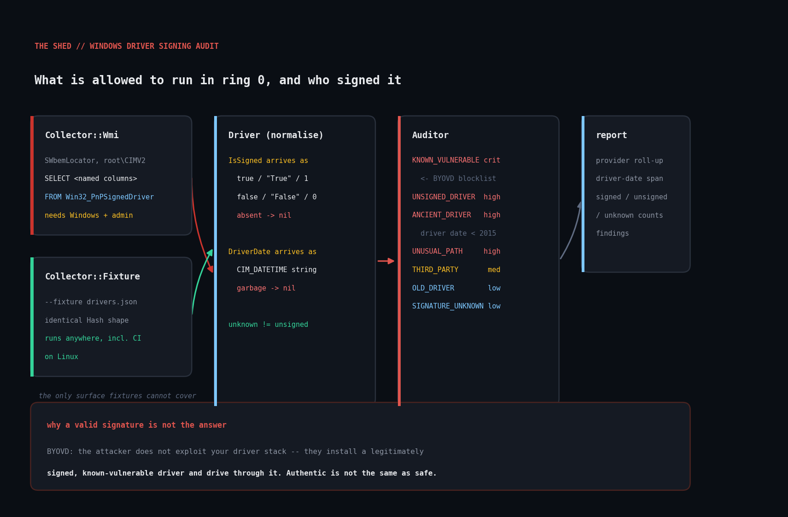

# win-driver-signing-audit

Audit installed Windows kernel-mode drivers over WMI for signing status, age,
provenance, and file location — with a swappable collector so the whole thing
runs and tests on Linux.



## The problem

A kernel-mode driver is the most privileged code on a Windows box. It runs in
ring 0, below every EDR hook and every user-mode protection you have bought.

So the interesting question for a Windows fleet is not "what software is
installed" — your inventory tool already answers that — but *what code is
currently allowed to run in the kernel, who signed it, and when was it last
touched.*

That question has become sharply practical. **Bring Your Own Vulnerable Driver**
(BYOVD) is now a standard opening move for kernel-level attacks: the attacker
does not exploit your driver stack, they install a legitimately signed,
known-vulnerable driver and drive through it. Microsoft maintains a
[vulnerable driver blocklist](https://learn.microsoft.com/en-us/windows/security/application-security/application-control/app-control-for-business/design/microsoft-recommended-driver-block-rules)
precisely because a valid signature tells you a driver is *authentic*, not that
it is *safe*.

This script enumerates `Win32_PnPSignedDriver` and reports drivers that are
unsigned, signed by someone other than Microsoft, very old, parked outside the
protected driver directories, or on a blocklist you supply.

## Prerequisites

- **Ruby >= 2.7.** Standard library plus `win32ole`, which ships with
  [RubyInstaller for Windows](https://rubyinstaller.org/).
- **Windows 7 or newer** for live WMI collection. Run from an **elevated**
  prompt — driver enumeration needs Administrator.
- **Any platform** for `--fixture` mode, which reads the same data from JSON.
  That is how the logic is tested in CI.

## Usage

On Windows:

```
ruby win_driver_signing_audit.rb
ruby win_driver_signing_audit.rb --json > drivers.json
ruby win_driver_signing_audit.rb --host SERVER01 --min-severity high
ruby win_driver_signing_audit.rb --blocklist byovd.txt
```

Anywhere, against an exported list:

```
ruby win_driver_signing_audit.rb --fixture drivers.json
```

| Flag | Meaning |
| --- | --- |
| `--host NAME` | remote host to query over WMI (default local) |
| `--fixture PATH` | read driver rows from JSON instead of WMI |
| `--blocklist PATH` | known-vulnerable driver names, one per line; `#` comments allowed |
| `--json` | emit JSON instead of text |
| `--min-severity SEV` | report `critical`/`high`/`medium`/`low` and above |

Exit codes: `0` clean, `1` warnings only, `2` high or critical present,
`3` could not enumerate.

## How it works

### The collector boundary

There are two collectors that return the identical `Hash` shape:

- **`Collector::Wmi`** connects through `WbemScripting.SWbemLocator` to
  `root\CIMV2` and queries `Win32_PnPSignedDriver`.
- **`Collector::Fixture`** reads the same rows from a JSON file.

Everything downstream consumes that one shape, which is what makes this
auditable on a Linux CI runner. The untested surface shrinks to eleven lines of
OLE calls.

One performance note on the query: it selects explicit columns rather than `*`.
The default `Win32_PnPSignedDriver` projection returns every PnP property, and
on a laptop with a few hundred devices the difference between `SELECT *` and a
named column list is seconds, not milliseconds.

### Normalising hostile data

WMI is an unfriendly data source for tidy code, and `Driver` exists to absorb
that. Two properties are genuinely inconsistent across provider versions:

**`IsSigned`** arrives as a real boolean over OLE, as the strings `"True"` /
`"False"` from some remote providers and from JSON, as `1` / `0` from others, and
sometimes not at all. The script accepts all of those shapes — and keeps
**absent** as a third state (`nil`), distinct from "unsigned". Reporting
"signing status could not be established" is honest; reporting an unknown driver
as unsigned would be a false accusation on the most alarming finding in the
report.

**`DriverDate`** arrives as `CIM_DATETIME`
(`"20230814000000.000000-000"`) or as an OLE date object depending on how you
asked. Anything unparseable becomes `nil` rather than raising, because one
mangled date must not abort a fleet-wide audit.

### The rules

| Code | Severity | Trigger |
| --- | --- | --- |
| `KNOWN_VULNERABLE_DRIVER` | critical | matches a `--blocklist` entry |
| `UNSIGNED_DRIVER` | high | `IsSigned` is explicitly false |
| `ANCIENT_DRIVER` | high | driver date before 2015 |
| `UNUSUAL_DRIVER_PATH` | high | file outside the system driver directories |
| `THIRD_PARTY_KERNEL_CODE` | medium | signed, but not by Microsoft |
| `OLD_DRIVER` | low | driver date before 2019 |
| `SIGNATURE_UNKNOWN` | low | `IsSigned` absent from WMI |

Notes on the ones that are judgement calls:

- **The blocklist is the only rule that can be critical**, because a
  known-vulnerable driver is not a posture problem, it is a live kernel-level
  foothold. Matching is case-insensitive against the INF name, the driver
  filename from the path, and the device name, since vendors ship the same
  vulnerable driver under several product names while the INF/service name stays
  stable.
- **`THIRD_PARTY_KERNEL_CODE` is not a vulnerability** and is deliberately
  `medium`. On most fleets the third-party kernel drivers are five to fifteen
  vendors; anything not on that list arrived recently and deliberately. It is an
  inventory prompt, not an alert.
- **Age is a proxy, not a verdict.** A 2011 driver is not automatically
  dangerous, but it predates the mitigations that make kernel code auditable —
  and old third-party drivers are the exact population BYOVD blocklists are
  drawn from.
- **A `nil` path produces no path finding.** If WMI gave us nothing to judge, the
  script says nothing rather than crying wolf. `DriverStore\FileRepository`
  counts as trusted alongside `System32\drivers`.

## Example output

```
Windows driver signing audit -- 2026-09-17 12:47:31 CDT
source: fixture /tmp/drvdemo/drivers.json
==============================================================================

DRIVERS: 9 enumerated
  Microsoft-provided: 4
  third-party:        5
  unsigned:           1
  signing unknown:    1

THIRD-PARTY KERNEL PROVIDERS
------------------------------------------------------------------------------
  NVIDIA                                   1 driver(s)  2025-2025
  Acme Devices Ltd                         1 driver(s)  2022-2022
  Orion Storage                            1 driver(s)  2011-2011
  Contoso Tools                            1 driver(s)  2023-2023
  Almico                                   1 driver(s)  2018-2018

FINDINGS (10)
------------------------------------------------------------------------------
[CRITICAL] KNOWN_VULNERABLE_DRIVER
    device:   Speedfan Hardware Monitor
    matches blocklist entry 'speedfan.sys' -- a driver on your BYOVD watchlist
    is loaded; a valid signature does not make it safe, it makes it usable
    evidence: inf=speedfan.inf path=C:\Windows\System32\drivers\speedfan.sys

[HIGH] ANCIENT_DRIVER
    device:   LegacySCSI Host Adapter
    driver binary dates from 2011, predating the mitigations that make kernel
    code auditable -- and old third-party drivers are the exact population
    BYOVD blocklists are drawn from
    evidence: driverDate=2011-04-18 version=2.1.0.14

[HIGH] UNSIGNED_DRIVER
    device:   Acme Widget Interface
    reports no digital signature -- on a correctly configured 64-bit Windows
    install this should be impossible, so either enforcement is disabled or the
    driver was installed in test-signing mode
    evidence: signer=(none) provider=Acme Devices Ltd

[HIGH] UNUSUAL_DRIVER_PATH
    device:   Vendor Telemetry Filter
    driver file lives outside the protected system driver directories, which is
    both unusual and a weaker place to defend
    evidence: path=C:\Program Files\ContosoAgent\bin\ctfilter.sys

[LOW] SIGNATURE_UNKNOWN
    device:   Generic Volume Shadow Copy
    WMI returned no IsSigned value for this device, so signing status could not
    be established either way -- verify manually with signtool
    evidence: signer=(none)

==============================================================================
9 driver(s); 1 critical, 3 high, 4 medium, 2 low
```

The provider roll-up with its date span is usually the most useful block on a
real host: five vendors you recognise and one you do not is the whole audit in
six lines.

## Testing

```
ruby win_driver_signing_audit_test.rb
```

33 checks against nine WMI-shaped fixture rows, covering every rule plus the
awkward parts: all five `IsSigned` type variants, `CIM_DATETIME` parsing,
unparseable dates, `nil` paths, `DriverStore` path recognition, blocklist
matching with comments, both accepted JSON shapes, severity filtering, and exit
codes.

### Honest scope note

**This harness does not prove the WMI query itself works.** That needs a real
Windows host, and no Windows host was available in the environment this was
written in. What is verified:

- Every line of logic *downstream* of the query, against fixtures shaped exactly
  like what `Win32_PnPSignedDriver` really returns — including the string-typed
  booleans and `CIM_DATETIME` strings.
- That `Collector::Wmi` fails cleanly on a non-Windows platform: it raises a
  `WmiError` mentioning `win32ole`, exits 3, and suggests `--fixture`, rather
  than producing a `LoadError` backtrace.

The `SELECT` statement, the `ConnectServer` call and the property names are
taken from Microsoft's documented `Win32_PnPSignedDriver` schema, but they have
not been executed. Verify against one host before trusting a fleet-wide run —
the quickest cross-check is that the driver count roughly matches
`pnputil /enum-drivers` or `driverquery /si`.

## Troubleshooting

**`error: win32ole is unavailable`**
You are not on Windows, or on a Ruby build without `win32ole`. Use `--fixture`.

**`WMI query failed: Access denied`**
Run from an elevated prompt. For `--host`, the account needs remote WMI rights
and the firewall must allow WMI-IN (DCOM 135 plus the dynamic range).

**Zero drivers returned, exit 3.**
Almost always a non-elevated shell. If elevated and still empty, the WMI
repository may be damaged — `winmgmt /verifyrepository` will say so.

**Every driver reports `SIGNATURE_UNKNOWN`.**
The provider is not populating `IsSigned` on this Windows version. Cross-check a
sample with `signtool verify /pa /v C:\Windows\System32\drivers\<name>.sys`. The
script deliberately will not guess.

**A driver you know is signed shows `UNSIGNED_DRIVER`.**
Check whether test signing is on — `bcdedit /enum | findstr testsigning`. That
is itself a serious finding: with test signing enabled, anyone can load any
driver.

**Everything looks fine but a driver is still in use you did not expect.**
`Win32_PnPSignedDriver` covers PnP devices. Non-PnP filter drivers and services
of type `kernel` are not all represented — see the extension idea below.

## Extending it

- **Wire in Microsoft's recommended block rules.** The published blocklist is
  the obvious source for `--blocklist`, and it is maintained by people who track
  this full-time. Convert the XML `FileRuleRef` entries to a name list and this
  script becomes a real BYOVD check.
- **Cover non-PnP drivers too.** Query `Win32_SystemDriver` (or read
  `HKLM\SYSTEM\CurrentControlSet\Services` for `Type` 1 and 2) and merge on the
  driver path. Filter drivers — the interesting ones for tampering — often are
  not PnP devices at all.
- **Verify the signature instead of trusting `IsSigned`.** Shelling out to
  `signtool verify /pa` per driver gives you the actual certificate chain, the
  signing timestamp, and whether the signing cert has been revoked. Slower, much
  stronger.
- **Hash the binaries.** SHA-256 per `.sys` file turns this into file-integrity
  monitoring for ring 0, and lets you match against threat-intel hashes rather
  than filenames, which are trivially renamed.
- **Check whether the directory is writable.** `UNUSUAL_DRIVER_PATH` currently
  flags location only. A driver in a directory that a non-admin can write to is
  considerably worse, and the ACL check is a natural follow-on.
- **Diff across the fleet.** Collect `--json` from every host and compare
  provider sets. One machine with a kernel driver no other machine has is the
  strongest single signal available here.

## References

- [`Win32_PnPSignedDriver` class](https://learn.microsoft.com/en-us/windows/win32/cimwin32prov/win32-pnpsigneddriver)
  — every property queried here
- [Microsoft recommended driver block rules](https://learn.microsoft.com/en-us/windows/security/application-security/application-control/app-control-for-business/design/microsoft-recommended-driver-block-rules)
  — the canonical BYOVD blocklist
- [Ruby `WIN32OLE`](https://docs.ruby-lang.org/en/master/WIN32OLE.html)
- [`CIM_DATETIME` format](https://learn.microsoft.com/en-us/windows/win32/wmisdk/cim-datetime)
- [Driver signing policy on Windows](https://learn.microsoft.com/en-us/windows-hardware/drivers/install/driver-signing)

## License

MIT, same as the rest of this repository.
