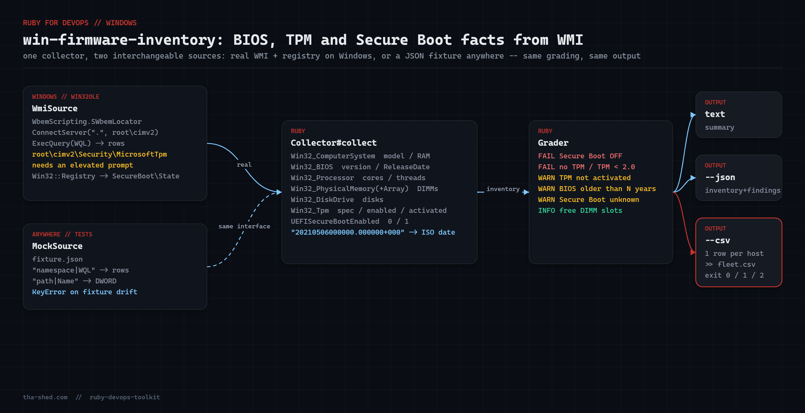

# win-firmware-inventory

Windows **hardware + firmware readiness inventory** via WMI (`win32ole`) and the registry: BIOS version and age, TPM presence/spec, Secure Boot state, DIMM slots, disks and serial numbers — graded with an exit code you can alert on.

Every quarter someone asks "which machines still have Secure Boot off?", "how many boxes are on a 2019 BIOS?", "do we have free RAM slots before we order?". Clicking through `msinfo32` on 200 machines is not an answer. `win_firmware_inventory.rb` is.



## Prerequisites

- Windows 10/11 or Server 2016+
- Ruby 2.7+ from [RubyInstaller](https://rubyinstaller.org/) — `win32ole` and `win32/registry` ship with it, no gems
- Run from an **elevated** prompt to read `Win32_Tpm` (the `root\cimv2\Security\MicrosoftTpm` namespace is admin-only); everything else works unelevated
- `--mock FILE` mode runs on any OS (Linux/macOS/CI) and touches no Windows APIs

## Usage

```powershell
ruby win_firmware_inventory.rb                 # readable summary
ruby win_firmware_inventory.rb --json          # full inventory as JSON
ruby win_firmware_inventory.rb --csv >> fleet.csv   # one row per machine
ruby win_firmware_inventory.rb --max-bios-age 3
ruby win_firmware_inventory.rb --mock fixture.json  # test anywhere
```

Exit codes: `0` OK · `1` WARN (old BIOS, TPM not activated, Secure Boot unknown) · `2` FAIL (Secure Boot OFF, no TPM, TPM < 2.0) · `3` win32ole unavailable.

## How it works

1. **Two interchangeable data sources.** `WmiSource` connects through `WbemScripting.SWbemLocator` and runs WQL; `MockSource` answers the same `query(namespace, wql)` / `registry_dword(path, name)` calls from a JSON fixture. The rest of the script cannot tell them apart, which is what makes the Windows-only logic testable on Linux.
2. **`Collector#collect`** issues eight small WQL queries (`Win32_ComputerSystem`, `Win32_BIOS`, `Win32_Processor`, `Win32_BaseBoard`, `Win32_PhysicalMemory`, `Win32_PhysicalMemoryArray`, `Win32_DiskDrive`, `Win32_Tpm`) and reads `HKLM\SYSTEM\CurrentControlSet\Control\SecureBoot\State\UEFISecureBootEnabled`. Selecting only the columns you need matters: `SELECT *` on `Win32_Processor` is measurably slower.
3. **WMI date parsing.** WMI returns `ReleaseDate` as `20210506000000.000000+000`; `parse_wmi_date` takes the first 8 characters and turns them into ISO-8601, then `age_years` compares against today.
4. **`Grader`** turns facts into `FAIL` / `WARN` / `INFO` findings: Secure Boot off, TPM missing or < 2.0, TPM present but not activated, BIOS older than `--max-bios-age`, free DIMM slots.
5. **Output**: text summary, `--json` (inventory + findings), or `--csv` (one row, header only when stdout is a TTY so `>>` appends cleanly).

## Example output

```
win-firmware-inventory v1.0.0
System   : Dell Inc. OptiPlex 7090 (x64-based PC)  serial 7XK2Q93
Board    : 0K240Y  serial /7XK2Q93/CNCMK0011A00CD/
BIOS     : Dell Inc. 1.9.2  released 2021-05-06 (5y old)
CPU      : 11th Gen Intel(R) Core(TM) i7-11700 @ 2.50GHz  8C/16T
Memory   : 15.9 GB in 2/4 slots  [DIMM1=8.0GB@3200, DIMM3=8.0GB@3200]
Disk     : NVMe PM9A1 NVMe Samsung 512GB  476.9 GB  Fixed hard disk media (SCSI)
TPM      : spec 2.0 enabled=true activated=true
SecureBoot: OFF

findings:
  [FAIL] Secure Boot is OFF
  [WARN] BIOS is 5 years old (2021-05-06) -- check vendor for firmware updates
  [INFO] 2 free DIMM slot(s)

result: FAIL
```

CSV row: `LT-ENG-007,LENOVO,20XW,PF3ABCDE,N32ET91W (1.67),2025-03-11,1,2.0,true,31.7,0,OK`

## Mock fixture format

```json
{
  "queries": {
    "root\\cimv2|SELECT SMBIOSBIOSVersion, ReleaseDate, SerialNumber, Manufacturer FROM Win32_BIOS":
      [{"SMBIOSBIOSVersion": "1.9.2", "ReleaseDate": "20210506000000.000000+000",
        "SerialNumber": "7XK2Q93", "Manufacturer": "Dell Inc."}],
    "root\\cimv2\\Security\\MicrosoftTpm|SELECT IsEnabled_InitialValue, IsActivated_InitialValue, SpecVersion, ManufacturerVersion FROM Win32_Tpm":
      [{"IsEnabled_InitialValue": true, "IsActivated_InitialValue": true, "SpecVersion": "2.0, 0, 1.38"}]
  },
  "registry": { "SYSTEM\\CurrentControlSet\\Control\\SecureBoot\\State|UEFISecureBootEnabled": 0 }
}
```

Keys are `namespace|WQL` exactly as the collector issues them; a missing key raises `KeyError` so you notice fixture drift immediately.

## Troubleshooting

- **`TPM : NOT PRESENT` on a machine that has one** — you are not elevated. `Win32_Tpm` lives in an admin-only namespace; the script also prints a `WMI query failed` warning on stderr in that case.
- **`SecureBoot: unknown`** — the registry key only exists on UEFI-booted systems. Legacy/CSM boot → no key → `WARN`, which is exactly what you want to find.
- **`cannot load such file -- win32ole`** — you are on non-Windows Ruby. Use `--mock`.
- **BIOS age off by one** — `ReleaseDate` is the SMBIOS date, which some OEMs stamp with the *build* date rather than the release date. Treat it as a trend signal, not a compliance fact.
- **How this was tested — honestly.** `win32ole` cannot run on Linux, so the WMI path was verified by review only. Every other line (collector, date parsing, grading, text/JSON/CSV output, exit codes) was executed under Ruby 3.3 with two fixtures via `--mock`: a Dell desktop with Secure Boot off and a 2021 BIOS (expect `FAIL`, exit 2) and a Lenovo laptop with everything green (expect `OK`, exit 0). Running without `--mock` on non-Windows correctly exits 3.

## Extending

- Push the CSV row to a share or an HTTP endpoint and build a fleet table in a sheet or Grafana.
- Add `Win32_NetworkAdapter` MACs and `Win32_OperatingSystem` build number for a full asset record.
- Query `Win32_EncryptableVolume` (namespace `root\cimv2\Security\MicrosoftVolumeEncryption`) to correlate TPM state with BitLocker status.
- Run as a scheduled task at logon and write results to the Application event log with `EventCreate`.

## References

- [Ruby `WIN32OLE` docs](https://docs.ruby-lang.org/en/3.3/WIN32OLE.html)
- [Ruby `Win32::Registry` docs](https://docs.ruby-lang.org/en/3.3/Win32/Registry.html)
- [Win32_BIOS class (Microsoft Learn)](https://learn.microsoft.com/en-us/windows/win32/cimwin32prov/win32-bios)
- [Win32_Tpm class (Microsoft Learn)](https://learn.microsoft.com/en-us/windows/win32/secprov/win32-tpm)
- [Win32_PhysicalMemoryArray (Microsoft Learn)](https://learn.microsoft.com/en-us/windows/win32/cimwin32prov/win32-physicalmemoryarray)
