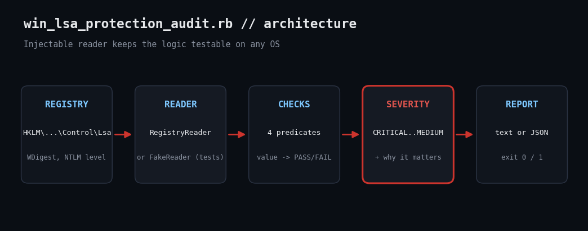

# Audit Windows LSA Protection and WDigest with Ruby

Mimikatz-style credential dumping depends on a handful of registry values. Check them across your Windows fleet with Ruby's bundled `win32/registry`.



## The problem

Attackers who land on a Windows host go after LSASS memory for cached credentials. Four registry settings decide how bad that is: RunAsPPL makes LSASS a protected process, UseLogonCredential controls cleartext WDigest caching, LmCompatibilityLevel governs NTLM strength, and everyoneincludesanonymous widens anonymous access. Checking them by hand across servers does not scale.

## Prerequisites

- Ruby 3.x for Windows (RubyInstaller); win32/registry ships with Ruby
- Run in an elevated prompt for consistent registry access (read-only, changes nothing)
- Linux/macOS can run --self-test only

## Usage

```
ruby win_lsa_protection_audit.rb
```

## How it works

1. **Declarative checks.** Each entry in CHECKS holds the key, value name, a lambda that decides pass/fail, severity, and a plain-English reason. WDigest passes when absent because modern Windows defaults it off.
2. **Injectable reader.** RegistryReader wraps Win32::Registry::HKEY_LOCAL_MACHINE and returns nil for absent values. FakeReader serves a Hash. Both expose #read(key, name), so run_checks does not care which it gets.
3. **Self-test.** --self-test feeds a good and a weak configuration through the real logic and raises if the expected results differ.
4. **Report.** Each setting prints PASS/FAIL, observed value, expected value and severity, with the reason on failures. Exit 1 on any failure.

## Example output

```
self-test OK (good: 4/4 PASS, bad: 3 FAIL)
sample findings for a weak host:
RunAsPPL                     FAIL    value=absent  want=1 or 2      HIGH
    -> LSASS is not a protected process; credential dumpers can read its memory.
UseLogonCredential           FAIL    value=1       want=0 or absent CRITICAL
    -> WDigest keeps cleartext passwords in LSASS memory.
LmCompatibilityLevel         FAIL    value=3       want=5           MEDIUM
    -> Allows LM/NTLMv1 authentication, which is trivially crackable.
everyoneincludesanonymous    PASS    value=absent  want=0           -
```

## Troubleshooting

- Honest caveat: the real win32/registry path cannot execute on Linux. I verified the check logic with the FakeReader harness (the output tab), and the registry wrapper is a few lines you should smoke-test on one Windows host first.
- RunAsPPL only takes effect after reboot; a FAIL right after enabling may be pending a restart.
- Group Policy may overwrite values; audit the effective (live) registry, as this does.

## Extending

- Add HKLM\SYSTEM\CurrentControlSet\Control\DeviceGuard (Credential Guard) checks.
- Run via WinRM across a fleet and aggregate the JSON.
- Add a --fix mode gated behind confirmation.

## References

- [Microsoft: Configure added LSA protection](https://learn.microsoft.com/en-us/windows-server/security/credentials-protection-and-management/configuring-additional-lsa-protection)
- [Ruby Win32::Registry](https://docs.ruby-lang.org/en/3.3/Win32/Registry.html)
- [Microsoft: LmCompatibilityLevel](https://learn.microsoft.com/en-us/previous-versions/windows/it-pro/windows-10/security/threat-protection/security-policy-settings/network-security-lan-manager-authentication-level)
