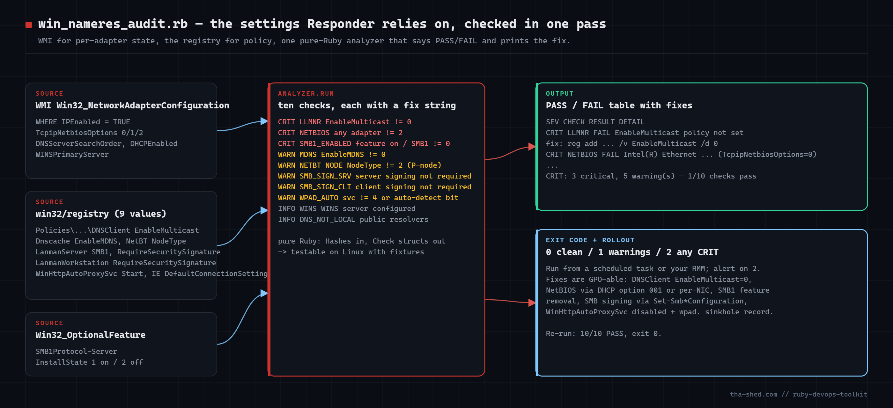
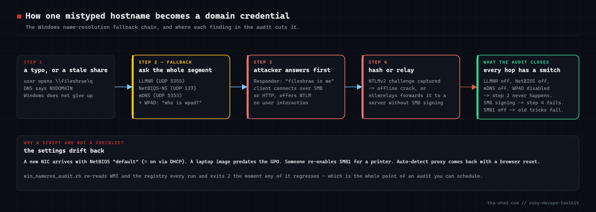

# win-nameres-audit

Audit a Windows host for the name-resolution and SMB settings that make credential-relay attacks
(Responder, ntlmrelayx) work: LLMNR, NetBIOS over TCP/IP per adapter, mDNS, WPAD auto-detect,
SMB1, SMB signing (server and client), NetBT node type, WINS and public DNS servers. Reads WMI and the
registry from Ruby, prints PASS/FAIL with the exact fix for each failing check, exits non-zero until
the box is actually hardened.



Companion article: https://tha-shed.com/ — *Ruby for DevOps: Auditing the Windows Name-Resolution Attack Surface*

## Why

When DNS returns NXDOMAIN, Windows broadcasts the question to the local segment (LLMNR/UDP 5355,
NetBIOS-NS/UDP 137, mDNS/UDP 5353) and, with proxy auto-detect on, asks for a host named `wpad`.
An attacker on the segment answers, the client authenticates with NTLM, and the hash is cracked or
relayed to any server that does not require SMB signing (MITRE ATT&CK T1557.001). Every hop has an
off switch; they drift back on.



## Prerequisites

- Ruby 3.x on Windows (RubyInstaller). `win32ole` is stdlib on Windows; `win32-registry` is a bundled
  default gem (`gem install win32-registry` if missing).
- Windows 10 / Server 2016+. Run **elevated** for the HKLM policy/service keys and `Win32_OptionalFeature`.
- Any OS for `test_win_nameres_audit.rb` — it never loads `win32ole`.

## Usage

```
ruby win_nameres_audit.rb          # PASS/FAIL table with fixes, exit 0/1/2
ruby win_nameres_audit.rb --json   # for your SIEM / RMM
ruby test_win_nameres_audit.rb     # fixture harness (Linux/macOS/Windows), 6 assertions
```

| Check | Severity | PASS when |
|-------|----------|-----------|
| LLMNR | CRIT | `HKLM\SOFTWARE\Policies\Microsoft\Windows NT\DNSClient\EnableMulticast` = 0 |
| NETBIOS | CRIT | every IP-enabled adapter has `TcpipNetbiosOptions` = 2 |
| SMB1_ENABLED | CRIT | `SMB1Protocol-Server` InstallState = 2 **or** `LanmanServer\Parameters\SMB1` = 0 |
| MDNS | WARN | `Dnscache\Parameters\EnableMDNS` = 0 |
| NETBT_NODE | WARN | `NetBT\Parameters\NodeType` = 2 (P-node) |
| SMB_SIGN_SRV | WARN | `LanmanServer\Parameters\RequireSecuritySignature` = 1 |
| SMB_SIGN_CLI | WARN | `LanmanWorkstation\Parameters\RequireSecuritySignature` = 1 |
| WPAD_AUTO | WARN | `WinHttpAutoProxySvc` Start = 4 **and** IE auto-detect bit (byte 8 & 0x08 of `DefaultConnectionSettings`) clear |
| WINS | INFO | no WINS server on any adapter |
| DNS_NOT_LOCAL | INFO | all adapter DNS servers are RFC1918 / link-local |

Exit codes: `0` clean, `1` warnings only, `2` any CRIT.

## How it works

1. **`WindowsSources#adapters`** — `Win32_NetworkAdapterConfiguration WHERE IPEnabled = TRUE`, returned as plain Hashes
   (`Array(...)` guards the `nil` WMI returns for empty arrays).
2. **`WindowsSources#registry`** — nine values opened with `KEY_READ | KEY_WOW64_64KEY`; any `Win32::Registry::Error`
   becomes `nil`, which for LLMNR/mDNS means *enabled* and is reported as such.
3. **`WindowsSources#smb1_feature_state`** — `Win32_OptionalFeature` InstallState for `SMB1Protocol-Server`.
4. **`Analyzer.run`** — ten explicit checks producing `Check` structs (severity, code, PASS/FAIL, observed detail, fix command).
   The IE auto-detect flag is decoded with `dcs.getbyte(8) & 0x08`.
5. **`summarize` / `print_text`** — status line, per-check rows, `fix:` lines only for failing CRIT/WARN checks.

## Example output (harness, unhardened fixture)

```
win_nameres_audit  2026-09-11 15:53  3 IP-enabled adapter(s)
----------------------------------------------------------------------------------------------------
  Intel(R) Ethernet Connection I219-LM     ip=10.20.5.41       dhcp=true  netbios=0 dns=10.20.0.10,10.20.0.11
  Intel(R) Wi-Fi 6 AX201 160MHz            ip=192.168.1.57     dhcp=true  netbios=0 dns=8.8.8.8,1.1.1.1
  Hyper-V Virtual Ethernet Adapter         ip=172.28.0.1       dhcp=false netbios=2 dns=

SEV    CHECK          RESULT DETAIL
CRIT   LLMNR          FAIL  EnableMulticast policy not set (LLMNR on by default)
                            fix: reg add "HKLM\SOFTWARE\Policies\Microsoft\Windows NT\DNSClient" /v EnableMulticast /t REG_DWORD /d 0 /f
CRIT   NETBIOS        FAIL  Intel(R) Ethernet Connection I219-LM (TcpipNetbiosOptions=0); Intel(R) Wi-Fi 6 AX201 160MHz (TcpipNetbiosOptions=0)
                            fix: wmic nicconfig where IPEnabled=true call SetTcpipNetbios 2   (or Set-NetAdapterBinding / DHCP option 001)
WARN   MDNS           FAIL  EnableMDNS not set (mDNS responder on by default)
...
CRIT   SMB1_ENABLED   FAIL  SMB1Protocol-Server InstallState=1, LanmanServer\SMB1=nil
WARN   WPAD_AUTO      FAIL  WinHttpAutoProxySvc Start=3, IE auto-detect=true
INFO   DNS_NOT_LOCAL  FAIL  Intel(R) Wi-Fi 6 AX201 160MHz -> 8.8.8.8; Intel(R) Wi-Fi 6 AX201 160MHz -> 1.1.1.1

CRIT: 3 critical, 5 warning(s) — 1/10 checks pass
```

After the GPO fixture: `OK: 0 critical, 0 warning(s) — 10/10 checks pass`, `assertions: 6/6 passed`.

## Troubleshooting

- **NETBIOS fails on Hyper-V / WSL / VPN adapters** — set them to 2 too, or filter by description.
- **LLMNR passes but Responder still gets hits** — check mDNS and NetBIOS; confirm the GPO is linked (`gpresult /h`).
- **`InstallState=nil`** — `Win32_OptionalFeature` needs elevation / is absent on Server Core; set `LanmanServer\SMB1 = 0` explicitly.
- **WPAD_AUTO fails after disabling the service** — the IE bit is per-user (HKCU of the account running the audit).
- **`WIN32OLERuntimeError: Access is denied`** — run elevated.
- **Testing note** — `WindowsSources` was reviewed against the documented `win32ole` / `Win32::Registry` APIs but not
  executed on Windows while this was written; the analysis layer was executed via the harness on Ruby 3.4
  (unhardened fixture CRIT, hardened fixture OK, 6/6 assertions). Run once by hand on a Windows host before scheduling.

## Extending

- LDAP signing / channel binding, `LmCompatibilityLevel`, `RestrictSendingNTLMTraffic`, IPv6 router discovery (mitm6).
- Fleet mode via `WIN32OLE.connect("winmgmts://HOST/root/cimv2")`.
- `--apply` mode that runs the `fix` strings elevated with a log (NETBIOS last).
- Baseline diff on `--json`: alert on PASS -> FAIL transitions.
- Linux twin: `avahi-daemon`, `systemd-resolved` `LLMNR=` / `MulticastDNS=`.

## References

- Win32_NetworkAdapterConfiguration: https://learn.microsoft.com/en-us/windows/win32/cimwin32prov/win32-networkadapterconfiguration
- Detect, enable and disable SMBv1: https://learn.microsoft.com/en-us/windows-server/storage/file-server/troubleshoot/detect-enable-and-disable-smbv1-v2-v3
- MITRE ATT&CK T1557.001: https://attack.mitre.org/techniques/T1557/001/
- Ruby `WIN32OLE`: https://docs.ruby-lang.org/en/3.4/WIN32OLE.html
- win32-registry gem: https://rubygems.org/gems/win32-registry
