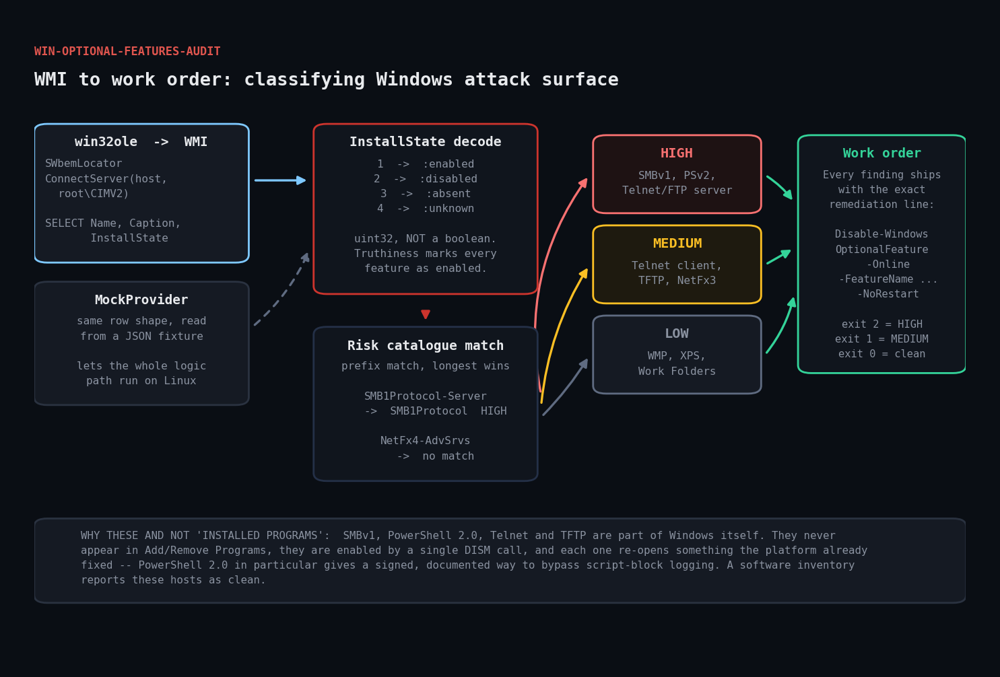

# win-optional-features-audit

Ruby tool that enumerates Windows optional features over WMI, classifies the
enabled ones against a risk catalogue, and emits the exact remediation command
for each finding.



## The problem

An "installed programs" inventory misses the most dangerous software on a
Windows box, because that software is not a program — it is a Windows *optional
feature*. SMBv1, Telnet Client, TFTP Client, PowerShell 2.0 and the legacy .NET
3.5 runtime all ship inside Windows itself, are enabled by a checkbox or a
one-line DISM call, and never appear in Add/Remove Programs.

They matter because each one re-opens something the platform already fixed:

- **SMBv1** is the protocol WannaCry and NotPetya spread over. Deprecated since
  2014, removed by default since 1709, and unfixable by design — no pre-auth
  integrity, no secure dialect negotiation. It still turns up enabled on file
  servers because an old scanner or NAS "needed" it once.
- **PowerShell 2.0** predates AMSI, script-block logging and constrained
  language mode. While it is installed, `powershell -version 2` is a signed,
  documented, one-flag downgrade that silently defeats the PowerShell logging
  your SOC is watching.
- **Telnet and TFTP clients** are living-off-the-land transfer tools that let an
  intruder move files without dropping a binary AV would notice.

## Prerequisites

| | |
|---|---|
| Ruby | [RubyInstaller for Windows](https://rubyinstaller.org/) >= 2.7 (`win32ole` is stdlib) |
| OS | Windows 8.1 / Server 2012 R2 or later |
| Privileges | Local admin; remote queries need admin on the target and DCOM reachable |

**This does not run under WSL or Linux Ruby** — `win32ole` does not exist there.
Use `--mock` to exercise the logic on any OS.

## Usage

```powershell
# audit this machine
ruby win_optional_features_audit.rb

# audit a remote server
ruby win_optional_features_audit.rb --computer FILESRV01

# list every enabled feature, not just risky ones
ruby win_optional_features_audit.rb --all

# JSON, including a ready-to-run remediation script array
ruby win_optional_features_audit.rb --format json

# offline: run the whole logic path against a fixture (works on Linux)
ruby win_optional_features_audit.rb --mock fixtures/mock_features.json
```

### Exit codes

| Code | Meaning |
|---|---|
| `0` | No catalogued risky features enabled |
| `1` | Medium-risk features enabled |
| `2` | High-risk features enabled, or WMI unreachable |

## How it works

### 1. Connecting to WMI

```ruby
locator = WIN32OLE.new('WbemScripting.SWbemLocator')
service = locator.ConnectServer(@computer, 'root\\CIMV2')
service.Security_.ImpersonationLevel = 3   # RPC_C_IMP_LEVEL_IMPERSONATE
```

Connecting explicitly rather than via the `winmgmts:` moniker shorthand means a
remote connection failure raises *here*, with a usable message, instead of
failing later in the middle of enumeration.

`ImpersonationLevel = 3` is required for most remote queries; without it the
provider often returns access-denied for perfectly authorised callers.

### 2. Decoding InstallState — the bug worth avoiding

`Win32_OptionalFeature.InstallState` is a `uint32`, not a boolean:

| Value | Meaning |
|---|---|
| `1` | Enabled |
| `2` | Disabled |
| `3` | Absent from the image entirely |
| `4` | Unknown |

```ruby
INSTALL_STATE = { 1 => :enabled, 2 => :disabled, 3 => :absent, 4 => :unknown }
```

Testing truthiness — `if feature.InstallState` — marks **every** feature as
enabled, because `2` and `3` are just as truthy as `1`. That produces a report
full of false positives, which is worse than no report: people stop reading it.

Note also that `3` (absent) is *better* than `2` (disabled): a feature whose
payload has been removed from the image cannot be re-enabled without source
media.

### 3. Prefix matching, longest wins

```ruby
def match_risk(name)
  n = name.downcase
  CATALOGUE.select { |r| n.start_with?(r.name.downcase) }
           .max_by { |r| r.name.length }
end
```

Microsoft versions these features: `SMB1Protocol`, `SMB1Protocol-Client`,
`SMB1Protocol-Server`, `SMB1Protocol-Deprecation`. A hardcoded exact match
silently misses the child features that actually carry the protocol.

Prefix matching — rather than `include?` — also avoids the reverse error.
`NetFx4-AdvSrvs` must not match the `NetFx3` entry, and it does not, because it
does not start with it. There is a regression test for exactly this.

### 4. Defensive property reads

Individual WMI properties can be NULL, and on some providers touching a NULL
property raises rather than returning nil. Each read is wrapped so one malformed
row cannot abort the whole audit.

### The risk catalogue

| Feature | Severity |
|---|---|
| `SMB1Protocol` (and children) | high |
| `MicrosoftWindowsPowerShellV2` | high |
| `TelnetServer` | high |
| `IIS-FTPServer` | high |
| `TelnetClient` | medium |
| `TFTP` | medium |
| `SimpleTCP` | medium |
| `NetFx3` | medium |
| `IIS-WebServerRole` | medium |
| `WindowsMediaPlayer` | low |
| `Printing-XPSServices` | low |
| `WorkFolders-Client` | low |

## Testing without Windows

`test_harness.rb` feeds `Analyzer` the exact row shape `WmiProvider` produces
and asserts on the result. The WMI call itself cannot run on Linux, but the
InstallState decoding, risk matching, severity ranking and exit-code mapping all
can — and that is where the bugs live. A WMI query that returns rows is the easy
part.

```
$ ruby test_harness.rb
win_optional_features_audit -- logic tests
--------------------------------------------------------------

InstallState decoding
  ok   state 1 decodes to :enabled
  ok   state 2 decodes to :disabled
  ok   state 3 decodes to :absent
  ok   unknown state falls back to :unknown
  ok   disabled feature is not reported as risky
  ok   absent feature is not reported as risky

Risk catalogue matching
  ok   parent SMB1Protocol matches
  ok   child SMB1Protocol-Server matches too
  ok   child SMB1Protocol-Client matches too
  ok   PowerShellV2Root matches V2 entry
  ok   unlisted feature has no risk
  ok   NetFx4 does not match the NetFx3 entry

Severity ordering
  ok   worst severity is :high
  ok   risky list is high-first
  ok   medium is worst when no high present
  ok   clean host reports no worst severity
  ok   clean host has empty risky list

Malformed / defensive input
  ok   nil row does not raise
  ok   nil InstallState becomes :unknown
  ok   empty feature list is handled

Reporting
  ok   text report names the feature
  ok   text report includes a fix line
  ok   json reports computer name
  ok   json emits remediation script
  ok   json worst_severity is high

--------------------------------------------------------------
25 passed, 0 failed
```

## Example output

```
============================================================================
Windows optional feature audit -- localhost
============================================================================
  18 features known: 12 enabled, 4 disabled, 2 absent from image

RISKY FEATURES ENABLED
----------------------------------------------------------------------------
[HIGH] MicrosoftWindowsPowerShellV2
       Windows PowerShell 2.0 Engine
       PowerShell 2.0 predates AMSI, script-block logging and constrained
       language mode. While installed, `powershell -version 2` is a signed,
       documented downgrade that silently defeats PowerShell logging.
       fix: Disable-WindowsOptionalFeature -Online -FeatureName MicrosoftWindowsPowerShellV2Root -NoRestart

[HIGH] SMB1Protocol
       SMB 1.0/CIFS File Sharing Support
       SMBv1 is the protocol WannaCry/NotPetya spread over. Deprecated
       since 2014, removed by default since 1709, and unfixable by design
       -- it has no pre-auth integrity and no secure dialect negotiation.
       fix: Disable-WindowsOptionalFeature -Online -FeatureName SMB1Protocol -NoRestart

[MED ] TelnetClient
       Telnet Client
       A built-in, unencrypted network client. Rarely needed post-2010 and
       commonly used by intruders for banner grabbing and lateral movement
       without dropping a new binary.
       fix: Disable-WindowsOptionalFeature -Online -FeatureName TelnetClient -NoRestart

RESULT: HIGH risk features present
```

Every finding ships with its remediation line, so the output is a work order
rather than a list.

## Troubleshooting

**`win32ole is unavailable`**
You are on Linux, macOS or WSL. Run it under RubyInstaller on Windows, or use
`--mock`.

**`WMI query failed ... 0x80070005` (access denied)**
Remote WMI needs local-admin rights on the *target*, DCOM enabled, and the
firewall rule `Windows Management Instrumentation (WMI-In)` allowed. On a
workgroup machine you also need `LocalAccountTokenFilterPolicy=1`.

**`0x800706BA` (RPC server unavailable)**
DCOM port 135 plus the dynamic RPC range is blocked, or the target is off.

**A feature you can see in `Get-WindowsOptionalFeature` is missing here**
`Win32_OptionalFeature` covers client optional features. Server roles live in
`Win32_ServerFeature` on Server SKUs — worth adding if you manage servers (see
Extending).

**Honest limitation:** the WMI path in this script has been verified by design
review and exercised through a mock provider, not executed on Linux — `win32ole`
makes that impossible. The 25 logic tests above all run on Linux; the
`ConnectServer`/`ExecQuery` sequence is the part you should confirm on a real
Windows host in your environment before scheduling it fleet-wide.

## Extending

- **Server roles.** Add a second query against `Win32_ServerFeature` on Server
  SKUs and merge the rows; the `Analyzer` interface does not change.
- **Fleet sweep.** Loop `--computer` over an AD computer list and aggregate the
  JSON. `worst_severity` sorts the fleet for you.
- **Auto-remediation.** The JSON output includes `remediation_script` as an
  array — feed it to PowerShell behind an approval gate. Disabling features
  usually requires a reboot, so schedule it in a window.
- **Baseline diffing.** Store last run's enabled set and alert on *new* features
  appearing. A feature turning on by itself is a strong signal.
- **CIS/STIG mapping.** Attach control IDs to catalogue entries so the output
  drops straight into a compliance report.
- **Local override list.** Some hosts genuinely need NetFx3. A suppressions file
  keyed by feature name plus a justification keeps the report actionable.

## References

- [Win32_OptionalFeature class](https://learn.microsoft.com/en-us/windows/win32/cimwin32prov/win32-optionalfeature)
- [Disable-WindowsOptionalFeature](https://learn.microsoft.com/en-us/powershell/module/dism/disable-windowsoptionalfeature)
- [Stop using SMB1 — Microsoft Storage at Microsoft blog](https://techcommunity.microsoft.com/blog/filecab/stop-using-smb1/425858)
- [PowerShell 2.0 deprecation](https://learn.microsoft.com/en-us/powershell/scripting/windows-powershell/install/windows-powershell-system-requirements)
- [Ruby WIN32OLE](https://docs.ruby-lang.org/en/3.3/WIN32OLE.html)
- [RubyInstaller for Windows](https://rubyinstaller.org/)

## License

MIT — see [LICENSE](../LICENSE).
