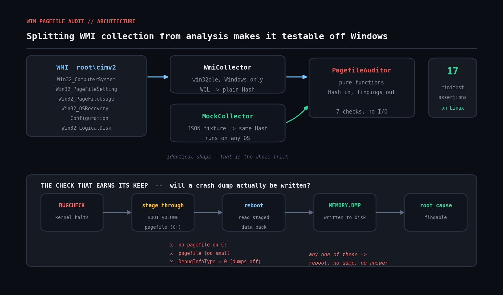

# win-pagefile-audit

Audit Windows pagefile and crash-dump configuration across a fleet, in Ruby, via WMI (`win32ole`). Read-only, no gems.



## The problem

The pagefile is the setting nobody owns. It defaults to **System managed**, which is fine on a laptop and quietly wrong on a 256 GB database server. Two failures follow, and both surface at the worst possible moment:

**1. Capacity.** A system-managed pagefile grows into whatever free space the system volume has. On a C: drive sized for the OS, a memory spike fills the disk — and a full system volume takes down *everything* on the box, not just the process that spiked.

**2. Crash dumps.** Windows writes a kernel memory dump **through the pagefile on the boot volume**. If that pagefile is too small, or was moved off C: to "save space", or the dump type is set to `None`, then when the server bugchecks you get a reboot and **no dump file**. The one artifact that would have told you why the machine died does not exist. You find this out after the outage.

Neither is visible in typical monitoring: disk usage looks fine until it isn't, and dump configuration has no metric at all.

## Prerequisites

| | |
|---|---|
| Ruby | 2.7+ on Windows (RubyInstaller) for live collection; any Ruby for `--mock` |
| Gems | none — `win32ole` ships with Ruby for Windows; `optparse`/`json` are stdlib |
| OS | Windows 7 / Server 2008 R2 and later |
| Privileges | local Administrator. Remote hosts also need DCOM + WMI firewall rules and admin rights on the target |
| Tests | `minitest` (bundled with Ruby) |

## Usage

```powershell
# Local host, elevated prompt
ruby win_pagefile_audit.rb

# A few servers
ruby win_pagefile_audit.rb --host SQLPROD01 --host APPWEB07

# JSON for a dashboard or ticket
ruby win_pagefile_audit.rb --format json

# CI / scheduled-task gate
ruby win_pagefile_audit.rb --fail-on high

# Capture a host's raw facts (this is how you make new fixtures)
ruby win_pagefile_audit.rb --dump-raw > fixtures/sqlprod01.json

# Replay collected facts anywhere, including Linux
ruby win_pagefile_audit.rb --mock fixtures/sample_hosts.json --host SQLPROD01
```

Exit codes: `0` clean, `1` findings at or above `--fail-on`, `2` collection failed on every host.

## How it works

### The architecture is the point

`win32ole` only exists on Windows, so the WMI path can't run in Linux CI. The script is built so that **collection and analysis are separate objects**:

* `WmiCollector#collect` runs five WQL queries and returns a plain Ruby `Hash`.
* `MockCollector#collect` reads a JSON file and returns **the same shape**.
* `PagefileAuditor#audit` takes that Hash and returns findings. Pure functions — no WMI, no I/O, no `win32ole`.

Everything except the five queries themselves is therefore testable anywhere. The test suite here runs on Linux and covers 17 cases with 36 assertions.

What is *not* covered by those tests: the `WIN32OLE.connect` moniker string, the WQL text, and WMI property-name casing. Those must be smoke-tested on a real Windows host with `--dump-raw`. The README says so honestly rather than pretending the suite proves more than it does.

### What it reads

| WMI class | for |
|---|---|
| `Win32_ComputerSystem` | installed RAM, `AutomaticManagedPagefile` |
| `Win32_PageFileSetting` | the **configured** initial/maximum size (persisted) |
| `Win32_PageFileUsage` | the **current** allocated size, current and peak usage |
| `Win32_OSRecoveryConfiguration` | `DebugInfoType`, dump path, overwrite flag |
| `Win32_LogicalDisk` | free space on the volumes the pagefiles live on |

The split between `PageFileSetting` (intent) and `PageFileUsage` (reality) matters: a host under `AutomaticManagedPagefile` often has **no** `Win32_PageFileSetting` instance at all while very much having a live pagefile.

### The seven checks

| check | severity | what it catches |
|---|---|---|
| `pagefile.absent` | high | no pagefile anywhere — no kernel dump is possible |
| `pagefile.automatic_managed` | high on ≥32 GB, else medium | system-managed sizing on a large-memory host |
| `pagefile.undersized` | medium | initial size below `max(RAM/8, 2048 MB)` |
| `pagefile.growth_window` | low | maximum > initial, so the file grows on demand — slow and fragmenting, mid-incident |
| `pagefile.peak_pressure` | high ≥90%, medium ≥70% | peak usage close to the allocation — this host genuinely needs it |
| `pagefile.volume_headroom` | medium | the volume can't absorb the pagefile's remaining growth room |
| `dump.disabled` | high | `DebugInfoType = 0` |
| `dump.minidump_only` | medium | `DebugInfoType = 3` — 256 KB isn't enough for pool or I/O-path analysis |
| `dump.no_boot_volume_pagefile` | high | kernel/complete/automatic dump selected but no pagefile on C: |
| `dump.pagefile_too_small` | high | boot-volume pagefile smaller than the dump needs to stage |
| `dump.no_overwrite` | low | later dumps are discarded after the first |

`kernel_dump_floor_mb` scales with RAM rather than sitting at a flat number: RAM-sized below 4 GB, then `RAM/8` capped at 32 GB plus 512 MB of header. A complete dump needs `RAM + 512 MB`.

`dump.disabled` deliberately **short-circuits** the other dump checks. If dumps are off, "your pagefile is too small to stage a dump" is noise — fix the first thing first.

## Example output

Against the bundled four-host fixture:

```
Windows pagefile + crash dump audit
==============================================================================

SQLPROD01  (SQLPROD01)
  RAM              : 262144 MB
  system managed   : YES
  pagefiles        : C:\pagefile.sys 4096-65536 MB
  allocated / peak : 4096 MB / 3990 MB
  crash dump       : Kernel memory dump -> %SystemRoot%\MEMORY.DMP
  HIGH   pagefile.automatic_managed
         AutomaticManagedPagefile is enabled. The pagefile is free to grow into whatever space the system volume has...
  HIGH   pagefile.peak_pressure
         C:\pagefile.sys peaked at 3990 MB of 4096 MB (97%). This host has genuinely needed the pagefile...
  HIGH   dump.pagefile_too_small
         The boot-volume pagefile is 4096 MB but a 'Kernel memory dump' on a 262144 MB host needs roughly 33280 MB to stage.
  MEDIUM pagefile.undersized
  MEDIUM pagefile.volume_headroom
  LOW    pagefile.growth_window

APPWEB07  (APPWEB07)
  pagefiles        : D:\pagefile.sys 8192-8192 MB
  crash dump       : Kernel memory dump -> %SystemRoot%\MEMORY.DMP
  HIGH   dump.no_boot_volume_pagefile
         Dump type is 'Kernel memory dump' but there is no pagefile on the boot volume (C:)...
  LOW    dump.no_overwrite

DCEDGE02  (DCEDGE02)
  pagefiles        : (none)
  crash dump       : None -> %SystemRoot%\MEMORY.DMP
  HIGH   pagefile.absent
  HIGH   dump.disabled

BUILD03  (BUILD03)
  RAM              : 32768 MB
  pagefiles        : C:\pagefile.sys 16384-16384 MB
  crash dump       : Kernel memory dump -> %SystemRoot%\MEMORY.DMP
  OK    no findings

==============================================================================
summary: 4 host(s), 10 finding(s)  high=6  medium=2  low=2
```

`APPWEB07` is the interesting one. Its pagefile is correctly sized, fixed, and nowhere near pressure — and it will still never produce a crash dump, because someone moved it to D:.

## Running the tests

```bash
ruby test_win_pagefile_audit.rb
```

```
Run options: --seed 9451
.................
Finished in 0.058328s, 291.4566 runs/s, 617.2022 assertions/s.
17 runs, 36 assertions, 0 failures, 0 errors, 0 skips
```

That runs on Linux. No Windows required, no WMI, no mocking library — just the fixture and the auditor.

## Troubleshooting

**`win32ole is not available`** — you're not on Windows. That's the script telling you honestly rather than failing obscurely. Use `--mock` to exercise the analysis, or run it on Windows for real collection.

**`WMI query against 'SERVER01' failed: access is denied`** — remote WMI needs more than a domain admin token. Check: DCOM is enabled on the target, the `Windows Management Instrumentation (WMI-In)` firewall rule is on, and you're running as a user with local admin rights *on the target*. `Test-WsMan SERVER01` and `Get-CimInstance -ComputerName SERVER01 Win32_ComputerSystem` are faster ways to isolate which of those is broken.

**`RPC server is unavailable`** — almost always the firewall. WMI uses DCOM's dynamic port range, not a single port. If you can't open it, run the script locally on each host via a scheduled task and collect the JSON centrally.

**"`pagefiles` shows `(none)` but Task Manager shows a pagefile."** — that's `AutomaticManagedPagefile` in action: Windows doesn't persist a `Win32_PageFileSetting` instance when it's managing sizing itself. The script reads `Win32_PageFileUsage` too, so the live file still appears in `allocated / peak`. If both are empty, there really is no pagefile.

**"`DebugInfoType` is 7 and I don't recognise it."** — that's Active memory dump, Server 2016+. It's a kernel dump that also captures user-mode pages the kernel was using, and it's usually the right choice on a modern server.

**Ruby 3.x and `win32ole`.** `win32ole` is still bundled with RubyInstaller but is no longer a default gem on every build. If `require 'win32ole'` fails on Windows, `gem install win32ole` fixes it.

**32-bit Ruby on 64-bit Windows** will see a redirected WMI view for some classes. Use a 64-bit Ruby build.

## Extending it

* **Add `Win32_PerfRawData_PerfOS_Memory`** for commit limit and commit charge. Commit pressure is the number that actually predicts a pagefile problem, and peak usage is only a proxy for it.
* **Check free space on the dump path**, not just the pagefile volume. The dump is staged through the pagefile and then *written* to `%SystemRoot%\MEMORY.DMP` on reboot — a full C: breaks the second half even when the first half worked.
* **Add `DedicatedDumpFile`.** Windows supports a dedicated dump file on a non-boot volume (`HKLM\SYSTEM\CurrentControlSet\Control\CrashControl\DedicatedDumpFile`), which is the supported way to have a small C: pagefile and still get dumps. The script currently reports `dump.no_boot_volume_pagefile` for those hosts — a false positive worth closing.
* **Fleet roll-up.** Run with `--format json` from a scheduled task on each host, drop the output on a share, and aggregate. "How many of our servers would produce no dump if they crashed tonight?" is a question most shops cannot answer.
* **Swap WMI for CIM over WinRM.** `Get-CimInstance` and WinRM are the modern, firewall-friendlier path. Shelling out to PowerShell and parsing `ConvertTo-Json` gives you the same Hash — and `MockCollector` shows how little else would have to change.
* **Add a `--remediate` mode carefully, or not at all.** Pagefile changes need a reboot; making them silently from an audit tool is how you surprise someone at 3am.

## References

- [`Win32_PageFileSetting`](https://learn.microsoft.com/en-us/windows/win32/cimwin32prov/win32-pagefilesetting) and [`Win32_PageFileUsage`](https://learn.microsoft.com/en-us/windows/win32/cimwin32prov/win32-pagefileusage) — the configured-vs-current split
- [`Win32_OSRecoveryConfiguration`](https://learn.microsoft.com/en-us/windows/win32/cimwin32prov/win32-osrecoveryconfiguration) — `DebugInfoType` values
- [Overview of memory dump file options](https://learn.microsoft.com/en-us/troubleshoot/windows-server/performance/memory-dump-file-options) — Microsoft's sizing requirements for each dump type, and the boot-volume pagefile requirement
- [How to determine the appropriate page file size](https://learn.microsoft.com/en-us/windows/client-management/determine-appropriate-page-file-size)
- [Ruby `WIN32OLE`](https://docs.ruby-lang.org/en/master/WIN32OLE.html) — the stdlib COM bridge
- [WQL (SQL for WMI)](https://learn.microsoft.com/en-us/windows/win32/wmisdk/wql-sql-for-wmi)

## Licence

MIT — see the repository root.
