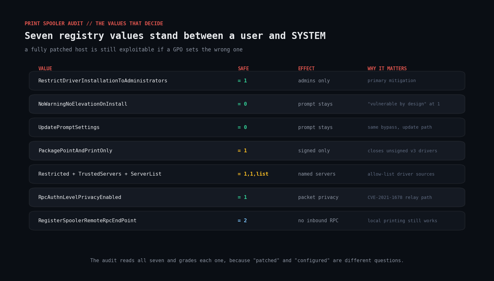
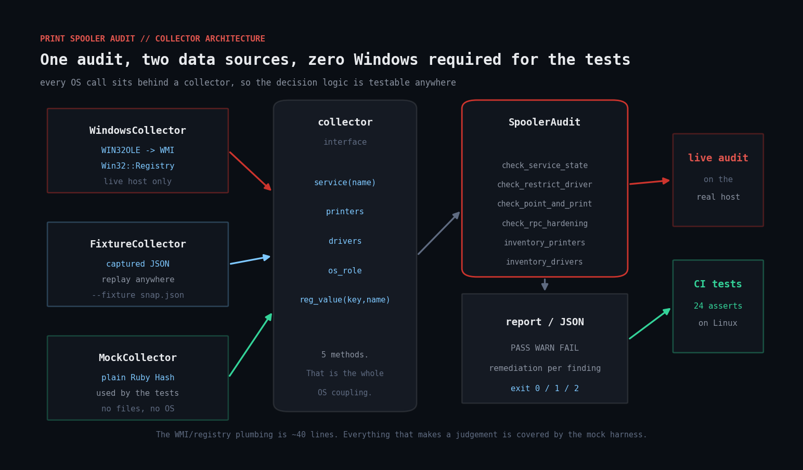

# win-print-spooler-audit

Audit the Windows Print Spooler attack surface in Ruby — service state via WMI, printers
and drivers via WMI, and the seven registry values that actually decide whether a
non-admin can load a DLL into a SYSTEM process.



## The problem

The Print Spooler runs as SYSTEM, is enabled by default on every Windows install
including domain controllers, and exposes an RPC interface that lets clients install
printer drivers. "Install a driver" means "load a DLL into a SYSTEM process". That
combination is why PrintNightmare (CVE-2021-1675 / CVE-2021-34527) turned into a two-year
patch treadmill, and why the mitigation is not a single hotfix but a set of registry
policies that are easy to set once and then silently regress the next time somebody edits
a GPO.

The dangerous state is not visible from the Services console:

* A box can be **fully patched and still exploitable**, because a GPO sets
  `NoWarningNoElevationOnInstall=1` — a value Microsoft's own advisory describes as
  making the system vulnerable by design.
* A box can look **alarming but be fine** — spooler running, but it genuinely is a print
  server with driver installation restricted to administrators.

"Patched" and "configured" are different questions, and only the second one is answerable
from the registry.

## What the script checks

| Check | Safe value | Why it matters |
| --- | --- | --- |
| Spooler service state | stopped, or a declared print server | graded against the host role |
| `RestrictDriverInstallationToAdministrators` | `1` | the primary PrintNightmare mitigation |
| `NoWarningNoElevationOnInstall` | `0` / unset | at `1`, install prompts are suppressed entirely |
| `UpdatePromptSettings` | `0` / unset | same bypass, on the driver *update* path |
| `PackagePointAndPrintOnly` | `1` | only signed, packaged drivers may install |
| `Restricted` + `TrustedServers` + `ServerList` | `1`, `1`, list | allow-list the servers drivers may come from |
| `RpcAuthnLevelPrivacyEnabled` | `1` / unset | at `0`, re-opens the CVE-2021-1678 NTLM relay path |
| `RegisterSpoolerRemoteRpcEndPoint` | `2` | disables inbound remote print RPC, keeps local printing |
| Shared printers on a `FILE:` port | none | a remote arbitrary-file-write performed by SYSTEM |
| Drivers loading from outside the protected driver store | none | where sideloaded v3 drivers land |

A running spooler on a **domain controller** is a `FAIL` on its own: it is the
highest-value spooler target on the network, because the printer-bug coercion primitive
is what turns a DC's spooler into an NTLM relay to AD CS.

Read-only. It never stops the spooler, writes a registry value, or removes a driver.
Every finding prints the exact `reg add` / `Set-Service` command you would run.

## Prerequisites

* **Ruby 2.7+** for Windows (RubyInstaller). `win32ole` and `win32/registry` ship with it
  — no gems.
* **Windows** for a live audit. Reading `HKLM\SOFTWARE\Policies\...` and querying WMI
  generally requires an elevated prompt; run from an **Administrator** PowerShell.
* **Any platform** (Linux, macOS) for `--fixture` replay and for the test suite.

## Usage

```powershell
# Audit this host (elevated PowerShell)
ruby win_print_spooler_audit.rb

# This box really is a print server -- relax the spooler-running finding
ruby win_print_spooler_audit.rb --role print-server

# Machine-readable
ruby win_print_spooler_audit.rb --json

# Capture this host's state for offline review or regression testing
ruby win_print_spooler_audit.rb --capture dc01.json
```

```bash
# Replay a captured snapshot anywhere -- no Windows needed
ruby win_print_spooler_audit.rb --fixture fixtures/vulnerable-dc.json

# Run the test suite (works on Linux/macOS/Windows)
ruby test_spooler_audit.rb
```

### Exit codes

`0` clean · `1` warnings · `2` failures · `3` usage error

## How it works

### The collector pattern



Everything that touches the OS sits behind a five-method interface:

```ruby
service(name)     # -> { 'state' => 'Running', 'start_mode' => 'Auto', ... }
printers          # -> [ { 'name' => ..., 'shared' => true, 'port' => ... } ]
drivers           # -> [ { 'name' => ..., 'path' => ... } ]
os_role           # -> { 'product_type' => 2, 'caption' => ... }
reg_value(key, n) # -> value or nil
```

Three implementations satisfy it:

* **`WindowsCollector`** — `WIN32OLE.connect('winmgmts://./root/cimv2')` for WMI,
  `Win32::Registry::HKEY_LOCAL_MACHINE.open` for the registry. About 40 lines.
* **`FixtureCollector`** — replays a JSON snapshot captured with `--capture`.
* **`MockCollector`** (in the test file) — a plain Ruby Hash.

That is the whole OS coupling. Every check, every severity decision, every remediation
string is in `SpoolerAudit`, which never sees a WMI object.

### Why `nil` is a distinct state

`reg_value` returns `nil` when the value **or the whole key** is absent, and that
distinction carries real meaning. Microsoft changed the *default* for
`RestrictDriverInstallationToAdministrators` to restricted in the August 2021 updates,
so an absent value is safe **on a patched host** — but only implicitly, and one GPO can
flip it. The script therefore grades it `WARN`, not `PASS`:

> RestrictDriverInstallationToAdministrators is not configured
> → Patched hosts default to restricted, but the value is unset so nothing pins it.

`RpcAuthnLevelPrivacyEnabled` is the opposite case: absent is genuinely `PASS`, because
the patched default is enforced and the only way to weaken it is to explicitly write `0`.
Getting these two backwards is the most common mistake in homegrown spooler checks.

### Host role inference

`Win32_OperatingSystem.ProductType` gives `1` (workstation), `2` (domain controller) or
`3` (member server). A running spooler is `FAIL` on a DC, `WARN` on a member server, and
`INFO` on a workstation. `--role print-server` overrides the inference — on a real print
server the spooler *must* run, and the driver-install policies carry the whole weight of
the mitigation.

## Testing Windows-only code on Linux

`win32ole` and `win32/registry` do not exist off Windows, so the live path cannot run
there. Rather than leave the logic untested until it reaches a real domain controller,
`test_spooler_audit.rb` drives `SpoolerAudit` through `MockCollector` with hand-built
data and asserts 24 specific behaviours:

```
======================================================================
  win_print_spooler_audit.rb -- mock collector test harness
  ruby 3.0.2 on x86_64-linux-gnu
======================================================================

baseline: fully hardened workstation
  ok    hardened host yields zero FAIL findings
  ok    hardened host yields zero WARN findings
  ok    stopped spooler reported as PASS
  ok    role inferred as workstation

registry regressions
  ok    RestrictDriverInstallation=0 is FAIL
  ok    RestrictDriverInstallation unset is WARN, not PASS
  ok    NoWarningNoElevationOnInstall=1 is FAIL
  ok    UpdatePromptSettings=1 is FAIL
  ok    RpcAuthnLevelPrivacyEnabled=0 is FAIL
  ok    RpcAuthnLevelPrivacyEnabled absent is PASS (patched default)
  ok    Restricted without TrustedServers is WARN
  ok    PackagePointAndPrintOnly=0 is WARN

host role logic
  ok    running spooler on a DC is FAIL
  ok    DC role inferred from ProductType=2
  ok    --role print-server downgrades the spooler finding to INFO
  ok    running spooler on a plain member server is WARN

printer and driver inventory
  ok    shared FILE: port printer is FAIL
  ok    unshared FILE: port printer is WARN
  ok    driver outside the driver store is WARN
  ok    remediation shows the Windows parent dir, not "."
  ok    driver inside the driver store is not flagged

fixture round-trip and JSON shape
  ok    FixtureCollector reproduces the MockCollector result
  ok    every finding carries severity, id and message
  ok    every FAIL/WARN carries a remediation

----------------------------------------------------------------------
  24 passed, 0 failed
----------------------------------------------------------------------
```

**Be honest about what this does and does not cover.** The 24 assertions exercise every
judgement the script makes. They do **not** exercise the WMI queries or the registry
reads — those are thin wrappers around single calls, and they are only proven by running
the script on Windows. What the harness buys you is that a logic regression is caught in
CI on Linux, instead of on a domain controller at 2am.

One of those tests exists because the harness caught a real bug: `File.dirname` is
platform-aware, so `File.dirname('C:\Program Files\Acme\bin\prn.dll')` returns `"."` on
Linux. The remediation string said `icacls "."`. The fix is a `win_dirname` helper that
splits on both separators, and the test pins it.

## Example output

Replaying `fixtures/vulnerable-dc.json` — a domain controller with a badly-configured GPO:

```
==============================================================================
  WINDOWS PRINT SPOOLER AUDIT -- 2026-09-16 12:15:46
==============================================================================

  Data source       : fixture fixtures/vulnerable-dc.json
  Host role         : domain-controller
  OS                : Microsoft Windows Server 2022 Standard
  Spooler           : Running (start Auto)
  Printers          : 3 (2 shared)
  Drivers installed : 3

------------------------------------------------------------------------------

[FAIL] NoWarningNoElevationOnInstall = 1 -- driver install prompts are suppressed entirely
       -> Microsoft states a system with this value set is vulnerable by design.

[FAIL] RestrictDriverInstallationToAdministrators = 0 -- non-admins may install printer drivers
       -> This is the PrintNightmare mitigation and it is explicitly disabled. Set it to 1.

[FAIL] UpdatePromptSettings = 1 -- driver UPDATE prompts are suppressed

[FAIL] printer 'Archive to PDF' uses a FILE: port AND IS SHARED
       -> A FILE: port turns a print job into a file write performed by the spooler (SYSTEM).

[FAIL] RpcAuthnLevelPrivacyEnabled = 0 -- spooler RPC authentication has been downgraded

[FAIL] Print Spooler is RUNNING on a domain controller
       -> A DC has no business printing. Stop-Service Spooler -Force;
          Set-Service Spooler -StartupType Disabled

[WARN] driver 'AcmeLabel v2 Driver' loads from C:\Program Files\AcmeLabel\bin\acmeprn.dll
       (outside the protected driver store)
       -> Verify the publisher and that the path is not writable by non-admins
          (icacls "C:\Program Files\AcmeLabel\bin").

[WARN] PackagePointAndPrintOnly = not set -- unpackaged (v3) drivers are allowed
[WARN] Point and Print is Restricted but TrustedServers is not enforced
[WARN] RegisterSpoolerRemoteRpcEndPoint = not set -- this host accepts inbound remote print RPC

[INFO] 3 printer driver(s) installed
[INFO] shared printer 'Archive to PDF' (share ARCHIVE, driver Microsoft Print To PDF)
[INFO] shared printer 'HP LaserJet M404 (Floor 3)' (share FLOOR3-HP, ...)

------------------------------------------------------------------------------
  6 fail   4 warn   3 info   0 pass
==============================================================================
```

## Troubleshooting

**`WIN32OLERuntimeError: failed to create WIN32OLE object` / access denied.**
Run from an elevated prompt. WMI's `root/cimv2` namespace and the policy keys under
`HKLM\SOFTWARE\Policies` both need administrator rights.

**Every registry value comes back `nil` on a host you know is configured.**
Two usual causes. First: 32-bit Ruby on 64-bit Windows gets redirected into
`HKLM\SOFTWARE\WOW6432Node`. Install 64-bit Ruby, or open the key with
`Win32::Registry::KEY_READ | 0x0100` (`KEY_WOW64_64KEY`). Second: the settings were made
in Group Policy but never applied — run `gpupdate /force` and re-check.

**The audit says the policy is right but `rundll32 printui.dll` still installs a driver as a
normal user.**
Check for a conflicting GPO further up the precedence chain with
`gpresult /h report.html`, and confirm the machine actually has the July 2021 or later
cumulative update. This script reads configuration; it does not verify patch level. Pair
it with `Get-HotFix` or your patch management system.

**`--fixture` output differs from the live run on the same box.**
Snapshots are point-in-time. Re-capture with `--capture` before comparing. The
`captured_at` field in the JSON tells you how stale it is.

**A driver legitimately lives outside the driver store and is flagged every run.**
That finding is a `WARN` by design — it asks for a human decision rather than asserting a
problem. If it is genuinely approved, filter it in your pipeline by its stable finding id
(`driver.outside_store:<name>`) rather than silencing the whole check.

**`win32ole` is missing.**
You are almost certainly on non-Windows Ruby, or on JRuby. The script detects this and
tells you to use `--fixture`. For a live audit you need CRuby on Windows.

## Extending it

* **Fleet sweep.** `--capture` over PowerShell Remoting into a share, then run the audit
  over every snapshot from one place. `Invoke-Command -ComputerName (Get-ADComputer ...)`
  makes this a one-liner.
* **Patch level.** Query `Win32_QuickFixEngineering` in the collector and cross-reference
  against the PrintNightmare KB list, so "patched" and "configured" are reported together.
* **Driver signature verification.** `Get-AuthenticodeSignature` on each driver path, or
  read the PE certificate table directly, and flag unsigned or self-signed drivers.
* **ACL the spooler directories.** Add a check on
  `C:\Windows\System32\spool\drivers` permissions — a writable driver directory is its own
  escalation path, independent of the RPC surface.
* **Point and Print client side.** The same policies apply to clients pulling drivers.
  Run the audit fleet-wide, not just on print servers.
* **Wire it to your SIEM.** The `--json` output has a stable `id` per finding, which makes
  it straightforward to alert only on transitions rather than on every run.

## References

* [Microsoft: KB5005010 — Restricting installation of new printer drivers after applying the July 6, 2021 updates](https://support.microsoft.com/en-us/topic/kb5005010-restricting-installation-of-new-printer-drivers-after-applying-the-july-6-2021-updates-31b91c02-05bc-4ada-a7ea-183b129578a7)
* [Microsoft: CVE-2021-34527 (PrintNightmare) guidance](https://msrc.microsoft.com/update-guide/vulnerability/CVE-2021-34527)
* [Microsoft: KB5005652 — Manage new Point and Print default driver installation behavior](https://support.microsoft.com/en-us/topic/kb5005652-manage-new-point-and-print-default-driver-installation-behavior-c78c43d5-bf6a-4c99-8a6f-97a4d3b56e6e)
* [Microsoft Learn: Point and Print Restrictions policy](https://learn.microsoft.com/en-us/troubleshoot/windows-server/printing/point-and-print-restrictions-policy)
* [Win32_Printer WMI class](https://learn.microsoft.com/en-us/windows/win32/cimwin32prov/win32-printer)
* [Win32_PrinterDriver WMI class](https://learn.microsoft.com/en-us/windows/win32/cimwin32prov/win32-printerdriver)
* [Ruby `win32ole` documentation](https://docs.ruby-lang.org/en/master/exts/win32ole/WIN32OLE.html)
* [Ruby `win32/registry` documentation](https://docs.ruby-lang.org/en/master/Win32/Registry.html)

## License

MIT — see the repository [LICENSE](../LICENSE).
