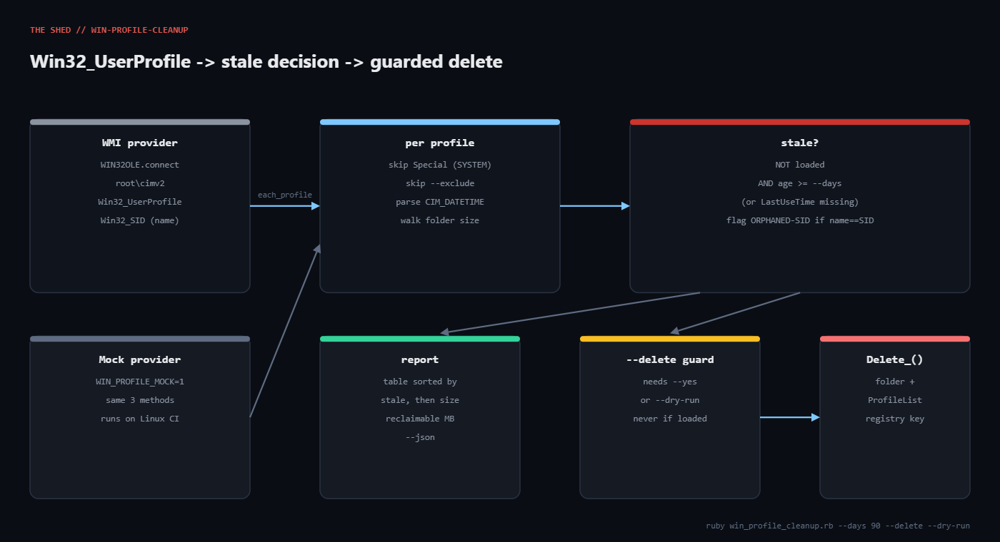

# win-profile-cleanup

**Platform:** Windows  
**Script:** [`win_profile_cleanup.rb`](win_profile_cleanup.rb)

Every contractor, intern and one-off RDP login leaves a C:\Users\<name> folder behind, and on shared hosts that adds up to tens of gigabytes. This script talks to WMI's Win32_UserProfile class through win32ole, ranks profiles by age and size, flags orphaned SIDs, and only deletes when you say so twice.



## Prerequisites

- Ruby 3.x for Windows (RubyInstaller). win32ole is part of the standard library on Windows; no gems required.
- Windows 10/11 or Server 2016+ with WMI running (it always is). Run from an elevated prompt for --delete; the audit works as a normal admin user.
- For testing on Linux/macOS/CI: set WIN_PROFILE_MOCK=1 to use the built-in fake provider.

## Usage

```bash
ruby win_profile_cleanup.rb                       # report profiles unused > 90 days
ruby win_profile_cleanup.rb --days 30 --min-size-mb 500
ruby win_profile_cleanup.rb --days 90 --exclude svc_backup --delete --dry-run
ruby win_profile_cleanup.rb --days 90 --delete --yes   # actually delete (elevated prompt)
ruby win_profile_cleanup.rb --json > profiles.json
WIN_PROFILE_MOCK=1 ruby win_profile_cleanup.rb    # test anywhere without win32ole
```

## How it works

### 1. Connect to WMI

WIN32OLE.connect('winmgmts://./root/cimv2') attaches to the local CIM repository. ExecQuery('SELECT * FROM Win32_UserProfile') returns one COM object per profile; each is converted to a plain Ruby hash so the rest of the script never touches COM directly.

### 2. Skip what must never be touched

Profiles with Special = true (SYSTEM, LocalService, NetworkService, DefaultAppPool) are skipped outright. --exclude matches the bare account name, the DOMAIN\name form, or the folder name, so --exclude svc_backup,ci-runner works however you think about the account.

### 3. Resolve SID to account

@wmi.Get("Win32_SID.SID='S-1-5-21-...'") gives ReferencedDomainName and AccountName. A WIN32OLERuntimeError here means the account no longer exists; the script keeps the SID as the name and flags the row as orphaned.

### 4. Decide staleness

A profile is stale when it is not loaded and either its age in days is at least --days or LastUseTime is missing entirely (which happens on profiles migrated from older Windows versions). Folder size is walked with Dir.glob and File::FNM_DOTMATCH, rescuing per-file errors so a locked NTUSER.DAT doesn't abort the walk; --no-size skips it on huge hosts.

### 5. Report, then guard the delete

Rows are sorted stale-first then by size, with total reclaimable MB at the bottom. --delete without --yes or --dry-run exits 2. With --yes, Win32_UserProfile.Delete_() is called per stale profile (the trailing underscore is how win32ole exposes a method whose name collides with a Ruby keyword) inside a rescue so one failure doesn't stop the run.

## Example output

```text
$ WIN_PROFILE_MOCK=1 ruby win_profile_cleanup.rb --days 90
Windows user-profile audit  host=localhost  stale after 90 days
============================================================================================
  ACCOUNT                PATH                         AGE(d)   SIZE(MB)  TYPE       LOADED    FLAGS
  CORP\contractor.old    C:\Users\contractor.old      210      4120      local      no        STALE
  CORP\amartinez         C:\Users\amartinez           95       1890      roaming    no        STALE
  CORP\svc_backup        C:\Users\svc_backup          400      35        local      no        STALE
  S-1-5-21-1-1004        C:\Users\tmp.LAB             120      12        temporary  no        STALE,ORPHANED-SID
  CORP\ci-runner         C:\Users\ci-runner           20       22400     local      no        
  CORP\jsmith            C:\Users\jsmith              0        -         local      yes       

Stale profiles: 4 / 6   reclaimable: 6057 MB (5.9 GB)
exit=1  (stale profiles found)

$ WIN_PROFILE_MOCK=1 ruby win_profile_cleanup.rb --days 90 --exclude svc_backup --delete --dry-run

  would delete C:\Users\contractor.old  (CORP\contractor.old, 4120 MB, 210d)
  would delete C:\Users\amartinez  (CORP\amartinez, 1890 MB, 95d)
  would delete C:\Users\tmp.LAB  (S-1-5-21-1-1004, 12 MB, 120d)

$ ruby win_profile_cleanup.rb --delete      # no --yes, no --dry-run
Refusing to delete without --yes (or use --dry-run).
exit=2

$ ruby win_profile_cleanup.rb                # on Linux, no mock
error: win32ole is only available on Windows. Set WIN_PROFILE_MOCK=1 to test elsewhere.
exit=2
```

## Troubleshooting

- "win32ole is only available on Windows" (exit 2): you ran it on Linux/macOS without WIN_PROFILE_MOCK=1. That is the intended behaviour and is what the sandbox test returned.
- The mock is not the real thing. As stated in the walkthrough, COM calls were verified against Microsoft's documented Win32_UserProfile and Win32_SID members, not executed. First run on a real host should be an audit only (no --delete), then --dry-run.
- Delete fails with "Access denied" (0x80070005). Not elevated, or the profile is loaded by a disconnected RDP session. Check query user and log the session off first; the script skips profiles WMI reports as loaded but a half-torn-down session can still hold files.
- Delete fails with 0x80041001 (generic failure). Usually a file inside the profile is open by a service (an updater, OneDrive). Stop the service or reboot, then re-run.
- Every profile shows age ?. LastUseTime is null on some upgraded systems; those profiles are treated as stale only if not loaded. Cross-check with the folder's modified date before deleting.
- Folder size walk takes forever. Profiles with AppData caches can have millions of files. Use --no-size for a quick audit, then run the size walk on the shortlist.

## Extending

- Fleet mode: wrap it in a PowerShell remoting or WinRM loop and collect --json per host into a CSV of reclaimable space by machine.
- Roaming-profile awareness: rows with roaming in the TYPE column live on a file server too; add a switch to also report the server-side folder.
- Scheduled task: run the audit weekly and email the report; only run --delete --yes from a change-controlled job with --exclude pinned to your service accounts.
- Add --older-than-logoff using Win32_NetworkLoginProfile.LastLogoff as a second opinion on age.
- Push reclaimable MB into a monitoring system as a gauge so you can see profile bloat trending before the disk alert fires.

## References

- [Win32_UserProfile class (Microsoft Learn)](https://learn.microsoft.com/en-us/windows/win32/wmisdk/win32-userprofile)
- [Win32_SID class (Microsoft Learn)](https://learn.microsoft.com/en-us/previous-versions/windows/desktop/secrcw32prov/win32-sid)
- [CIM_DATETIME format](https://learn.microsoft.com/en-us/windows/win32/wmisdk/cim-datetime)
- [Ruby WIN32OLE docs](https://docs.ruby-lang.org/en/3.3/WIN32OLE.html)

- Tutorial post: https://tha-shed.com/ ("Ruby for DevOps: Reclaiming Gigabytes of Stale Windows User Profiles with WMI")

---

Part of [ruby-devops-toolkit](https://github.com/jjam3774/ruby-devops-toolkit). MIT licensed.
