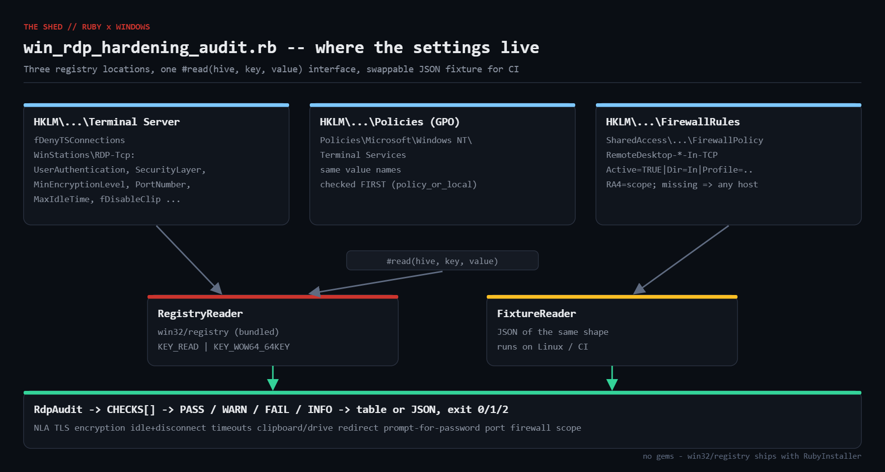

# win-rdp-hardening-audit

Audit Remote Desktop hardening on a Windows host from the registry using only
Ruby's bundled `win32/registry`. Honors Group Policy precedence, parses the
Windows Firewall rule strings for RDP scope, and grades each setting
PASS / WARN / FAIL / INFO with a plain-English explanation. Includes JSON
fixtures so the logic runs and can be unit-tested on Linux/macOS/CI.



## Prerequisites

* Ruby 2.7+ from [RubyInstaller](https://rubyinstaller.org/) on Windows
  (`win32/registry` is bundled — no gems)
* Elevated prompt recommended (FirewallRules key may be restricted)
* Any OS for fixture mode

## Usage

```powershell
ruby win_rdp_hardening_audit.rb                 # table
ruby win_rdp_hardening_audit.rb --json          # JSON for SIEM / CSV merge
ruby win_rdp_hardening_audit.rb --fixture fixture_default_windows.json   # run anywhere
ruby win_rdp_hardening_audit.rb --fixture fixture_hardened.json
```

Exit codes: `0` all pass, `1` warnings only, `2` at least one FAIL.

## Checks

| id | setting | pass when |
|----|---------|-----------|
| rdp_enabled | `fDenyTSConnections` | 1 (info only; if RDP is off the rest become INFO) |
| nla_required | `UserAuthentication` | 1 |
| security_layer_tls | `SecurityLayer` | 2 (TLS) |
| encryption_high | `MinEncryptionLevel` | 3 or 4 (High / FIPS) |
| idle_timeout | `MaxIdleTime` | 1..900000 ms |
| disconnect_timeout | `MaxDisconnectionTime` | > 0 |
| clipboard_redirect | `fDisableClip` | 1 |
| drive_redirect | `fDisableCdm` | 1 |
| prompt_for_password | `fPromptForPassword` | 1 |
| port_nonstandard | `PortNumber` | != 3389 (info only) |
| firewall_scope | `FirewallRules\RemoteDesktop*` | inbound rule has `RA4=` scope on Public/Any |

Values are read from `HKLM\SOFTWARE\Policies\Microsoft\Windows NT\Terminal Services`
first (Group Policy) and fall back to
`HKLM\SYSTEM\CurrentControlSet\Control\Terminal Server\WinStations\RDP-Tcp`.

## How it works

1. `RegistryReader#read(hive, key, value)` opens with `KEY_READ | KEY_WOW64_64KEY`
   and returns `nil` on any `Win32::Registry::Error`. `FixtureReader` is a
   `Hash#dig` over JSON of the same shape — the audit cannot tell them apart.
2. `CHECKS` is a table of `{fetch, pass, explain}` lambdas; adding a check is
   adding one hash.
3. `policy_or_local` implements GPO precedence.
4. `firewall_scope` selects active inbound `RemoteDesktop*` rules, collects
   every `Profile=` token and the `RA4=` remote scope; missing `RA4` = any host.
5. `RdpAudit#run` grades, `overall` maps to the exit code.

## Example output

```
$ ruby win_rdp_hardening_audit.rb --fixture fixture_default_windows.json
RDP hardening audit  host=claude
==============================================================================
[INFO] Remote Desktop enabled                         0
       -> RDP is ENABLED; remaining checks matter
[FAIL] Network Level Authentication required          0
       -> UserAuthentication=0; without NLA attackers reach the login screen pre-auth (BlueKeep class bugs)
[FAIL] Security layer set to TLS                      1
       -> SecurityLayer=1; 0=RDP-native, 1=negotiate, 2=TLS/SSL. Require TLS
[FAIL] Encryption level High or FIPS                  2
       -> MinEncryptionLevel=2; 1=Low 2=Client-compatible 3=High 4=FIPS
[WARN] Idle session timeout configured                0
       -> MaxIdleTime=0 ms; set <= 900000 (15 min) so abandoned sessions cannot be hijacked
[WARN] Disconnected session timeout configured        nil
       -> MaxDisconnectionTime=nil; disconnected sessions linger forever and hold licences/memory
[WARN] Clipboard redirection disabled                 0
       -> fDisableClip=0; clipboard is a common exfil path for jump hosts
[WARN] Drive redirection disabled                     0
       -> fDisableCdm=0; mapped client drives let malware hop across the session
[WARN] Always prompt for password on connect          0
       -> fPromptForPassword=0; prevents saved-credential auto-logon from stolen .rdp files
[INFO] Listening port (informational)                 3389
       -> PortNumber=3389; 3389 is scanned constantly. Changing it is obscurity, not security, but cuts log noise
[FAIL] Firewall RDP rule limited to trusted subnets   1 rule(s)
       -> 1 inbound RDP rule(s) allow any remote address on Public/Any profile
==============================================================================
summary: INFO=2  FAIL=4  WARN=5
exit=2

$ ruby win_rdp_hardening_audit.rb --fixture fixture_hardened.json
RDP hardening audit  host=claude
==============================================================================
[INFO] Remote Desktop enabled                         0
       -> RDP is ENABLED; remaining checks matter
[ OK ] Network Level Authentication required          1
[ OK ] Security layer set to TLS                      2
[ OK ] Encryption level High or FIPS                  4
[ OK ] Idle session timeout configured                900000
[ OK ] Disconnected session timeout configured        3600000
[ OK ] Clipboard redirection disabled                 1
[ OK ] Drive redirection disabled                     1
[ OK ] Always prompt for password on connect          1
[INFO] Listening port (informational)                 3389
       -> PortNumber=3389; 3389 is scanned constantly. Changing it is obscurity, not security, but cuts log noise
[ OK ] Firewall RDP rule limited to trusted subnets   1 rule(s)
==============================================================================
summary: INFO=2  PASS=9
exit=0
```

## Testing note

The Linux sandbox used to develop this cannot load `win32/registry`, so the
`RegistryReader` path was verified against the documented API but not
executed; every check was exercised end-to-end through the JSON fixtures.
Please open an issue for any Windows-specific problem.

## Troubleshooting

* **`cannot load such file -- win32/registry`** — non-RubyInstaller build, or you are on Linux (use `--fixture`).
* **All values `nil`** — verify with `reg query "HKLM\SYSTEM\CurrentControlSet\Control\Terminal Server\WinStations\RDP-Tcp"`.
* **0 firewall rules** — custom rule names; extend the regex in `firewall_scope`.
* **Access denied** — run elevated.

## Extending

* `--fix` / `--fix-dry-run` remediation via `reg.write_i` or generated `reg add` commands.
* Fleet runs over WinRM / OpenSSH-for-Windows, merged to CSV.
* Extra checks: Restricted Admin mode, RD Gateway enforcement, `Remote Desktop Users` membership.
* Scheduled fixture export + diff for drift detection.
* Write results to the Windows Event Log for SIEM pickup.

## References

* [Win32::Registry](https://ruby-doc.org/stdlib-3.0.2/libdoc/win32/registry/rdoc/Win32/Registry.html)
* [Win32_TSGeneralSetting](https://learn.microsoft.com/en-us/windows/win32/termserv/win32-tsgeneralsetting)
* [Configure Network Level Authentication](https://learn.microsoft.com/en-us/troubleshoot/windows-server/remote/configure-network-level-authentication)
* [CIS Windows Server Benchmarks](https://www.cisecurity.org/benchmark/microsoft_windows_server)
