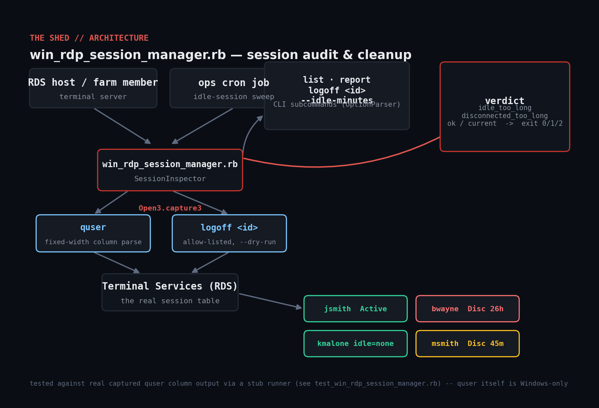

# win-rdp-session-manager

Audit and clean up Remote Desktop / Terminal Services sessions on a Windows
host (or RDS farm member) by driving the built-in `quser`/`logoff`
command-line tools from Ruby. No gems, no WMI — just `Open3` and careful
parsing of `quser`'s fixed-width columns.



## Prerequisites

- Ruby >= 2.7. No gems.
- Windows with the Remote Desktop Services role tools (`quser.exe` /
  `logoff.exe` ship with every Windows Server and most desktop SKUs).
- To manage sessions on a remote host, network access to that host's RPC
  endpoint and `--server NAME`; otherwise it audits the local machine.
- Nothing Windows-specific is needed to run the test suite — the mock
  harness runs on any platform with Ruby.

## Usage

```console
> ruby win_rdp_session_manager.rb list
> ruby win_rdp_session_manager.rb report --idle-minutes 120 --disc-minutes 30 --json
> ruby win_rdp_session_manager.rb logoff 7 --dry-run
```

Exit codes:

| Code | Meaning |
|------|---------|
| 0 | No session exceeds the configured idle/disconnected thresholds |
| 1 | At least one session exceeds a threshold (flagged, not yet acted on) |
| 2 | `quser` could not be reached (not on Windows, Terminal Services down, RPC unreachable on a remote `--server`) |

## How it works

- **`QuserParser`** finds each column's start offset from the header row
  (`USERNAME`, `SESSIONNAME`, `ID`, `STATE`, `IDLE TIME`, `LOGON TIME`) and
  slices every data row at those same offsets. `quser`'s columns are
  fixed-width, not delimiter-separated — a disconnected session leaves
  `SESSIONNAME` blank, which would silently shift every later field left
  under a naive whitespace split. `"No User exists for *"` (nobody logged
  on) parses to an empty list rather than an error.
- **`IdleTime.to_minutes`** normalizes `quser`'s several idle-time formats
  (`"."`, `"none"`, `"23"`, `"2:15"`, `"1+02:15"`) into whole minutes, or
  `nil` when there's no meaningful value at all.
- **`ThresholdEvaluator`** flags an `Active` session idle past
  `--idle-minutes` or a `Disc` session past `--disc-minutes`, and never
  flags the session you're actually running from (the `>`-marked current
  session).
- **`logoff`** is a single allow-listed action behind `--dry-run`, exactly
  like the mutating commands in the systemd/Task-Scheduler tools elsewhere
  in this repo.

## Example output

```console
> ruby win_rdp_session_manager.rb report --idle-minutes 120 --disc-minutes 60
[OK]   administrator (id=1, Active, idle=.) — current
[OK]   jsmith (id=2, Active, idle=3) — ok
[WARN] bwayne (id=3, Disc, idle=1+02:15) — disconnected_too_long
[OK]   msmith (id=4, Disc, idle=45) — ok
[OK]   kmalone (id=5, Active, idle=none) — ok
```

## Testing

`quser.exe`/`logoff.exe` only exist on Windows, so — per the same pattern
used for the systemd and Task Scheduler tools elsewhere in this repo — the
column-offset parsing and threshold logic is verified against **real
captured `quser` output** (reproduced byte-for-byte, fixed-width columns
and all, including the blank-`SESSIONNAME` disconnected-session case) fed
through a stubbed process runner, and the honest failure path on
non-Windows is confirmed separately:

```console
$ ruby test_win_rdp_session_manager.rb
...
ALL CHECKS PASSED (22 assertions)
```

## Troubleshooting

- **`quser/logoff not found on PATH`** — you're not on Windows, or
  Terminal Services role tools aren't installed. This tool's transport is
  genuinely Windows-only.
- **A disconnected session's "idle time" seems too short/long** — `quser`
  doesn't report "time since disconnect" directly; `IDLE TIME` keeps
  counting from whenever the user last had input focus, which is a
  reasonable approximation but not exact if they were already idle before
  disconnecting.
- **Report always shows 0 flagged sessions** — check `--idle-minutes`/
  `--disc-minutes` aren't set higher than realistic session ages; defaults
  are 120 and 60 respectively.
- **`logoff` on a remote host fails with an RPC error** — the target
  Windows Firewall must allow Remote Administration / RPC from the host
  running this script.

## Extending

- Add a `--reason` message broadcast to the user (via `msg.exe`) before
  `logoff`, giving them a warning window instead of an instant kick.
- Add weekly/monthly historical tracking (append each `report --json` run
  to a log) to spot chronically-abandoned sessions, not just today's snapshot.
- Support enumerating sessions across an entire RDS farm by reading
  `--server` values from a file instead of one at a time.
- Add a `--exempt-users` list (service accounts, admins) that's always
  excluded from thresholds regardless of idle time.

## References

- [Microsoft: query user (quser)](https://learn.microsoft.com/en-us/windows-server/administration/windows-commands/query-user)
- [Microsoft: logoff](https://learn.microsoft.com/en-us/windows-server/administration/windows-commands/logoff)
