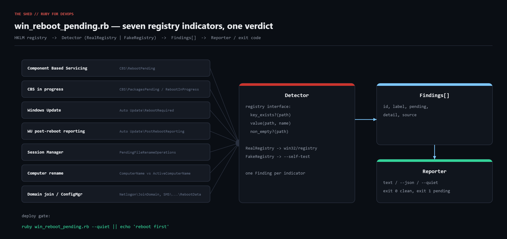

# win-reboot-pending

Answer "does this Windows box need a reboot?" honestly. Windows has no single flag;
this script checks **seven** registry indicators (Component Based Servicing, Windows
Update, PendingFileRenameOperations, computer rename, domain join, ConfigMgr, legacy
Update.exe), reports which tripped and why, and exits `1` when a reboot is pending so
deploy scripts can refuse to land on a half-patched host.



Blog post: https://tha-shed.com/ (search "win_reboot_pending")

## Prerequisites

- Ruby 3.x for Windows (RubyInstaller); stdlib only (`win32/registry`, `json`, `optparse`, `time`)
- Windows Server 2016+ / Windows 10+ (paths are stable back to Win7 / 2008 R2)
- Elevated prompt recommended (some keys are not readable by standard users)
- Any OS with Ruby 3.0+ can run `--self-test`

## Usage

```powershell
ruby win_reboot_pending.rb              # checklist + verdict
ruby win_reboot_pending.rb --json       # for monitoring
ruby win_reboot_pending.rb --quiet      # exit code only: 0 clean, 1 reboot pending
ruby win_reboot_pending.rb --self-test  # run detection logic against fake registries (any OS)
```

Deploy gate example:

```powershell
ruby win_reboot_pending.rb --quiet; if ($LASTEXITCODE -ne 0) { throw "reboot pending - aborting deploy" }
```

## How it works

- `RealRegistry` wraps `Win32::Registry::HKEY_LOCAL_MACHINE.open` in three methods
  (`key_exists?`, `value`, `non_empty?`), each rescuing `Win32::Registry::Error` so a
  missing key is `false`/`nil`. `FakeRegistry` implements the same interface over a hash.
- `Detector#run` returns one `Finding` per indicator:

  | id | source |
  |---|---|
  | `cbs_reboot_pending` | `HKLM\...\Component Based Servicing\RebootPending` |
  | `cbs_in_progress` | `...\Component Based Servicing\{RebootInProgress,PackagesPending}` |
  | `wu_reboot_required` | `...\WindowsUpdate\Auto Update\RebootRequired` |
  | `wu_post_reboot_reporting` | `...\WindowsUpdate\Auto Update\PostRebootReporting` |
  | `pending_file_rename` | `SYSTEM\CurrentControlSet\Control\Session Manager\PendingFileRenameOperations` |
  | `computer_rename` | `ComputerName\ComputerName` vs `ActiveComputerName\ComputerName` |
  | `domain_join` | `Services\Netlogon\{JoinDomain,AvoidSpnSet}` |
  | `sccm_reboot` | `SOFTWARE\Microsoft\SMS\Mobile Client\Reboot Management\RebootData` |
  | `update_exe_volatile` | `SOFTWARE\Microsoft\Updates\UpdateExeVolatile` |

- `PendingFileRenameOperations` (REG_MULTI_SZ) is decoded as source/destination pairs
  (empty destination = delete) with the `\??\` prefix stripped, and the first three
  are shown in the report.
- `Reporter` prints a checklist, JSON, or nothing (`--quiet`); exit code is the verdict.

## Example output (self-test, Linux sandbox)

```
self-test: 5 scenarios against FakeRegistry (x86_64-linux-gnu)
  PASS clean machine                          pending=false tripped=[]
  PASS after cumulative update                pending=true  tripped=["cbs_reboot_pending", "wu_reboot_required"]
  PASS driver install queued file replace     pending=true  tripped=["pending_file_rename"]
  PASS hostname changed, not rebooted         pending=true  tripped=["computer_rename"]
  PASS sccm scheduled reboot                  pending=true  tripped=["sccm_reboot"]

sample report for scenario "after cumulative update":
REBOOT PENDING CHECK  host=claude  2026-09-05 19:48:21
============================================================================
[PENDING] Component Based Servicing                  RebootPending key present
[  ok   ] CBS packages pending / reboot in progress  clear
[PENDING] Windows Update                             RebootRequired key present
[  ok   ] Windows Update post-reboot reporting       clear
[  ok   ] Pending file rename operations             none queued
[  ok   ] Computer rename                            no rename staged
[  ok   ] Pending domain join                        clear
[  ok   ] ConfigMgr client                           no ConfigMgr client / clear
[  ok   ] Legacy Update.exe                          clear
----------------------------------------------------------------------------
VERDICT: REBOOT PENDING (2 indicators: cbs_reboot_pending, wu_reboot_required)

self-test: all 5 passed
```

## Testing

The detection logic was verified with `--self-test`, which runs the real `Detector`
against five `FakeRegistry` scenarios (clean, post-cumulative-update, driver install,
hostname change, SCCM scheduled reboot) and asserts the exact indicator ids that trip.
The `RealRegistry` adapter uses only the documented `win32/registry` stdlib API but was
**not** executed on a live Windows host in this write-up - run it once on a known
pending machine before using it as a deploy gate.

## Troubleshooting

- **`cannot load such file -- win32/registry`** - not Windows Ruby; use RubyInstaller (not WSL).
- **All "ok" but Windows Update still nags** - add `WindowsUpdate\Services\Pending` subkey check.
- **Access denied on Session Manager / SMS keys** - run elevated; errors are swallowed as "clear".
- **32-bit Ruby on 64-bit Windows** - use 64-bit Ruby or `KEY_WOW64_64KEY`.

## Extending

- Add `Win32_OperatingSystem.LastBootUpTime` via `win32ole` for uptime.
- Fleet sweep over WinRM / `powershell-bridge` with `--json`.
- `--reboot-if-pending --after 22:00` to schedule `shutdown /r` outside business hours.
- List downloaded-but-not-installed updates via `Microsoft.Update.Session`.

## References

- Microsoft Learn - Windows Update restart behavior: https://learn.microsoft.com/en-us/windows/deployment/update/waas-restart
- Microsoft Learn - `MoveFileExW` / `MOVEFILE_DELAY_UNTIL_REBOOT`: https://learn.microsoft.com/en-us/windows/win32/api/winbase/nf-winbase-movefileexw
- Ruby `Win32::Registry`: https://docs.ruby-lang.org/en/3.3/Win32/Registry.html
- RubyInstaller: https://rubyinstaller.org/
