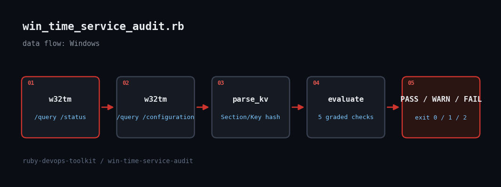

# Auditing the Windows Time Service with Ruby and w32tm

> Kerberos gives up when two clocks drift more than five minutes apart, and the classic cause is a Windows Time service quietly running off the local CMOS clock. This script grades w32tm output so drift is caught before authentication starts failing.



## The problem

When a domain member stops syncing, nothing complains until logons, LDAP binds or file-share access start failing with cryptic Kerberos errors. `w32tm /query /status` tells you the truth, but only if you read it: is the source a real time server or *Local CMOS Clock*? When was the last successful sync? Is the NtpClient provider even enabled? Is `MaxPosPhaseCorrection` set so high that one bad source can step the clock by days? This tutorial wraps `w32tm` with Open3, parses its `Key: value` output, and grades it PASS/WARN/FAIL.

## Prerequisites

- Ruby 2.7+ (RubyInstaller on Windows; tested on 3.3.6)
- Windows with `w32tm.exe` on PATH (standard); an elevated prompt is not required for `/query`
- Stdlib only: optparse, json, open3, time

## Usage

```
ruby win_time_service_audit.rb
ruby win_time_service_audit.rb --json --max-sync-hours 12
ruby win_time_service_audit.rb --standalone        # non-domain host
ruby win_time_service_audit.rb --fixture fixtures/bad
```

## How it works

1. **Run w32tm through Open3** - `Open3.capture3` keeps stdout and stderr separate and returns the exit status, so a failure (service stopped) becomes a clear error and exit code 2 instead of a parse of garbage.
2. **Parse Key: value output with sections** - `/query /configuration` repeats keys such as `Enabled` and `Type` under several `[Section]` headers, so the parser namespaces each key as `Section/Key` and strips the trailing `(Local)`/`(Policy)` markers.
3. **Grade five checks** - Source (not free-running CMOS), last sync age against a threshold, stratum, NtpClient `Type` matching the host role (NT5DS for domain members, NTP for standalone), and the phase-correction limits.
4. **Handle locale honestly** - The last-sync timestamp is locale formatted. The parser tries the US format, then `Time.parse`, and reports WARN on failure rather than guessing.
5. **Fixtures for off-Windows testing** - `--fixture DIR` reads `status.txt` and `config.txt` instead of running w32tm. The four minitest cases stamp a fresh timestamp into the fixture so they stay deterministic.

## Example output

```
win-time-service-audit: FAIL
  [FAIL] source           clock is free-running (Source: Local CMOS Clock); nothing is disciplining it
  [FAIL] last-sync        224.8 h ago (limit 24 h)
  [WARN] stratum          stratum 0
  [WARN] client-type      Type="NTP", expected NT5DS for this host role
  [FAIL] ntpclient        NtpClient provider is disabled
  [WARN] phase-correction MaxPos/NegPhaseCorrection 4294967295/172800s lets a bad source step the clock by days
exit=2
Finished in 0.414335s, 9.6540 runs/s, 26.5486 assertions/s.

4 runs, 11 assertions, 0 failures, 0 errors, 0 skips
```

## Testing

Windows-only command (w32tm.exe): logic verified with 4 minitest cases against fixture w32tm output on Linux; live w32tm was not executed in the sandbox.

## Troubleshooting

- **Honest limitation:** w32tm.exe does not exist on Linux, so the live Open3 call was not run here. The parser, grading logic and exit codes were tested against realistic captured-format fixtures; the first run on a real Windows host is the true integration test.
- **Non-English Windows** - w32tm labels are localized, so the key names may differ. Run `w32tm /query /status` once, and adjust the key names in `evaluate`.
- **Access denied / service not running** - the script prints the w32tm error and exits 2; start the service with `net start w32time`.

## Extending it

- Run against a fleet with `w32tm /query /computer:HOST` or WinRM
- Add `w32tm /monitor` to compare offsets across domain controllers
- Emit JSON to a SIEM (already supported with `--json`)
- Check the `Time-Service` event log for source-change events

## References

- [Microsoft: Windows Time service tools and settings](https://learn.microsoft.com/en-us/windows-server/networking/windows-time-service/windows-time-service-tools-and-settings)
- [Ruby Open3 docs](https://docs.ruby-lang.org/en/master/Open3.html)
- [Microsoft: Kerberos clock skew (maximum tolerance)](https://learn.microsoft.com/en-us/windows/security/threat-protection/security-policy-settings/maximum-tolerance-for-computer-clock-synchronization)
