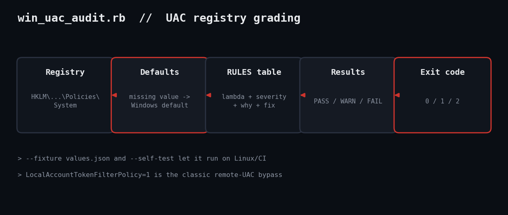

# Audit Windows UAC Settings with Ruby

UAC is only a security boundary if its registry knobs are set right. One zero in the wrong place turns elevation prompts into a rubber stamp. Here is a Ruby auditor that grades them and prints the exact fix.



## The problem

The problem: User Account Control is controlled by a handful of values under `Policies\System`. Setting `EnableLUA=0`, silencing admin prompts, or leaving `LocalAccountTokenFilterPolicy=1` (which hands remote local admins a full token) quietly removes protection, and a GUI check of the slider will not show all of it. This script reads the values, applies Windows defaults for absent ones, and grades each PASS/WARN/FAIL.

## Prerequisites

- Ruby 3.0+ for Windows (RubyInstaller) for live mode; any OS for `--fixture` and `--self-test`
- No gems: `win32/registry` ships with Ruby on Windows
- Read access to HKLM (standard users can read this key)

## Usage

```
ruby win_uac_audit.rb
ruby win_uac_audit.rb --fixture values.json --json
ruby win_uac_audit.rb --self-test
```

## How it works

Data-driven rules. Instead of a chain of ifs, `RULES` is a table. Adding a check means adding one row, and the report code never changes.

Defaults. Windows treats a missing value as its built-in default (for example `ConsentPromptBehaviorAdmin` is 5). Judging a raw nil would produce false alarms, so `evaluate` substitutes the default first. `LocalAccountTokenFilterPolicy` defaults to absent, which is the safe state.

Registry access. `Win32::Registry::HKEY_LOCAL_MACHINE.open` reads each value, rescuing the error for values that do not exist.

Testability. `--self-test` builds one good and one bad settings hash and asserts the exit codes and the number of FAILs, so CI on Linux can guard the logic.

## Example output

```
PASS  EnableLUA                       = 1
FAIL  ConsentPromptBehaviorAdmin      = 0
        why: admins elevate with no prompt (0) or without secure desktop (1,3,4)
        fix: Set to 2 (always prompt) or 5 (default)
PASS  ConsentPromptBehaviorUser       = 3
FAIL  PromptOnSecureDesktop           = 0
        why: prompts render on the user desktop where malware can click them
        fix: Set PromptOnSecureDesktop=1
WARN  FilterAdministratorToken        = 0
        why: built-in Administrator (RID 500) is exempt from Admin Approval Mode
        fix: Set FilterAdministratorToken=1
PASS  EnableInstallerDetection        = 1
PASS  EnableVirtualization            = 1
FAIL  LocalAccountTokenFilterPolicy   = 1
        why: remote local-admin logons get a full token (pass-the-hash lateral movement)
        fix: Delete the value or set it to 0
self-test OK (3 assertions)
```

## Troubleshooting

- LoadError win32/registry: you are not on Windows; use `--fixture`.
- Domain GPO overrides: policy writes the same keys, so the registry shows the effective value, but run `gpresult` to find the source.
- Testing note: the live registry path could not be executed in the Linux sandbox; only the rule engine was tested, with fixtures and the self-test.

## Extending it

- Scan a fleet via remote registry or WinRM and aggregate
- Add `ValidateAdminCodeSignatures` and `EnableSecureUIAPaths`
- Diff against a saved baseline like the registry-drift tool

## References

- [Microsoft: UAC group policy settings](https://learn.microsoft.com/en-us/windows/security/application-security/application-control/user-account-control/settings-and-configuration)
- [Ruby Win32::Registry](https://docs.ruby-lang.org/en/master/Win32/Registry.html)
- Blog post: https://tha-shed.com/ruby-windows-uac-audit/
