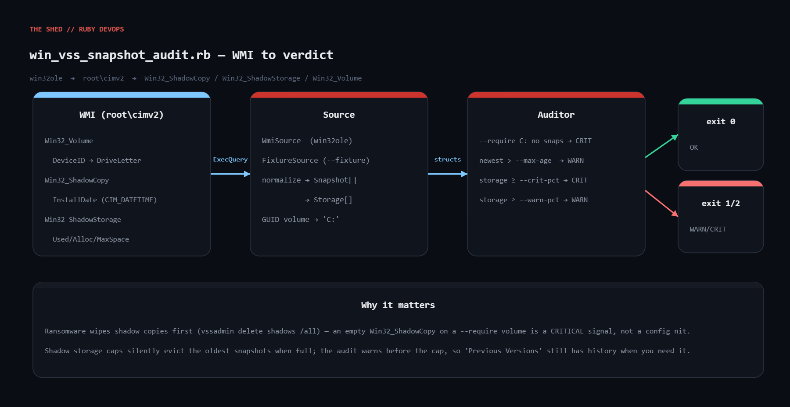

# win-vss-snapshot-audit

Windows Volume Shadow Copy (VSS) audit via WMI, in stdlib-only Ruby (`win32ole`). Lists every shadow copy with its age, shows shadow storage usage against its cap, lets you declare volumes that **must** have snapshots, and exits 0/1/2 for monitoring. Ransomware deletes shadow copies first; a full diff area silently evicts the oldest ones — this script catches both.



| Exit | Meaning |
|------|---------|
| 0 | OK — every checked volume has a fresh snapshot, storage healthy |
| 1 | WARNING — newest snapshot older than `--max-age`, or storage ≥ `--warn-pct` |
| 2 | CRITICAL — a `--require` volume has no snapshots, or storage ≥ `--crit-pct` |
| 3 | error (WMI unavailable / not Windows without `--fixture`) |

## Prerequisites

- Windows 10/11 or Server 2016+ with the VSS service; run from an **elevated** prompt (non-admin `Win32_ShadowCopy` queries often return nothing)
- Ruby 2.7+ via RubyInstaller (`win32ole` is included); stdlib only otherwise
- Any OS for testing: `--fixture` runs the full pipeline on sample data

## Usage

```
ruby win_vss_snapshot_audit.rb
ruby win_vss_snapshot_audit.rb --require C: --require D: --max-age 24 --warn-pct 80 --crit-pct 95
ruby win_vss_snapshot_audit.rb --json
ruby win_vss_snapshot_audit.rb --fixture          # sample data, works on Linux/macOS/CI
```

Scheduled task example (hourly, elevated):

```
schtasks /create /tn "VSS audit" /sc hourly /ru SYSTEM /tr "ruby C:\toolkit\win_vss_snapshot_audit.rb --require C: --quiet"
```

## How it works

1. **Source selection** — `--fixture` → `FixtureSource`; Windows → `WmiSource`; otherwise exit 3 with a clear message. Both expose `snapshots` and `storage`.
2. **WMI queries** — `WIN32OLE.connect('winmgmts://./root/cimv2')`, then `ExecQuery` on `Win32_ShadowCopy`, `Win32_ShadowStorage` and `Win32_Volume`. uint64 properties arrive as strings, hence `.to_i`.
3. **Volume normalisation** — `Win32_Volume` maps `\\?\Volume{GUID}\` DeviceIDs to drive letters (memoised). `Win32_ShadowStorage.Volume` is an object reference like `\\HOST\root\cimv2:Win32_Volume.DeviceID="\\\\?\\Volume{...}\\"`; `ref_device_id` extracts and un-escapes it.
4. **CIM_DATETIME** — `20260909031500.000000-300` is sliced by fixed width; the trailing signed minutes are the UTC offset.
5. **Policy** — `Auditor#audit` collects `[severity, message]` findings; the exit code is the max severity. `MaxSpace = 0xFFFFFFFFFFFFFFFF` is treated as *unbounded* so it never reports a bogus 100%.
6. **Report** — text table or `--json`.

## Example output

```
$ ruby win_vss_snapshot_audit.rb --fixture --require C: --require E:
CRITICAL - E: has NO shadow copies; D: newest snapshot is 40.0h old (limit 24.0h); C: shadow storage 90.0% used (warn 80.0%)

SHADOW COPIES
  C:   2026-09-09 07:39:25 age    3.0h  persistent, client-accessible
  C:   2026-09-08 07:39:25 age   27.0h  persistent, client-accessible
  D:   2026-09-07 18:39:25 age   40.0h  persistent, client-accessible

SHADOW STORAGE
  C:   on C:   used 18.0 GiB   alloc 19.0 GiB   max 20.0 GiB   (90.0%)
  D:   on D:   used 4.0 GiB    alloc 5.0 GiB    max 50.0 GiB   (8.0%)
exit=2

$ ruby win_vss_snapshot_audit.rb --fixture --max-age 48 --warn-pct 95
OK - all volumes protected
...
exit=0
```

### Stub harness (runs on Linux, drives the real `WmiSource` code)

Save as `test_wmi_stub.rb` next to the script:

```ruby
require 'ostruct'
class WIN32OLE
  ROWS = {
    'Win32_Volume' => [OpenStruct.new(DeviceID: '\\\\?\\Volume{1111}\\', DriveLetter: 'C:'),
                       OpenStruct.new(DeviceID: '\\\\?\\Volume{2222}\\', DriveLetter: 'D:')],
    'Win32_ShadowCopy' => [OpenStruct.new(ID: '{s1}', VolumeName: '\\\\?\\Volume{1111}\\', InstallDate: '20260909031500.000000-300', ProviderID: '{p}', Persistent: true, ClientAccessible: true)],
    'Win32_ShadowStorage' => [OpenStruct.new(Volume: '\\\\HOST\\root\\cimv2:Win32_Volume.DeviceID="\\\\\\\\?\\\\Volume{1111}\\\\"', DiffVolume: '\\\\HOST\\root\\cimv2:Win32_Volume.DeviceID="\\\\\\\\?\\\\Volume{2222}\\\\"', UsedSpace: '1073741824', AllocatedSpace: '2147483648', MaxSpace: '18446744073709551615')]
  }
  def self.connect(_); new; end
  def ExecQuery(q); ROWS.fetch(q[/FROM (\w+)/, 1]); end
end
$LOADED_FEATURES << 'win32ole.rb'
load './win_vss_snapshot_audit.rb'
src = VssAudit::WmiSource.new
snaps = src.snapshots; st = src.storage
puts "snapshot: #{snaps.first.volume} created #{snaps.first.created_at.iso8601}"
puts "storage : #{st.first.volume} diff on #{st.first.diff_volume} used=#{VssAudit::Report.human(st.first.used_bytes)} max=#{VssAudit::Report.human(st.first.max_bytes)} pct=#{st.first.pct_used}"
raise 'volume map failed' unless snaps.first.volume == 'C:' && st.first.volume == 'C:' && st.first.diff_volume == 'D:'
raise 'time parse failed' unless snaps.first.created_at.utc.hour == 8 # 03:15 at -300min == 08:15Z
puts 'STUB HARNESS: all assertions passed'
```

```
$ ruby test_wmi_stub.rb
snapshot: C: created 2026-09-09T03:15:00-05:00
storage : C: diff on D: used=1.0 GiB max=unbounded pct=0.0
STUB HARNESS: all assertions passed
```

## Troubleshooting

- **Honest note:** developed and tested in a Linux sandbox, so `WmiSource` was never run against a live WMI service. Policy/report/CLI were verified with `--fixture`; the WMI parsing (volume map, object-reference unpacking, CIM_DATETIME) was verified with the mock above. Run once on a real Windows host before relying on it.
- **Empty list but `vssadmin list shadows` shows snapshots** — not elevated.
- **`WIN32OLERuntimeError: Access denied` / RPC unavailable** — `winmgmt` stopped or repository corrupt: `winmgmt /verifyrepository`, then `/salvagerepository`.
- **0% with max "unbounded"** — correct for `/maxsize=UNBOUNDED` volumes; only capped volumes are percent-checked.
- **Volumes shown as `\\?\Volume{...}`** — no drive letter (mount-point folder / system reserved); the DeviceID is kept rather than dropping the row.
- **Ages off by hours** — the offset in `InstallDate` is honoured; check the host clock/timezone.

## Extending

- `--create VOL` calling `Win32_ShadowCopy.Create("C:\", "ClientAccessible")` when a required volume has none.
- Remote hosts via `winmgmts://SERVER/root/cimv2` and a fleet list.
- Write findings to the Event Log for SIEM alerting on "all snapshots gone".
- Correlate with `Win32_ShadowProvider`; trend `pct_used` to predict eviction.

## References

- Win32_ShadowCopy: https://learn.microsoft.com/en-us/previous-versions/windows/desktop/vsswmi/win32-shadowcopy
- Win32_ShadowStorage: https://learn.microsoft.com/en-us/previous-versions/windows/desktop/vsswmi/win32-shadowstorage
- CIM_DATETIME: https://learn.microsoft.com/en-us/windows/win32/wmisdk/cim-datetime
- Ruby WIN32OLE: https://docs.ruby-lang.org/en/3.3/WIN32OLE.html
