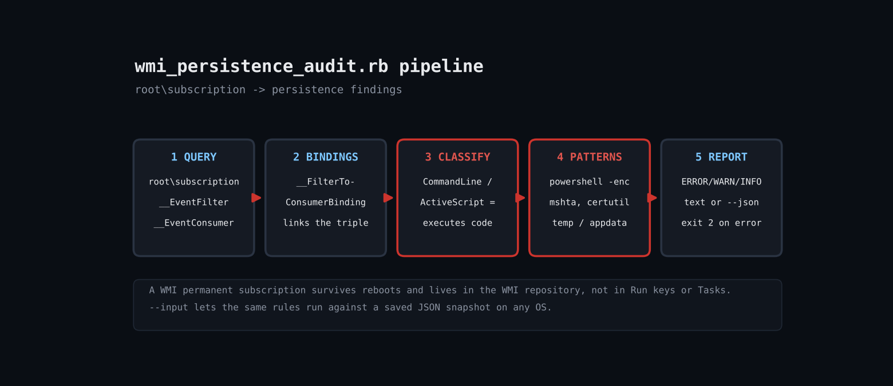

# Hunt WMI Persistence on Windows with Ruby: Audit Permanent Event Subscriptions

A WMI permanent event subscription is three objects in root\subscription: an __EventFilter (the trigger), an __EventConsumer (the action) and a __FilterToConsumerBinding joining them. If the consumer is a CommandLineEventConsumer or ActiveScriptEventConsumer, Windows will run arbitrary code every time the filter fires, surviving reboots, and none of the usual autorun tools show it. Legitimate use is rare, so enumerating them is a high-signal audit. Ruby's bundled win32ole can query WMI directly, no PowerShell required.



## Prerequisites

- Ruby 3.0+ for Windows (RubyInstaller); win32ole is built in
- Elevated prompt (administrator) to read root\subscription
- Windows 10/11 or Server 2016+

## Usage

```
ruby wmi_persistence_audit.rb [--json] [--input FIXTURE.json]
```

## How it works

1. **Snapshot WMI** - snapshot_from_wmi connects to winmgmts:\\.\root\subscription and runs three ExecQuery calls, converting each COM object into a plain Hash. Keeping the data as plain hashes is what makes the audit logic testable.
2. **Join the triple** - Bindings reference consumers by a WMI path string, so a consumer is considered bound if any binding contains its quoted name. Unbound consumers are reported as dormant or half-removed.
3. **Classify consumers** - Only CommandLineEventConsumer and ActiveScriptEventConsumer are errors, because they execute code. Passive consumers (log file, event log) are info.
4. **Pattern-match payloads** - The command line, executable path and script text are matched against shell interpreters, LOLBins, encoded-command flags and temp-path locations.
5. **Check filters** - Filters that fire on timers, logon or uptime are warned, because those are how persistence triggers.

## Example output

```
Subscriptions: 2 filter(s), 4 consumer(s), 3 binding(s)
ERROR exec-consumer        UpdaterConsumer          CommandLineEventConsumer runs: powershell.exe -nop -w hidden -enc SQBFAFgA C:\Windows\System32\WindowsPowerShell\v1.0\powershell.exe
ERROR suspicious-payload   UpdaterConsumer          payload matches shell/LOLBin/encoded/temp-path pattern
ERROR exec-consumer        DormantScript            ActiveScriptEventConsumer runs: WScript.Echo 1
ERROR suspicious-payload   DormantScript            payload matches shell/LOLBin/encoded/temp-path pattern
WARN  script-consumer      DormantScript            inline VBScript script stored in WMI repository
WARN  orphan-consumer      DormantScript            consumer has no binding to a filter (dormant or half-removed)
WARN  boot-timer-filter    UpdaterFilter            filter fires on timer/startup/logon events
INFO  passive-consumer     AuditLog                 LogFileEventConsumer (does not execute code)
```

## Troubleshooting

- Honest testing note: win32ole and WMI cannot run on Linux, so the audit rules were verified against a hand-built JSON snapshot passed with --input (Output tab). The snapshot_from_wmi function itself was not executed in the sandbox.
- WIN32OLERuntimeError access denied: not elevated.
- SCM Event Log Consumer is Microsoft's own subscription and is allow-listed in KNOWN_GOOD; extend it for your EDR/agents.
- False positives: some management agents legitimately use CommandLine consumers; baseline once, then alert on change.

## Extending

- Save a baseline JSON and alert only on new subscriptions
- Remove a confirmed-bad triple with Delete_ after review
- Also scan root\default and root\cimv2 for consumers
- Ship findings to your SIEM as JSON

## References

- https://learn.microsoft.com/en-us/windows/win32/wmisdk/monitoring-events
- https://learn.microsoft.com/en-us/windows/win32/wmisdk/--eventconsumer

Part of [ruby-devops-toolkit](https://github.com/jjam3774/ruby-devops-toolkit) (MIT).
