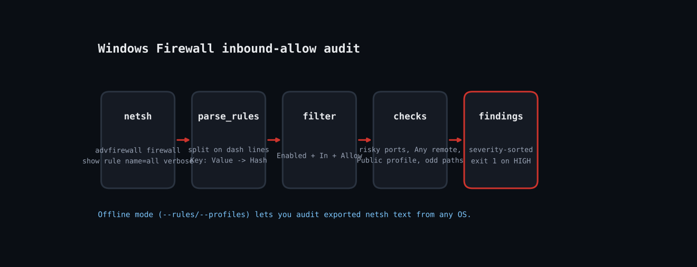

# Audit Windows Firewall Inbound Rules with Ruby and netsh



Over a machine's life, installers and admins add inbound allow rules and nobody removes them. The result is RDP or SMB reachable from anywhere, or an executable in a user's Downloads folder with its own firewall exception. This script shells out to `netsh advfirewall`, parses the verbose rule dump into Ruby hashes, and applies a short set of risk checks. It also has an offline mode so you can audit exported text on any machine.

Blog post: https://tha-shed.com (search "Audit Windows Firewall Inbound Rules with Ruby and netsh")

## Prerequisites
- Ruby 2.7+ via RubyInstaller on Windows (tested on 3.3.6 on Linux for the offline mode).
- Stdlib only. Live mode needs an elevated prompt and an English-locale Windows, because `netsh` labels are localised.
- Offline: `netsh advfirewall firewall show rule name=all verbose > rules.txt` and `netsh advfirewall show allprofiles state > profiles.txt`.

## Usage
```
ruby firewall_audit.rb
ruby firewall_audit.rb --json
ruby firewall_audit.rb --rules rules.txt --profiles profiles.txt
```

## How it works
1. **Parse the netsh dump**: `parse_rules` splits on the dashed separator lines, then turns each `Key:   Value` line into a hash entry.
2. **Check profile state**: `parse_profiles` reports any Domain/Private/Public profile whose State is OFF as HIGH.
3. **Filter to what matters**: Only rules that are Enabled, Direction In, Action Allow can expose the host, so everything else is skipped.
4. **Apply risk checks**: Known-dangerous ports (RDP 3389, SMB 445, Telnet 23, FTP 21, WinRM) are HIGH when RemoteIP is Any, MEDIUM otherwise. Rules allowing programs from Users, Downloads, Temp or AppData paths are flagged. Any-program/any-port/any-remote on the Public profile is HIGH.
5. **Report and exit**: Severity-sorted output, `--json` for pipelines, exit 1 if any HIGH.

## Example output
```
Parsed 7 rules
HIGH   firewall-off   Public profile               profile state is OFF
HIGH   risky-port     Remote Desktop - User Mode (TCP-In) RDP (3389) open to Any on Domain,Private,Public
MEDIUM risky-port     File and Printer Sharing (SMB-In) SMB (445) open to LocalSubnet on Domain,Private
MEDIUM odd-program-path Dev Tool Helper              allows inbound for C:\Users\bob\Downloads\helper.exe
MEDIUM risky-port     Legacy Telnet                Telnet (23) open to 10.0.0.0/8 on Domain
2 high / 5 total
```

## Troubleshooting
- **Access denied or empty output:** use an elevated prompt.
- **Non-English Windows:** netsh field names are translated, so parsing finds zero rules. Use PowerShell `Get-NetFirewallRule` instead (see Extending).
- **Honest testing note:** `netsh` only exists on Windows. The parser and checks were verified in the Linux sandbox against a hand-built sample of netsh-format output (7 rules, 3 profiles); the live `netsh` call itself was not executed here.

## Extending
- Switch to `Get-NetFirewallRule | ConvertTo-Json` for locale-independent parsing.
- Diff against a saved baseline to report only new rules.
- Export findings to CSV for auditors.
- Remove a flagged rule with `netsh advfirewall firewall delete rule name=...` behind a `--fix` flag.

## References
- [netsh advfirewall reference](https://learn.microsoft.com/en-us/windows-server/administration/windows-commands/netsh-advfirewall)
- [Windows Firewall rules overview](https://learn.microsoft.com/en-us/windows/security/operating-system-security/network-security/windows-firewall/)
- [Ruby OptionParser](https://docs.ruby-lang.org/en/master/OptionParser.html)
