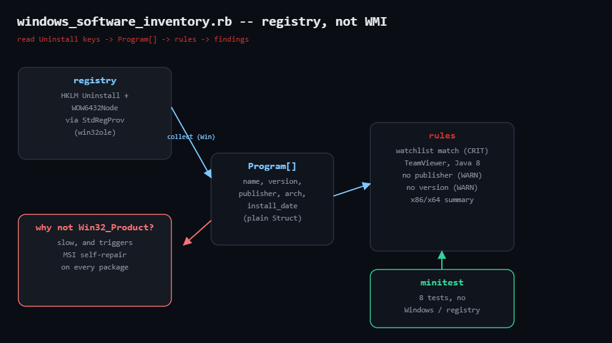

# windows-software-inventory

Builds a clean inventory of installed software on Windows by reading the
registry Uninstall keys directly — **not** `Win32_Product`, which is slow and
triggers an MSI self-repair on every package. Flags watchlisted software
(remote-access tools, EOL runtimes), entries with no publisher, and missing
versions.

Collection (registry via `win32ole`) is separated from the analysis rules, so
the detection logic is unit-tested on any OS — see
`windows_software_inventory_test.rb` (8 tests, no Windows or registry required).



## Prerequisites

- **Collector**: Windows + Ruby (RubyInstaller); `win32ole` ships with Ruby on
  Windows. Read access to HKLM (standard user is fine for machine-wide keys).
- **Rules / tests**: any OS, plain Ruby.

## Usage

```powershell
ruby windows_software_inventory.rb
ruby windows_software_inventory.rb --json
ruby windows_software_inventory.rb --watch "TeamViewer,AnyDesk,Java 8"
```

```bash
ruby windows_software_inventory_test.rb   # runs anywhere
```

Exit codes: `0` clean · `1` warnings · `2` a watchlist match (CRIT).

## How it works

1. **Enumerate the Uninstall keys** — subkeys under
   `HKLM\SOFTWARE\Microsoft\Windows\CurrentVersion\Uninstall` and the
   `WOW6432Node` path (32-bit apps), via the `StdRegProv` WMI provider. Reads
   `DisplayName`, `DisplayVersion`, `Publisher`, `InstallDate`; skips `KB…` /
   update entries. No `Win32_Product`, so no self-repair.
2. **The Program boundary** — each entry becomes a plain `Program` Struct
   tagged with architecture; every rule is a pure function over those structs.
3. **Rules** — `watchlist-match` (CRIT, case-insensitive substring against a
   configurable list), `no-publisher` / `no-version` (WARN), plus an x86/x64
   summary.

## Example output (fixtures)

```
windows_software_inventory: 6 programs (4 x64, 2 x86)
CRIT watchlist-match  TeamViewer 15                          matches watchlist term "teamviewer" (version 15.58.4)
CRIT watchlist-match  Java 8 Update 411                      matches watchlist term "java 8" (version 8.0.4110.9)
WARN no-publisher     Internal Deploy Tool                   no publisher recorded — unsigned or hand-installed?
2 CRIT, 3 WARN
```

## Testing notes (honest ones)

The analysis rules were verified with the bundled minitest fixtures on Linux
(8 runs, 19 assertions, 0 failures). The registry collector uses the documented
`StdRegProv` API but requires a real Windows host — run it on one before
trusting fleet numbers.

## Troubleshooting

- **Missing per-user apps** — this reads HKLM (machine-wide); add
  `HKCU\...\Uninstall` to catch per-user installs.
- **A vendor you trust is watchlisted** — override the default list with
  `--watch`.
- **Store/UWP apps absent** — Microsoft Store apps aren't in the Uninstall
  keys; they need `Get-AppxPackage` (out of scope).

## Extending

- Add the HKCU hive for a complete picture on shared workstations.
- Compare `DisplayVersion` against EOL thresholds instead of matching names.
- Baseline diffing: save the JSON and alert on newly installed software.
- Fleet rollup via WinRM; aggregate by publisher or finding code.

## References

- Blog post: https://tha-shed.com/ (Ruby for DevOps series)
- Win32_Product self-repair (Microsoft): https://learn.microsoft.com/en-us/troubleshoot/windows-server/admin-development/windows-installer-reconfigured-all-applications
- StdRegProv WMI class: https://learn.microsoft.com/en-us/previous-versions/windows/desktop/regprov/stdregprov
- Ruby stdlib `WIN32OLE`: https://docs.ruby-lang.org/en/3.3/WIN32OLE.html
