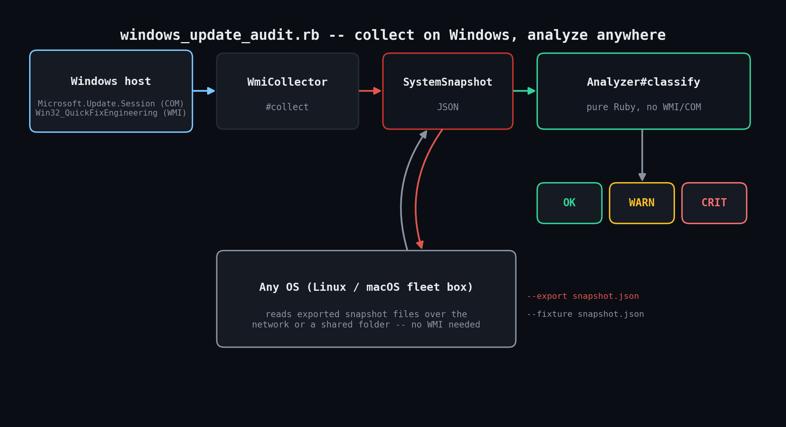

# windows-update-audit

Audits Windows Update compliance via the Windows Update Agent COM API and WMI — no
PowerShell, no third-party gems. Answers three questions a patch-compliance dashboard
actually needs: are there uninstalled updates and how severe are they, is a reboot
blocking updates that already downloaded, and how long since a patch actually landed.



## Why

"Windows Update is turned on" isn't the same thing as "this machine is patched" — the
service can look fine while silently having stopped working. This script talks directly
to `Microsoft.Update.Session` (the same COM API the Windows Update GUI itself uses) and
`Win32_QuickFixEngineering` over WMI to check what's actually true right now.

## Prerequisites

- Ruby 3.0+ on Windows for live collection (uses the bundled `win32ole` library —
  nothing extra to install)
- Any OS for offline analysis via `--fixture` — the `Analyzer` class has zero
  Windows-specific dependencies
- No gems — `win32ole`, `json`, `optparse`, `date`, `time` are all standard library
- Windows Update Agent present and functional on the target machine; no special
  permissions beyond a normal user session are required to *search* for updates

## Usage

```powershell
# Live audit on a Windows host, human-readable
ruby windows_update_audit.rb

# Live audit, also export the snapshot for a central fleet report
ruby windows_update_audit.rb --export C:\snapshots\%COMPUTERNAME%.json

# JSON output
ruby windows_update_audit.rb --json
```

```bash
# Offline analysis of a previously-exported snapshot, from any OS
ruby windows_update_audit.rb --fixture snapshot.json
```

Exit codes: `0` = OK, `1` = WARN, `2` = CRIT.

## How it works

- **`WmiCollector`** is the only Windows-specific code in the file. It creates a
  `Microsoft.Update.Session`, searches with `"IsInstalled=0 and IsHidden=0"` via
  `CreateUpdateSearcher`, reads `Microsoft.Update.SystemInfo#RebootRequired`, and queries
  `Win32_QuickFixEngineering` for install history. Everything gets flattened into a
  plain `SystemSnapshot` struct — no COM objects survive past this point.
- **`Analyzer`** classifies any `SystemSnapshot` — live or from `--fixture` — into
  OK/WARN/CRIT with specific reasons: any Critical-severity pending update forces CRIT;
  Important-severity updates or a pending reboot push to at least WARN; patch staleness
  is evaluated independently against `--warn-days`/`--crit-days`.
- The collector/analyzer split is a real operational feature, not just a test seam:
  `--export` lets each Windows box drop a snapshot to a shared folder, and `--fixture`
  lets a central Linux/macOS box roll many snapshots into one fleet report.

### The locale date-parsing bug

`Win32_QuickFixEngineering.InstalledOn` is a locale-formatted string, not a real WMI
timestamp — on a US-locale box it's `M/D/YYYY`. Ruby's `Date.parse` guesses the *wrong*
format for slash-separated dates and silently read `"7/10/2026"` as October 7th instead
of July 10th during development. The fix: parse explicitly with
`Date.strptime(str, '%m/%d/%Y')` first, falling back to `Date.parse` only for other
formats. See the regression test for this specifically in
`windows_update_audit_test.rb`.

## Example output

```
$ ruby windows_update_audit_test.rb
...
US-locale M/D/Y InstalledOn strings are parsed correctly (regression: not D/M/Y)
  ok - 7/10/2026 means July 10th (25 days before Aug 4), not Oct 7th
...
14/14 checks passed

$ ruby windows_update_audit.rb --fixture test/fixtures/crit_critical_pending.json
host: DB03   status: CRIT
pending updates: 1   reboot required: false   days since last patch: 7
----------------------------------------------------------------------
  - 1 Critical-severity update(s) pending: KB5041500
exit=2
```

## Testing notes

`Microsoft.Update.Session` and `Win32_QuickFixEngineering` only exist on Windows, so this
couldn't be exercised end-to-end in the Linux sandbox this was developed in. Instead, the
pure-logic `Analyzer` class is fully unit-tested (`windows_update_audit_test.rb`, 14
checks) against hand-built `SystemSnapshot` fixtures covering every branch: clean
systems, Critical/Important pending updates, pending reboots, stale patching, missing
history, and the locale date-parsing regression specifically. The CLI's `--fixture` path
was also verified end-to-end against hand-built JSON snapshots like the one below
(covering OK, WARN, and CRIT cases). **The live WIN32OLE collection path
(`WmiCollector`) has not been run against a real Windows host in this environment and
should be validated there before relying on it in production.**

<details>
<summary>Example <code>--fixture</code> snapshot (CRIT: one Critical update pending)</summary>

```json
{
  "hostname": "DB03",
  "collected_at": "2026-08-04T12:00:00Z",
  "reboot_required": false,
  "pending_updates": [
    {"title": "2026-08 Security Update for Windows Server", "kb_ids": ["KB5041500"], "severity": "Critical", "is_downloaded": false}
  ],
  "hotfixes": [
    {"hotfix_id": "KB5030001", "installed_on": "7/28/2026", "description": "Update"}
  ]
}
```

</details>

## Troubleshooting

- **`WIN32OLERuntimeError` creating `Microsoft.Update.Session`** — the Windows Update
  service may be disabled or the machine locked down by policy; confirm `wuauserv` is at
  least in a startable state.
- **Search takes a long time on first run** — normal; the Update Agent syncs its local
  catalog. Subsequent runs are much faster.
- **`days since last patch` looks stuck** — `Win32_QuickFixEngineering` only reflects
  Component-Based-Servicing updates; cross-check with PowerShell's `Get-HotFix` if the
  number looks suspicious.
- **Running on non-Windows raises immediately** — intentional; use `--fixture` to
  analyze a snapshot exported elsewhere.
- **Numbers don't exactly match the Windows Update GUI** — the GUI applies its own
  display filtering that can differ slightly from the raw `IUpdateSearcher` query.

## Extending

- Fleet rollup: scheduled task per box exports to a shared folder, one central
  `--fixture` pass builds the compliance report.
- Auto-remediation: schedule an off-hours restart when `reboot_required` is the only
  issue found.
- Severity-weighted SLAs: track how long each Critical update has been pending, not
  just whether one exists.
- Combine with this toolkit's `eventlog-monitor` to distinguish "nothing pending" from
  "updates are failing to install."

## References

- [`IUpdateSession` / `Microsoft.Update.Session`](https://learn.microsoft.com/en-us/windows/win32/api/wuapi/nn-wuapi-iupdatesession)
- [`Win32_QuickFixEngineering` class](https://learn.microsoft.com/en-us/windows/win32/cimwin32prov/win32-quickfixengineering)

## License

MIT — see the repository root [LICENSE](../LICENSE).
