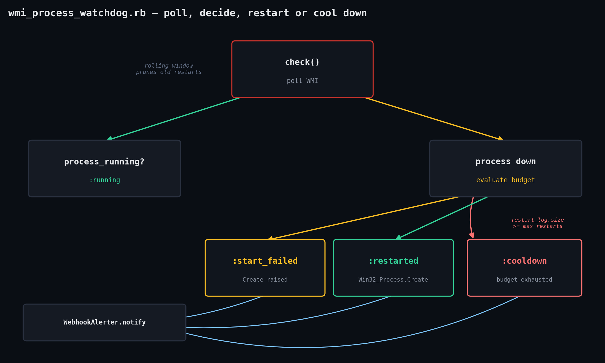

# wmi-process-watchdog

Watch a named process on Windows via WMI and restart it if it disappears, with a restart-storm cooldown budget and an optional webhook alert — for the "the agent/service keeps silently dying and nobody notices until a customer complains" problem, without installing a full monitoring stack.



## Prerequisites

- Ruby 3.0+ **on Windows** (the stdlib `win32ole` library, and the WMI service itself, only exist on Windows — see the Troubleshooting note on how this was tested without a Windows box)
- Permission to query WMI's `root/cimv2` namespace and, for restarting, permission to create the target process (run elevated if the process needs it)
- No third-party gems — only stdlib `win32ole`, `optparse`, `ostruct`, `time`, `net/http`, `json`

## Usage

```powershell
ruby wmi_process_watchdog.rb --process worker.exe --start-cmd "C:\app\worker.exe" `
  --interval 15 --max-restarts 5 --window 600 `
  --webhook https://hooks.example.com/alert

# Single check-and-restart pass (good for a Scheduled Task instead of a long-running loop)
ruby wmi_process_watchdog.rb --process worker.exe --start-cmd "C:\app\worker.exe" --once
```

Options:

| Flag | Default | Meaning |
|---|---|---|
| `--process NAME` | required | Exact WMI `Name` to watch, e.g. `worker.exe` |
| `--start-cmd CMD` | required | Command line used to relaunch it |
| `--interval SECONDS` | 15 | Seconds between checks |
| `--max-restarts N` | 5 | Restart budget per rolling window |
| `--window SECONDS` | 600 | Width of that rolling window |
| `--webhook URL` | — | POST a JSON `{"text": "..."}` alert here on restart/cooldown/failure |
| `--once` | off | Single pass instead of looping forever |

## How it works

1. **`WmiBackend`** is the only class that touches `WIN32OLE`. `process_running?` runs a `SELECT ProcessId FROM Win32_Process WHERE Name = '...'` query; `start_process` calls the well-known `Win32_Process.Create` WMI method (which launches the process independently of this Ruby process, so it survives the watchdog exiting) and raises if the WMI `ReturnValue` isn't `0`.
2. **`Watchdog#check`** is the actual decision logic, and it's plain Ruby with no WMI calls of its own — it's handed a `wmi:` object satisfying `process_running?`/`start_process` and an `alerter:` object satisfying `notify`, which is what makes it unit-testable:
   - process running → `:running`, nothing else happens
   - process down, but `restart_log` (timestamps of past restarts, pruned to the rolling `window_seconds`) has hit `max_restarts` → `:cooldown`, alert fired, **no restart attempted** (this is what stops a crash-looping process from hammering WMI/the OS every 15 seconds forever)
   - process down, under budget, restart succeeds → `:restarted`, timestamp logged, alert fired with the new PID
   - process down, under budget, `Win32_Process.Create` raises → `:start_failed`, alert fired, **not** counted against the restart budget (a failed attempt isn't a successful restart eating into your budget for the next real one)
3. **`WebhookAlerter`** is a thin `Net::HTTP.post` wrapper that never raises out of `notify` — a broken webhook shouldn't take down the watchdog loop.
4. The **CLI** loop calls `check`, logs the outcome with a timestamp, and either exits (`--once`) or sleeps `--interval` seconds.

## Example output

```
2026-09-28T16:21:04+00:00  worker.exe  restarted
2026-09-28T16:21:19+00:00  worker.exe  running
2026-09-28T16:21:34+00:00  worker.exe  running
```

## Troubleshooting

- **This was tested on Linux, not Windows** — honestly: `win32ole` and the `Win32_Process`/WMI service are Windows-only and cannot execute on this sandbox's Linux host at all. `WmiBackend` was written directly against Microsoft's documented `Win32_Process.Create` and `Win32_Process` WQL query shape, but the actual COM/WMI calls are unexercised outside Windows. What *is* fully tested — on this Linux box, with real assertions, no skips — is every branch of `Watchdog#check` (healthy, down-and-restarted, down-and-restart-fails, cooldown budget exhaustion, and the rolling window freeing back up) via a `FakeWmi`/`FakeAlerter` stand-in in `watchdog_test.rb`. Run `ruby watchdog_test.rb` to see all 18 assertions pass. Please do a supervised first run on a real Windows box (start with `--once` and a non-critical process) before trusting this unattended in production, and open an issue in the repo if `Win32_Process.Create`'s actual behavior differs from what's coded here.
- **`WIN32OLERuntimeError` connecting to WMI** — usually a permissions/DCOM issue; try running from an elevated prompt, or check the `Winmgmt` service is running (`Get-Service Winmgmt`).
- **Restarted process immediately exits again** — you'll see rapid `:restarted` → down → `:restarted` cycles until `--max-restarts` is hit, then `:cooldown`. That's the intended failure mode: it stops trying and pages you (via `--webhook`) instead of looping forever. Check the underlying process's own crash logs; the watchdog only knows it's not in the process table.
- **`Win32_Process.Create` succeeds but the process needs different privileges/session** — `Create` runs in the `LocalSystem`/service context by default when launched from a service; for interactive-session processes you likely need `Create`'s `StartupInfo` desktop parameter, which this script doesn't set — see Extending it.

## Extending it

- Pass a `Win32_ProcessStartup` object into `Create` to control the working directory, window state, or desktop/session.
- Track memory/CPU via `Win32_PerfFormattedData_PerfProc_Process` and restart on resource exhaustion, not just disappearance.
- Swap the Slack/Teams-shaped `{"text": ...}` webhook payload for whatever your alerting tool expects.
- Register the watchdog itself as a Windows service (e.g. with the `win32-service` gem) so it survives reboots without a Scheduled Task.

## References

- Full script + this README: [`ruby-devops-toolkit/wmi-process-watchdog`](https://github.com/jjam3774/ruby-devops-toolkit/tree/main/wmi-process-watchdog)
- `Win32_Process.Create` (Microsoft Learn): https://learn.microsoft.com/en-us/windows/win32/cimwin32prov/create-method-in-class-win32-process
- Ruby `win32ole` stdlib docs: https://docs.ruby-lang.org/en/3.3/WIN32OLE.html
