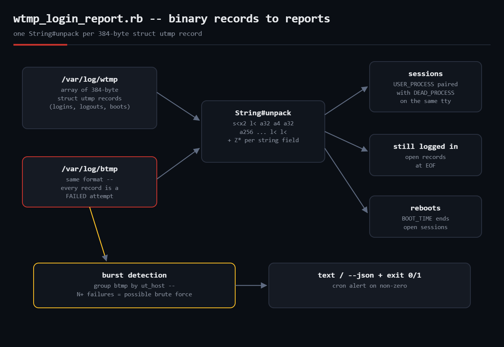

# wtmp-login-report

Reads Linux **login history straight from the binary `wtmp`/`btmp` files** in
pure standard-library Ruby — no `last`, no `lastb`, no gems. Reconstructs
login sessions with durations, shows who is still logged in, and (from
`btmp`) groups failed login attempts by source host with brute-force burst
detection and cron-friendly exit codes.



## Prerequisites

- Ruby 2.7+ (tested on 3.0) — standard library only (`optparse`, `json`, `time`)
- Linux with glibc's utmp files (`/var/log/wtmp`, `/var/log/btmp`)
- Reading `btmp` normally requires root (it contains usernames typo'd as passwords)
- x86_64/glibc struct layout (384-byte records); see Troubleshooting for others

## Usage

```bash
ruby wtmp_login_report.rb                        # session history from /var/log/wtmp
sudo ruby wtmp_login_report.rb --btmp            # failed logins from /var/log/btmp
ruby wtmp_login_report.rb --file fixture.wtmp    # any utmp-format file
sudo ruby wtmp_login_report.rb --btmp --burst 10 --json | jq .bursts
```

Exit codes: `0` ok, `1` at least one host with `--burst` or more failed
attempts — point it at cron and alert on non-zero.

## How it works

- **The file is just an array of C structs.** glibc's `struct utmp` is 384
  bytes: `ut_type` (what happened), `ut_line` (tty), `ut_user`, `ut_host`,
  and a 32-bit timestamp — even on x86_64, `ut_tv` uses 32-bit fields for
  cross-arch compatibility. One `String#unpack` per record
  (`s<x2l<a32a4a32a256s<s<l<l<l<a16a20`) turns it into Ruby values.
- **Fixed-width strings are NUL-padded**, so each is re-unpacked with `Z*`
  to stop at the first NUL.
- **Sessions are pairs.** A `USER_PROCESS` record is a login on a tty; the
  next `DEAD_PROCESS` on the *same tty* is the logout. A `BOOT_TIME` record
  implicitly ends every open session (the machine rebooted).
- **btmp is the same format** — every record is a *failed* attempt. Group by
  `ut_host`, count, and a host with more than `--burst` failures is flagged.

## Example output

```
$ ruby wtmp_login_report.rb --file fixture.wtmp
== fixture.wtmp -- 2 completed session(s), 1 reboot(s) ==
deploy       pts/0      10.0.4.17                08-25 07:58 -> 08:23  (25m00s)
ana          pts/0      10.0.4.99                08-25 08:58 -> 09:28  (30m00s)
-- still logged in --
root         tty1       (local)                  since 08-25 07:00
deploy       pts/1      10.0.4.17                since 08-25 09:03

$ ruby wtmp_login_report.rb --file fixture.btmp --btmp --burst 10
== fixture.btmp -- 17 failed login attempt(s) ==
-- by source host --
[BURST]    14  198.51.100.23                  targets: root, admin, oracle, git
            3  203.0.113.7                    targets: root
$ echo $?
1
```

The repo includes `make_fixture.rb`, which writes realistic fixture files
using the same struct layout — that's how the parser was tested in a
container whose real `wtmp` had no interactive logins (it still correctly
read the container image's 13 recorded reboots).

## Troubleshooting

- **Garbage output / wrong dates** — your platform's `struct utmp` differs.
  The 384-byte x86_64 glibc layout covers mainstream Linux; musl (Alpine)
  and BSDs differ. Check `getconf` or `/usr/include/bits/utmp.h` and adjust
  `RECORD_SIZE`/`UNPACK`.
- **`cannot read /var/log/btmp`** — that file is `0600 root:utmp` on purpose;
  run with sudo.
- **Sessions with no logout** — normal: still-open sessions, or wtmp was
  rotated between login and logout. Rotated files (`wtmp.1`) parse fine via
  `--file`.
- **Year-2038 note** — the 32-bit `ut_tv.sec` field overflows in 2038; glibc
  is migrating to utmpx/64-bit; revisit the unpack string then.

## Extending it

- Follow rotated files (`wtmp.1`, `wtmp.2.gz`) for longer history windows
- Emit per-user monthly duration totals (poor-man's `ac`)
- Push `bursts` JSON to your alerting webhook, or auto-feed fail2ban
- Parse `ut_addr_v6` to catch hosts that spoof `ut_host` strings

## References

- [utmp(5) man page](https://man7.org/linux/man-pages/man5/utmp.5.html)
- [Ruby String#unpack docs](https://docs.ruby-lang.org/en/3.0/String.html#method-i-unpack)
- Blog post: https://tha-shed.com/ (Ruby for DevOps series)
